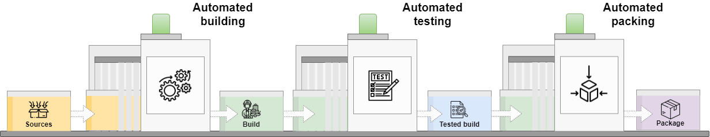
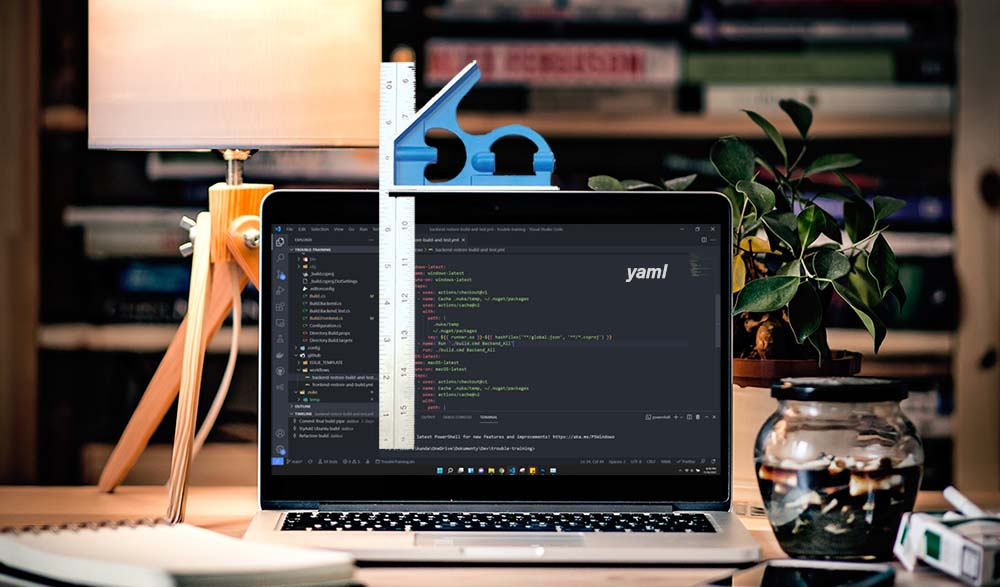
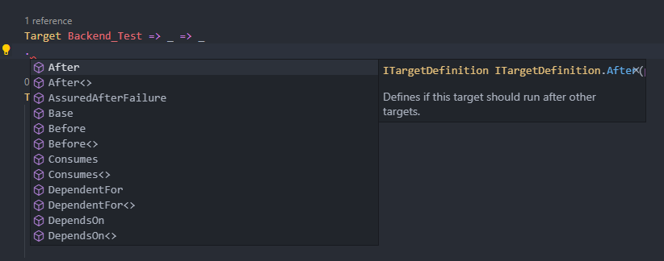
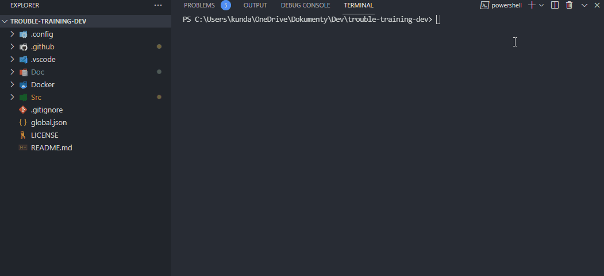
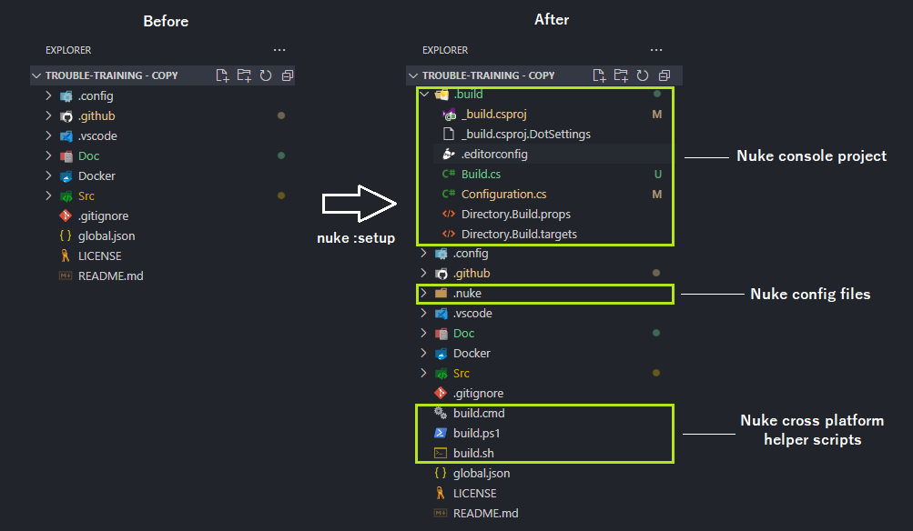
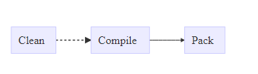
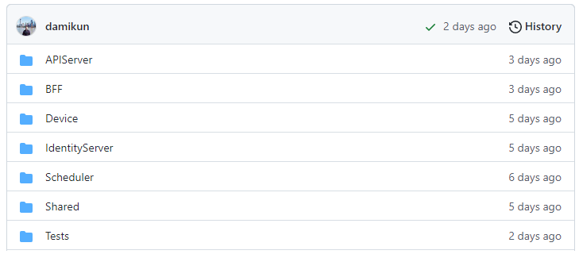
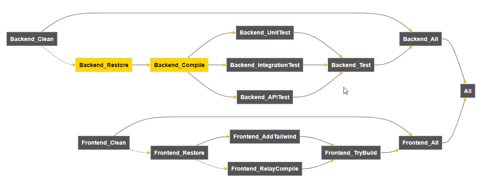
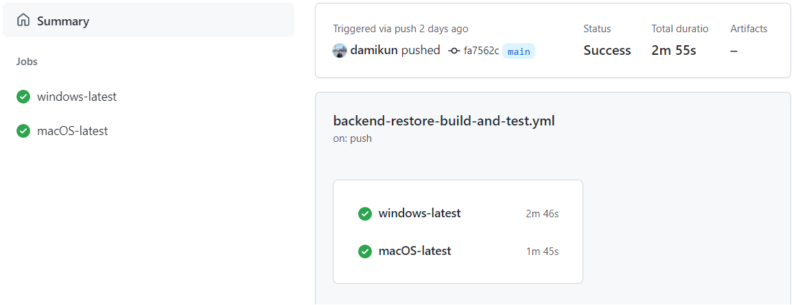

## Intro

The build process involves a series of automated tasks performed on raw source code to prepare that code for future deployment.

Instead of manually calling the compiler and package manager as `dotnet restore`/`dotnet build`, you can automate this process, especially if you are working with multiple solutions/projects that depend on each other and require certain steps to be built.

### Today's Build automation is not just about building the code



Rather, it provides many features and rich tools that help with:

- Cleanup
- Restore packages and dependencies
- Compilation
- Test automation
- Post-build processing
- Generating production builds
- Packaging, creating Docker images, etc. 
- Deployment between different environments
- Notifications and reporting
- Integration of 3-party applications
- Version control

### GithubActions, AzurePipelines, TeamCity and what else?

You know these build servers are widely used, but there are also many online tools as *SonarCloud* etc. used by companies and OSS projects.

**They are cool, no reason to stop using them**, but the way how you configure them is not a daily pleasure.



**Problems:**
- They provide several pre-built actions, and each time you have to decide what to use and how to configure it, what arguments to enter, etc.
- Yaml as a common configuration definition really sucks. Once I read *that it's there to make developers feel at home*... 🤣 Where is intelisense and strong typecheck? i am .Net developer.
- You can not build software locally and on CI/CD server equally. We need to create helper scripts for local development.
- Stack changes require studying new documentation and bending the existing solution.
- Cross-platform issues with custom scripts and paths
- Configuring the build process is something you do not want to do every day. It's best not to touch it until it's working because it's so complex and you can not remember exactly what each part does because you picked it up from the first post on the internet.

## Nuke build 


Nuke is hire to provide a nice typed and cross-platform experience by setting up the build process using console application. The oficial documentation can be found on [www.nuke.build](https://nuke.build/docs/getting-started/philosophy.html)

It helps you define dependencies between different actions (targets) and automatically generate code for CI/CD in advance, from your C# code using the code base you know from your daily work.

Since nuke runs as console app it provides nice strongly typed intellisense with documentation.

<p align="center">
  
</p>

Nuke is not a compiler, it's just an abstraction that gives you a pleasant experience with your code. It provides built-in functionality with source generators driven by attributes and builder patterns.

It's also extensible and currently offers a variety of integrations. So you get a beautiful API that works across platforms and is not just for C# programmers!

### Quick setup

To install `Nuke.GlobalTool`, run the following command:

```sh
dotnet tool install Nuke.GlobalTool --global
```

Now you can run the quickstart setup with `nuke:setup` from your project root directory. This is usually the folder where you have the `.gitignore` file.

</br>

<p align="center">
  
</p>


> &#10240;
>**NOTE:** As you can see, you can customise the root folder and the location of the build project! Make sure that the defined paths/folders are not part of `.gitignore`. They must be part of source-contol!
> &#10240;

You can skip the quickstart if you want, but it generates some important cross-platform execution scripts that help install the SDK!

Let us take a look at the generated files:

<p align="center">
  
</p>

- `.build` - Contains a C# console application where you can define your build process.
- `.nuke` - Contains the nuke schema and temporary files (These are generated).
- `build.cmd` - Is a cross-platform script (runs on Mac/Win/Linux) that triggers a concrete OS script to install the .Net SDK and required dependencies to get Nuke running properly as a console application.
- `build.sh` - Linux/MacOS init script
- `build.ps1` - Windows init script
</br>

The `./build/Build.cs` file is the entry point of the Nuke console applicati.

This is some dummy example of build:

```c#

[CheckBuildProjectConfigurations]
[ShutdownDotNetAfterServerBuild]
class Build : NukeBuild
{
    public static int Main() => Execute<Build>(x => x.Compile);

        Target Clean => _ => _
        .Before(Compile)
        .Executes(() => {
            // Action you wanna perform in clean
        });

        Target Compile => _ => _
        .Executes(() => {
            // Action you wanna perform in copile
        });

        Target Pack => _ => _
        .DependsOn(Compile)
        .Executes(() => {
            // Action you wanna perform in pack
        });
}

```

It contains the console `Main()` with the default `Target`.

In the abaw example, the default target is `Compile` = > (`Run(x = > x.Compile)`). This means when you run the script `./build.cmd`, it will use `Compile` and create the execution plan for it!

To visualize the dependency between the defined targets, you can run `nuke --plan` and get the following visualization in your browser:

<p align="center">
  
</p>

</br>


### More complex Demo example

The demo contains several projects that are interconnected. I want to build the frontend and the backend separately and do this on each *Github* push to verify that the code build is possible and bug-free, and to ensure that all backend tests can be run OK.

<p align="center">
  
</p>

This is the Nuke build plan for this project (`nuke --plan`):

<p align="center">
  
</p>

As you can see, there are multiple Targets and dependencies between them. Sometimes you just want to build the frontend, other times the backend, or all together.

> &#10240;
>**NOTE:** With Nuke you define tarets and it is up to you how you define the relationships between the tarets with the builder patterns `.DependsOn(...)`, `.Before(...)` , `.After(...)` and so on..
> &#10240;

Since the demo consists of several parts (frontend, backend, tests), you want to avoid putting all the code in one file. Instead, you can use `partial class`.

`.build/Build.cs`
```c#
partial class Build : NukeBuild {
    // All concat targets
 }
```

`.build/Build.Backend.cs`
```c#
partial class Build : NukeBuild { 
    // All related to backend Clen/Build/Compile
}
```

`.build/Build.Backend.Test.cs`
```c#
partial class Build : NukeBuild { 
    // All related to backend Unit/Integration/API Tests
}
```

`.build/Build.Frontend.cs`
```c#
partial class Build : NukeBuild { 
    // All related to frontend Clean/Restore/Compile/Build
 }
```

The main `Build` class derived from base `NukeBuild` provides some event callbacks that can be overridden:

```c#
// Method that is invoked after the instance of the build was created.
protected internal virtual void OnBuildCreated();

// Method that is invoked after the build has finished (succeeded or failed).
protected internal virtual void OnBuildFinished();

// Method that is invoked after build instance is initialized. I.e., value injection
protected internal virtual void OnBuildInitialized();

// Method that is invoked when a target has failed.
protected internal virtual void OnTargetFailed(string target);

// Method that is invoked before a target is about to start.
protected internal virtual void OnTargetRunning(string target);

// Method that is invoked when a target is skipped.
protected internal virtual void OnTargetSkipped(string target);

// Method that is invoked when a target has been executed successfully.
protected internal virtual void OnTargetSucceeded(string target);
```

Example:

```c#
protected override void OnBuildInitialized()
{
    Logger.Info("🚀 Build process started");

    base.OnBuildInitialized();
}
```

</br>

Let us take a look at Main `Build.cs` for this demo:

`.build/Build.cs`
```c#
[GitHubActions(
    "backend-restore-build-and-test",
    GitHubActionsImage.WindowsLatest,
    GitHubActionsImage.MacOsLatest,
    InvokedTargets = new[] { nameof(Backend_All) },
    On = new[] {
        GitHubActionsTrigger.PullRequest,
        GitHubActionsTrigger.Push
    },
    AutoGenerate = true)]
[GitHubActions(
    "frontend-restore-and-build",
    GitHubActionsImage.WindowsLatest,
    GitHubActionsImage.MacOsLatest,
    InvokedTargets = new[] { nameof(Frontend_All) },
    On = new[] {
         GitHubActionsTrigger.PullRequest,
         GitHubActionsTrigger.Push
    },
    AutoGenerate = false)]
[CheckBuildProjectConfigurations]
[ShutdownDotNetAfterServerBuild]
partial class Build : NukeBuild
{
    public static int Main() => Execute<Build>(x => x.Backend_Compile);

    //---------------
    // Params and Definitions
    //---------------

    [Parameter("Configuration to build - Default is 'Debug' (local) or 'Release' (server)")]
    readonly Configuration Configuration = IsLocalBuild ? Configuration.Debug : Configuration.Release;

    [Solution] readonly Solution Solution;

    //---------------
    // Enviroment
    //---------------

    AbsolutePath SourceDirectory => RootDirectory / "Src";

    //---------------
    // Build process
    //---------------

    protected override void OnBuildInitialized()
    {
        Logger.Info("🚀 Build process started");

        base.OnBuildInitialized();
    }

    Target Backend_All => _ => _
        .DependsOn(
            Backend_Clean,
            Backend_Test
        );

    Target Frontend_All => _ => _
        .DependsOn(
            Frontend_Clean,
            Frontend_TryBuild
        );

    Target All => _ => _
        .DependsOn(
            Backend_All,
            Frontend_All);
}
```

The `GitHubActions` attribute ensures that the correct Github workflow `.yaml` is created under the root directory `./github/workflows/`.

This is very handy as you do not have to write it yourself. Same goes for `AzurePipelines`, `SonarCloud` or any other tools out there! (supported by nuke)

```c#
[GitHubActions(
    "backend-restore-build-and-test",  // <-- Workflow Name
    GitHubActionsImage.WindowsLatest,  // <-- Runs on Windows
    GitHubActionsImage.MacOsLatest,    // <-- Runs on MacOs
    InvokedTargets = new[] {
         nameof(Backend_All)           // <-- What targets we wanna triger
    },  
    On = new[] {
        GitHubActionsTrigger.Push      // <-- Trigger event
    },
    AutoGenerate = true)]              // <-- Regenerate `.yaml` on change
```

This informs Nuke to generate the source code as `.github/workflows/backend-restore-build-and-test.yaml`.

```yaml
name: backend-restore-build-and-test

on: [push]

jobs:
  windows-latest:
    name: windows-latest
    runs-on: windows-latest
    steps:
      - uses: actions/checkout@v1
      - name: Cache .nuke/temp, ~/.nuget/packages
        uses: actions/cache@v2
        with:
          path: |
            .nuke/temp
            ~/.nuget/packages
          key: ${{ runner.os }}-${{ hashFiles('**/global.json', '**/*.csproj') }}
      - name: Run './build.cmd Backend_All'
        run: ./build.cmd Backend_All
  macOS-latest:
    name: macOS-latest
    runs-on: macOS-latest
    steps:
      - uses: actions/checkout@v1
      - name: Cache .nuke/temp, ~/.nuget/packages
        uses: actions/cache@v2
        with:
          path: |
            .nuke/temp
            ~/.nuget/packages
          key: ${{ runner.os }}-${{ hashFiles('**/global.json', '**/*.csproj') }}
      - name: Run './build.cmd Backend_All'
        run: ./build.cmd Backend_All

```

As you can see from the `.yaml` definition, Nuke uses the coross-platform script `./build.cmd` that I mentioned at the beginning of this article.

After you commit your code, Github will use this file to perform the build process for you.

<p align="center">
  
</p>

<p align="center">
  
</p>

</br>

Let us go ahead and look in detail at how the backendtargets Clean, Build, and Compile are configured:

`.build/Build.Backend.cs`
```c#
partial class Build : NukeBuild
{
    Target Backend_Clean => _ => _
        .Before(Backend_Restore)
        .Executes(() =>
        {
            SourceDirectory.GlobDirectories("**/bin", "**/obj")
                .Where(e => !e.ToString().Contains(
                    "node_modules",
                    StringComparison.OrdinalIgnoreCase))
                .Where(e => !e.ToString().Contains(
                    "ClientApp",
                    StringComparison.OrdinalIgnoreCase))
                .ForEach(DeleteDirectory);

            Backend_TestsDirectory.GlobDirectories("**/bin", "**/obj")
                .Where(e => !e.Contains("node_modules"))
                .ForEach(DeleteDirectory);
        });

    Target Backend_Restore => _ => _
        .Executes(() =>
        {
            DotNetRestore(s => s
                .SetProjectFile(Solution));
        });

    Target Backend_Compile => _ => _
        .DependsOn(Backend_Restore)
        .Executes(() =>
        {
            DotNetBuild(s => s
                .SetProjectFile(Solution)
                .SetConfiguration(Configuration)
                .EnableNoRestore());
        });
}

```

These are backend test targets

The project contains unit, integration and API tests. They need to be executed together or separately!

`.build/Build.Backend.Test.cs`
```c#
partial class Build : NukeBuild
{

    //---------------
    // Enviroment
    //---------------

    AbsolutePath Backend_TestsDirectory => RootDirectory / "Src" / "Tests";
    AbsolutePath Backend_Unit_Tests_Directory => RootDirectory / "Src" / "Tests" / "APIServer.Aplication.Unit";
    AbsolutePath Backend_Integration_Tests_Directory => RootDirectory / "Src" / "Tests" / "APIServer.Aplication.Integration";
    AbsolutePath Backend_API_Tests_Directory => RootDirectory / "Src" / "Tests" / "APIServer.API";

    //---------------
    // Build process
    //---------------

    Target Backend_Test => _ => _
        .DependsOn(
            Backend_UnitTest,
            Backend_IntegrationTest,
            Backend_APITest
        );

    Target Backend_UnitTest => _ => _
        .DependsOn(Backend_Compile)
        .Executes(() =>
        {
            DotNetTest(s => s
                .SetProjectFile(Backend_Unit_Tests_Directory)
                .SetConfiguration(Configuration)
                .EnableNoRestore()
                .EnableNoBuild());
        });

    Target Backend_IntegrationTest => _ => _
        .DependsOn(Backend_Compile)
        .Executes(() =>
        {
            DotNetTest(s => s
                .SetProjectFile(Backend_Integration_Tests_Directory)
                .SetConfiguration(Configuration)
                .EnableNoRestore()
                .EnableNoBuild());
        });

    Target Backend_APITest => _ => _
        .DependsOn(Backend_Compile)
        .Executes(() =>
        {
            DotNetTest(s => s
                .SetProjectFile(Backend_API_Tests_Directory)
                .SetConfiguration(Configuration)
                .EnableNoRestore()
                .EnableNoBuild());
        });
}

```

These are front end targets

The frontend needs to be restored (packages installed) and compiled in a few steps, as you can see in the code below.

`.build/Build.Frontend.cs`
```c#

partial class Build : NukeBuild
{
    //---------------
    // Enviroment
    //---------------

    AbsolutePath FrontendDirectory = RootDirectory / "Src" / "BFF" / "API" / "ClientApp";

    //---------------
    // Build process
    //---------------

    Target Frontend_Clean => _ => _
        .Before(Frontend_Restore)
        .Executes(() =>
        {

            SourceDirectory.GlobDirectories("**/BFF/API/ClientApp/node_modules")
                .ForEach(DeleteDirectory);
        });

    Target Frontend_Restore => _ => _
        .Executes(() =>
        {
            // Ecample of intsall packages based on package.json
            NpmTasks.NpmInstall(settings =>
                settings
                    .EnableProcessLogOutput()
                    .SetProcessWorkingDirectory(FrontendDirectory));
        });

    Target Frontend_AddTailwind => _ => _
        .DependsOn(Frontend_Restore)
        .Executes(() =>
        {
            // Example of dirrcty npm install command
            NpmTasks.Npm(
                "install -D tailwindcss@npm:@tailwindcss/postcss7-compat postcss@^7 autoprefixer@^9",
                FrontendDirectory);
        });

    Target Frontend_RelayCompile => _ => _
        .After(Frontend_Restore)
        .Executes(() =>
        {
            // Compile relay
            NpmTasks.NpmRun(s => s
                .SetCommand("relaycompile_presisted_js")
                .SetProcessWorkingDirectory(FrontendDirectory)
            );
        });

    Target Frontend_TryBuild => _ => _
        .DependsOn(Frontend_AddTailwind, Frontend_RelayCompile)
        .Executes(() =>
        {
            NpmTasks.NpmLogger = CustomLogger;

            NpmTasks.NpmRun(settings =>
                settings
                    .SetCommand("build")
                    .SetProcessWorkingDirectory(FrontendDirectory)
            );
        });

    // Helper
    public static void CustomLogger(OutputType type, string output)
    {
        switch (type)
        {
             case OutputType.Std:
                Logger.Normal(output);
                break;
            case OutputType.Err:
                {
                    if (
                        output.Contains(
                            "npmWARN",
                            StringComparison.OrdinalIgnoreCase
                        ) ||

                        output.Contains(
                            "npm WARN",
                            StringComparison.OrdinalIgnoreCase
                        ))

                        Logger.Warn(output);

                    else

                        Logger.Error(output);
                    break;
                }
        }
    }

}

```