# Table of contents
  - [Elsticsearch  <a name="elsticSearch"></a>](#elsticsearch--)
      - [What is Elasticsearch used for?](#what-is-elasticsearch-used-for)
      - [Demo architecture](#demo-architecture)
      - [Terms](#terms)
      - [How does Elasticsearch work?](#how-does-elasticsearch-work)
        - [Elasticsearch document](#elasticsearch-document)
      - [What is an Elasticsearch index?](#what-is-an-elasticsearch-index)
      - [What is Kibana?](#what-is-kibana)
      - [What is APM?](#what-is-apm)
        - [APM architecture](#apm-architecture)
        - [APM Kibana Interface](#apm-kibana-interface)
  - [Install in docker enviroment](#install-in-docker-enviroment)
      - [Install options](#install-options)
      - [Docker compose](#docker-compose)
      - [Explore containers](#explore-containers)
  - [NetCore Integration with ElasticSearch](#netcore-integration-with-elasticsearch)
  - [First startup](#first-startup)
      - [Create a log index pattern:](#create-a-log-index-pattern)
        - [Logs structure](#logs-structure)
    - [APM Services](#apm-services)
      - [Connect traces and logs (Trace vs. Logs)](#connect-traces-and-logs-trace-vs-logs)
    - [What is Logstash?](#what-is-logstash)
      - [Configure Logstash index](#configure-logstash-index)
      - [Understand *logstash.conf*](#logstashconf)
      - [Logstash pipeline (filters)](#logstash-pipeline-filters)
        - [Mutate](#mutate)
        - [Date](#date)
        - [Conditional rules](#conditional-rules)
  - [Beats](#beats)
    - [Beats docker install](#beats-docker-install)
      - [Compose Docker](#compose-docker)
      - [Explore containers](#explore-containers-1)
    - [Metricbeat](#metricbeat)
    - [Filebeat](#filebeat)
    - [Heartbeat](#heartbeat)    
    - [PacketBeat](#packetbeat)

>**NOTE:** This part requires prior implementation of [Configure Logging](./Logging.md) and [Configure Tracing](./OpenTelemetry.md). **Without these steps, it is not possible to fully debug Elasticsearch services, as no data is sent.**.


## Elsticsearch  <a name="elsticSearch"></a>


Elasticsearch is a distributed search and analytics engine for all types of data. Often associated with the term **ELK Stack** (Elasticsearch, Logstash and Kibana).

- **NoSQL database** - can be used as a replacement for document stores like MongoDB.
- **JSON Document** - uses documents as JSON objects stored in an Elasticsearch index, which is the basic unit of storage.
- **Schema-free** - does not require you to specify a schema. Uses JSON and does some guesswork to determine the types.
- **RESTful APIs** - use to configure and query data.
- **Scalable and distributed** - multiple nodes with replicas.

#### What is Elasticsearch used for?
- Search in applications/websites
- Logging and log analysis
- Infrastructure and application metrics and performance monitoring
- Spatial data analysis and visualization
- Security analysis
- Business analytics

#### Demo architecture

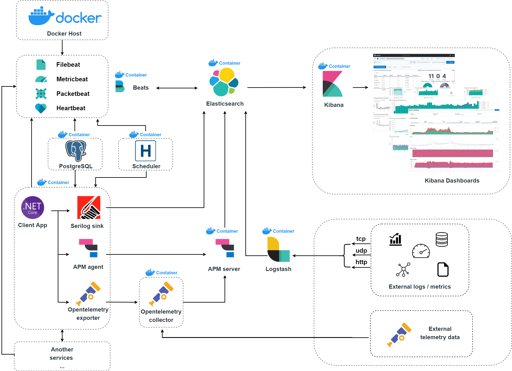


#### Terms 
- **Docker** - Is a containerization technology and an open platform for developing, shipping, and running applications. 
- **Beast** - Single-purpose data shipper. 
  - `Metricbeat` - Metrics shipper, collects and ships various system and service metrics.
  - `Filebeat` - Log shipper, preloads and preprocesses log files 
  - `Heartbeat` - Uptime shipper, monitors service uptime
  - `Packetbeat` - Real-time network packet analyzer
- **Logstash** - Processing pipeline that ingests data from various sources, transforms it and stores it in Elastic. 
- **Serilog** - Serilog is a diagnostic logging library for . NET applications
  - `Serilog sink` delivers the data to Elasticsearch (exporter). This is done in a similar structure to *Logstash* and makes it easier to use Kibana to visualize your logs. 
- **Opentelemetry** - Is a collection of tools, APIs and SDKs used to collect telemetry data from distributed systems. 
  - `Opentelemetry Exporter` - Client-side SDK that ensures that data is sent to various systems, in this case the Elastic APM Server. 
- **APM Server** - Application Performance Monitoring System. The APM server receives data from APM agents and converts it into Elasticsearch documents. 
  - `APM Agent` - Client-side SDK for app metrics data to APM Server.
- **Kibana** - Front-end application built on top of Elastic Stack that provides search and data visualization capabilities. 
- **PostgreSQL** - Is an open source object-relational database. 
- **Scheduler** - Is an application that allows you to schedule and track computer batch tasks. 
- **Other Services** - Can be a file server, Redis, message queue, notification service, etc.

#### How does Elasticsearch work?

<p align="center">
  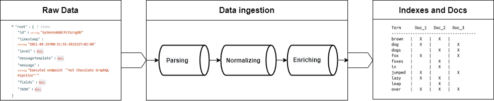
</p>


1) **Raw Data** - Data flows into Elasticsearch from a variety of sources, including logs, system metrics, and web applications
2) **Data Entry** - Process by which this raw data is parsed, normalized, and enriched before being indexed in Elasticsearch.
3) **Ready to Query** Once the data is indexed in Elasticsearch, users can run complex queries over their data and use aggregations to get complex summaries of their data.


##### Elasticsearch document

Documents are JSON objects that are stored in an Elasticsearch index. Each document is a key-value pair (names of fields or properties) with their corresponding values.

<pre style="max-height: 400px; overflow-y:scroll !important">
<code>
{
  "_index": "webapi-development-2021-08",
  "_type": "_doc",
  "_id": "di8wensBOBlfLtGcEwOL",
  "_score": 1,
  "_ignored": [
    "metadata.parameters.keyword",
    "message.keyword",
    "metadata.command_text.keyword"
  ],
  "_source": {
    "@timestamp": "2021-08-25T00:02:55.6229371+02:00",
    "log.level": "Information",
    "message": "Executed DbCommand (\"3\"ms) [Parameters=[\"@p15='4', @p0='2021-08-25T00:02:55.3266248+02:00' (DbType = DateTime), @p1='1' (Nullable = true), @p2='2021-06-22T15:40:53.4908940' (DbType = DateTime), @p3='0001-01-01T00:00:00.0000000' (DbType = DateTime), @p4='make sure the hmi unit is not running and is unplugged from its power source.\nwe recommend using an industrial grade paper towel, that is stable when wet and does not leave lint. paper towels also should be discarded after a single use on each hmi unit.\nuse isopropyl alcohol 70% for disinfection. to avoid discoloration, avoid highly concentrated alcohol (greater than 70% concentration), non-diluted bleach or ammonia solutions.\nput the disinfection solution in a spray bottle that can apply a mist of the solution in a fine layer.\nwear one-way silicone gloves and face mask when disinfecting the devices to avoid any cross contamination.\nalways wash your hands with water and soap before putting on gloves and immediately after taking off the gloves.\n\ndo not!!\ndo not use thinner, benzene, organic solvents and strong acidic substances.\nto protect the touch sheet, do not rub the edge part strongly.\n\n', @p5='{\\\"ops\\\":[{\\\"insert\\\":\\\"Make sure the HMI unit is not running and is unplugged from its power source.\\\"},{\\\"attributes\\\":{\\\"list\\\":\\\"ordered\\\"},\\\"insert\\\":\\\"\\n\\\"},{\\\"insert\\\":\\\"We recommend using an industrial grade paper towel, that is stable when wet and does not leave lint. Paper towels also should be discarded after a single use on each HMI unit.\\\"},{\\\"attributes\\\":{\\\"list\\\":\\\"ordered\\\"},\\\"insert\\\":\\\"\\n\\\"},{\\\"insert\\\":\\\"Use Isopropyl Alcohol 70% for disinfection. To avoid discoloration, avoid highly concentrated alcohol (greater than 70% concentration), non-diluted bleach or ammonia solutions.\\\"},{\\\"attributes\\\":{\\\"list\\\":\\\"ordered\\\"},\\\"insert\\\":\\\"\\n\\\"},{\\\"insert\\\":\\\"Put the disinfection solution in a spray bottle that can apply a mist of the solution in a fine layer.\\\"},{\\\"attributes\\\":{\\\"list\\\":\\\"ordered\\\"},\\\"insert\\\":\\\"\\n\\\"},{\\\"insert\\\":\\\"Wear one-way silicone gloves and face mask when disinfecting the devices to avoid any cross contamination.\\\"},{\\\"attributes\\\":{\\\"list\\\":\\\"ordered\\\"},\\\"insert\\\":\\\"\\n\\\"},{\\\"insert\\\":\\\"Always wash your hands with water and soap before putting on gloves and immediately after taking off the gloves.\\\"},{\\\"attributes\\\":{\\\"list\\\":\\\"ordered\\\"},\\\"insert\\\":\\\"\\n\\\"},{\\\"insert\\\":\\\"\\n\\\"},{\\\"attributes\\\":{\\\"size\\\":\\\"large\\\",\\\"bold\\\":true},\\\"insert\\\":\\\"DO NOT!!\\\"},{\\\"insert\\\":\\\"\\nDo not use thinner, benzene, organic solvents and strong acidic substances.\\\"},{\\\"attributes\\\":{\\\"list\\\":\\\"bullet\\\"},\\\"insert\\\":\\\"\\n\\\"},{\\\"insert\\\":\\\"To protect the touch sheet, do not rub the edge part strongly.\\\"},{\\\"attributes\\\":{\\\"list\\\":\\\"bullet\\\"},\\\"insert\\\":\\\"\\n\\\"},{\\\"insert\\\":\\\"\\n\\\"}]}', @p6='False', @p7='0', @p8='cleanup display', @p9='1', @p10='100', @p11='1', @p12='7', @p13='1', @p14='1' (Nullable = true)\"], CommandType='Text', CommandTimeout='30']\"\r\n\"\"UPDATE \\\"Issues\\\" SET \\\"ChangedTimestamp\\\" = @p0, \\\"CreatedById\\\" = @p1, \\\"CreatedTimestamp\\\" = @p2, \\\"DeadLine\\\" = @p3, \\\"Description\\\" = @p4, \\\"DescriptionDelta\\\" = @p5, \\\"Flagged\\\" = @p6, \\\"Index\\\" = @p7, \\\"Name\\\" = @p8, \\\"Priority\\\" = @p9, \\\"Progress\\\" = @p10, \\\"ProjectID\\\" = @p11, \\\"Status\\\" = @p12, \\\"Type\\\" = @p13, \\\"UpdatedById\\\" = @p14\r\nWHERE \\\"ID\\\" = @p15;\"",
    "metadata": {
      "message_template": "Executed DbCommand ({elapsed}ms) [Parameters=[{parameters}], CommandType='{commandType}', CommandTimeout='{commandTimeout}']{newLine}{commandText}",
      "elapsed": "3",
      "parameters": "@p15='4', @p0='2021-08-25T00:02:55.3266248+02:00' (DbType = DateTime), @p1='1' (Nullable = true), @p2='2021-06-22T15:40:53.4908940' (DbType = DateTime), @p3='0001-01-01T00:00:00.0000000' (DbType = DateTime), @p4='make sure the hmi unit is not running and is unplugged from its power source.\nwe recommend using an industrial grade paper towel, that is stable when wet and does not leave lint. paper towels also should be discarded after a single use on each hmi unit.\nuse isopropyl alcohol 70% for disinfection. to avoid discoloration, avoid highly concentrated alcohol (greater than 70% concentration), non-diluted bleach or ammonia solutions.\nput the disinfection solution in a spray bottle that can apply a mist of the solution in a fine layer.\nwear one-way silicone gloves and face mask when disinfecting the devices to avoid any cross contamination.\nalways wash your hands with water and soap before putting on gloves and immediately after taking off the gloves.\n\ndo not!!\ndo not use thinner, benzene, organic solvents and strong acidic substances.\nto protect the touch sheet, do not rub the edge part strongly.\n\n', @p5='{\"ops\":[{\"insert\":\"Make sure the HMI unit is not running and is unplugged from its power source.\"},{\"attributes\":{\"list\":\"ordered\"},\"insert\":\"\\n\"},{\"insert\":\"We recommend using an industrial grade paper towel, that is stable when wet and does not leave lint. Paper towels also should be discarded after a single use on each HMI unit.\"},{\"attributes\":{\"list\":\"ordered\"},\"insert\":\"\\n\"},{\"insert\":\"Use Isopropyl Alcohol 70% for disinfection. To avoid discoloration, avoid highly concentrated alcohol (greater than 70% concentration), non-diluted bleach or ammonia solutions.\"},{\"attributes\":{\"list\":\"ordered\"},\"insert\":\"\\n\"},{\"insert\":\"Put the disinfection solution in a spray bottle that can apply a mist of the solution in a fine layer.\"},{\"attributes\":{\"list\":\"ordered\"},\"insert\":\"\\n\"},{\"insert\":\"Wear one-way silicone gloves and face mask when disinfecting the devices to avoid any cross contamination.\"},{\"attributes\":{\"list\":\"ordered\"},\"insert\":\"\\n\"},{\"insert\":\"Always wash your hands with water and soap before putting on gloves and immediately after taking off the gloves.\"},{\"attributes\":{\"list\":\"ordered\"},\"insert\":\"\\n\"},{\"insert\":\"\\n\"},{\"attributes\":{\"size\":\"large\",\"bold\":true},\"insert\":\"DO NOT!!\"},{\"insert\":\"\\nDo not use thinner, benzene, organic solvents and strong acidic substances.\"},{\"attributes\":{\"list\":\"bullet\"},\"insert\":\"\\n\"},{\"insert\":\"To protect the touch sheet, do not rub the edge part strongly.\"},{\"attributes\":{\"list\":\"bullet\"},\"insert\":\"\\n\"},{\"insert\":\"\\n\"}]}', @p6='False', @p7='0', @p8='cleanup display', @p9='1', @p10='100', @p11='1', @p12='7', @p13='1', @p14='1' (Nullable = true)",
      "command_type": 1,
      "command_timeout": 30,
      "new_line": "\r\n",
      "command_text": "UPDATE \"Issues\" SET \"ChangedTimestamp\" = @p0, \"CreatedById\" = @p1, \"CreatedTimestamp\" = @p2, \"DeadLine\" = @p3, \"Description\" = @p4, \"DescriptionDelta\" = @p5, \"Flagged\" = @p6, \"Index\" = @p7, \"Name\" = @p8, \"Priority\" = @p9, \"Progress\" = @p10, \"ProjectID\" = @p11, \"Status\" = @p12, \"Type\" = @p13, \"UpdatedById\" = @p14\r\nWHERE \"ID\" = @p15;",
      "event_id": {
        "id": 20101,
        "name": "Microsoft.EntityFrameworkCore.Database.Command.CommandExecuted"
      },
      "span_id": "71b0eb66643afbab",
      "trace_id": "457e1ae0962bd5bf39b2653cd94cc701",
      "parent_id": "ae4f3edc79609e3a",
      "environment": "Development"
    },
    "ecs": {
      "version": "1.6.0"
    },
    "event": {
      "created": "2021-08-25T00:02:55.6229371+02:00",
      "severity": 2,
      "timezone": "Central Europe Standard Time"
    },
    "host": {
      "name": "MACBOOKPRO"
    },
    "log": {
      "logger": "Microsoft.EntityFrameworkCore.Database.Command",
      "original": null
    },
    "process": {
      "thread": {
        "id": 165
      },
      "executable": "WebApi",
      "name": "WebApi",
      "pid": 19160
    }
  },
  "fields": {
    "metadata.event_id.name": [
      "Microsoft.EntityFrameworkCore.Database.Command.CommandExecuted"
    ],
    "log.level.keyword": [
      "Information"
    ],
    "host.name.keyword": [
      "MACBOOKPRO"
    ],
    "metadata.elapsed": [
      "3"
    ],
    "metadata.trace_id.keyword": [
      "457e1ae0962bd5bf39b2653cd94cc701"
    ],
    "process.pid": [
      19160
    ],
    "log.logger": [
      "Microsoft.EntityFrameworkCore.Database.Command"
    ],
    "ecs.version.keyword": [
      "1.6.0"
    ],
    "metadata.parent_id.keyword": [
      "ae4f3edc79609e3a"
    ],
    "metadata.environment.keyword": [
      "Development"
    ],
    "metadata.new_line.keyword": [
      "\r\n"
    ],
    "metadata.span_id.keyword": [
      "71b0eb66643afbab"
    ],
    "log.level": [
      "Information"
    ],
    "host.name": [
      "MACBOOKPRO"
    ],
    "event.timezone": [
      "Central Europe Standard Time"
    ],
    "process.executable": [
      "WebApi"
    ],
    "event.severity": [
      2
    ],
    "metadata.elapsed.keyword": [
      "3"
    ],
    "metadata.command_type": [
      1
    ],
    "metadata.message_template.keyword": [
      "Executed DbCommand ({elapsed}ms) [Parameters=[{parameters}], CommandType='{commandType}', CommandTimeout='{commandTimeout}']{newLine}{commandText}"
    ],
    "metadata.event_id.id": [
      20101
    ],
    "metadata.event_id.name.keyword": [
      "Microsoft.EntityFrameworkCore.Database.Command.CommandExecuted"
    ],
    "process.executable.keyword": [
      "WebApi"
    ],
    "message": [
      "Executed DbCommand (\"3\"ms) [Parameters=[\"@p15='4', @p0='2021-08-25T00:02:55.3266248+02:00' (DbType = DateTime), @p1='1' (Nullable = true), @p2='2021-06-22T15:40:53.4908940' (DbType = DateTime), @p3='0001-01-01T00:00:00.0000000' (DbType = DateTime), @p4='make sure the hmi unit is not running and is unplugged from its power source.\nwe recommend using an industrial grade paper towel, that is stable when wet and does not leave lint. paper towels also should be discarded after a single use on each hmi unit.\nuse isopropyl alcohol 70% for disinfection. to avoid discoloration, avoid highly concentrated alcohol (greater than 70% concentration), non-diluted bleach or ammonia solutions.\nput the disinfection solution in a spray bottle that can apply a mist of the solution in a fine layer.\nwear one-way silicone gloves and face mask when disinfecting the devices to avoid any cross contamination.\nalways wash your hands with water and soap before putting on gloves and immediately after taking off the gloves.\n\ndo not!!\ndo not use thinner, benzene, organic solvents and strong acidic substances.\nto protect the touch sheet, do not rub the edge part strongly.\n\n', @p5='{\\\"ops\\\":[{\\\"insert\\\":\\\"Make sure the HMI unit is not running and is unplugged from its power source.\\\"},{\\\"attributes\\\":{\\\"list\\\":\\\"ordered\\\"},\\\"insert\\\":\\\"\\n\\\"},{\\\"insert\\\":\\\"We recommend using an industrial grade paper towel, that is stable when wet and does not leave lint. Paper towels also should be discarded after a single use on each HMI unit.\\\"},{\\\"attributes\\\":{\\\"list\\\":\\\"ordered\\\"},\\\"insert\\\":\\\"\\n\\\"},{\\\"insert\\\":\\\"Use Isopropyl Alcohol 70% for disinfection. To avoid discoloration, avoid highly concentrated alcohol (greater than 70% concentration), non-diluted bleach or ammonia solutions.\\\"},{\\\"attributes\\\":{\\\"list\\\":\\\"ordered\\\"},\\\"insert\\\":\\\"\\n\\\"},{\\\"insert\\\":\\\"Put the disinfection solution in a spray bottle that can apply a mist of the solution in a fine layer.\\\"},{\\\"attributes\\\":{\\\"list\\\":\\\"ordered\\\"},\\\"insert\\\":\\\"\\n\\\"},{\\\"insert\\\":\\\"Wear one-way silicone gloves and face mask when disinfecting the devices to avoid any cross contamination.\\\"},{\\\"attributes\\\":{\\\"list\\\":\\\"ordered\\\"},\\\"insert\\\":\\\"\\n\\\"},{\\\"insert\\\":\\\"Always wash your hands with water and soap before putting on gloves and immediately after taking off the gloves.\\\"},{\\\"attributes\\\":{\\\"list\\\":\\\"ordered\\\"},\\\"insert\\\":\\\"\\n\\\"},{\\\"insert\\\":\\\"\\n\\\"},{\\\"attributes\\\":{\\\"size\\\":\\\"large\\\",\\\"bold\\\":true},\\\"insert\\\":\\\"DO NOT!!\\\"},{\\\"insert\\\":\\\"\\nDo not use thinner, benzene, organic solvents and strong acidic substances.\\\"},{\\\"attributes\\\":{\\\"list\\\":\\\"bullet\\\"},\\\"insert\\\":\\\"\\n\\\"},{\\\"insert\\\":\\\"To protect the touch sheet, do not rub the edge part strongly.\\\"},{\\\"attributes\\\":{\\\"list\\\":\\\"bullet\\\"},\\\"insert\\\":\\\"\\n\\\"},{\\\"insert\\\":\\\"\\n\\\"}]}', @p6='False', @p7='0', @p8='cleanup display', @p9='1', @p10='100', @p11='1', @p12='7', @p13='1', @p14='1' (Nullable = true)\"], CommandType='Text', CommandTimeout='30']\"\r\n\"\"UPDATE \\\"Issues\\\" SET \\\"ChangedTimestamp\\\" = @p0, \\\"CreatedById\\\" = @p1, \\\"CreatedTimestamp\\\" = @p2, \\\"DeadLine\\\" = @p3, \\\"Description\\\" = @p4, \\\"DescriptionDelta\\\" = @p5, \\\"Flagged\\\" = @p6, \\\"Index\\\" = @p7, \\\"Name\\\" = @p8, \\\"Priority\\\" = @p9, \\\"Progress\\\" = @p10, \\\"ProjectID\\\" = @p11, \\\"Status\\\" = @p12, \\\"Type\\\" = @p13, \\\"UpdatedById\\\" = @p14\r\nWHERE \\\"ID\\\" = @p15;\""
    ],
    "metadata.message_template": [
      "Executed DbCommand ({elapsed}ms) [Parameters=[{parameters}], CommandType='{commandType}', CommandTimeout='{commandTimeout}']{newLine}{commandText}"
    ],
    "metadata.span_id": [
      "71b0eb66643afbab"
    ],
    "metadata.command_text": [
      "UPDATE \"Issues\" SET \"ChangedTimestamp\" = @p0, \"CreatedById\" = @p1, \"CreatedTimestamp\" = @p2, \"DeadLine\" = @p3, \"Description\" = @p4, \"DescriptionDelta\" = @p5, \"Flagged\" = @p6, \"Index\" = @p7, \"Name\" = @p8, \"Priority\" = @p9, \"Progress\" = @p10, \"ProjectID\" = @p11, \"Status\" = @p12, \"Type\" = @p13, \"UpdatedById\" = @p14\r\nWHERE \"ID\" = @p15;"
    ],
    "process.name": [
      "WebApi"
    ],
    "metadata.command_timeout": [
      30
    ],
    "@timestamp": [
      "2021-08-24T22:02:55.622Z"
    ],
    "process.name.keyword": [
      "WebApi"
    ],
    "metadata.parent_id": [
      "ae4f3edc79609e3a"
    ],
    "ecs.version": [
      "1.6.0"
    ],
    "event.created": [
      "2021-08-24T22:02:55.622Z"
    ],
    "log.logger.keyword": [
      "Microsoft.EntityFrameworkCore.Database.Command"
    ],
    "metadata.new_line": [
      "\r\n"
    ],
    "metadata.environment": [
      "Development"
    ],
    "process.thread.id": [
      165
    ],
    "metadata.parameters": [
      "@p15='4', @p0='2021-08-25T00:02:55.3266248+02:00' (DbType = DateTime), @p1='1' (Nullable = true), @p2='2021-06-22T15:40:53.4908940' (DbType = DateTime), @p3='0001-01-01T00:00:00.0000000' (DbType = DateTime), @p4='make sure the hmi unit is not running and is unplugged from its power source.\nwe recommend using an industrial grade paper towel, that is stable when wet and does not leave lint. paper towels also should be discarded after a single use on each hmi unit.\nuse isopropyl alcohol 70% for disinfection. to avoid discoloration, avoid highly concentrated alcohol (greater than 70% concentration), non-diluted bleach or ammonia solutions.\nput the disinfection solution in a spray bottle that can apply a mist of the solution in a fine layer.\nwear one-way silicone gloves and face mask when disinfecting the devices to avoid any cross contamination.\nalways wash your hands with water and soap before putting on gloves and immediately after taking off the gloves.\n\ndo not!!\ndo not use thinner, benzene, organic solvents and strong acidic substances.\nto protect the touch sheet, do not rub the edge part strongly.\n\n', @p5='{\"ops\":[{\"insert\":\"Make sure the HMI unit is not running and is unplugged from its power source.\"},{\"attributes\":{\"list\":\"ordered\"},\"insert\":\"\\n\"},{\"insert\":\"We recommend using an industrial grade paper towel, that is stable when wet and does not leave lint. Paper towels also should be discarded after a single use on each HMI unit.\"},{\"attributes\":{\"list\":\"ordered\"},\"insert\":\"\\n\"},{\"insert\":\"Use Isopropyl Alcohol 70% for disinfection. To avoid discoloration, avoid highly concentrated alcohol (greater than 70% concentration), non-diluted bleach or ammonia solutions.\"},{\"attributes\":{\"list\":\"ordered\"},\"insert\":\"\\n\"},{\"insert\":\"Put the disinfection solution in a spray bottle that can apply a mist of the solution in a fine layer.\"},{\"attributes\":{\"list\":\"ordered\"},\"insert\":\"\\n\"},{\"insert\":\"Wear one-way silicone gloves and face mask when disinfecting the devices to avoid any cross contamination.\"},{\"attributes\":{\"list\":\"ordered\"},\"insert\":\"\\n\"},{\"insert\":\"Always wash your hands with water and soap before putting on gloves and immediately after taking off the gloves.\"},{\"attributes\":{\"list\":\"ordered\"},\"insert\":\"\\n\"},{\"insert\":\"\\n\"},{\"attributes\":{\"size\":\"large\",\"bold\":true},\"insert\":\"DO NOT!!\"},{\"insert\":\"\\nDo not use thinner, benzene, organic solvents and strong acidic substances.\"},{\"attributes\":{\"list\":\"bullet\"},\"insert\":\"\\n\"},{\"insert\":\"To protect the touch sheet, do not rub the edge part strongly.\"},{\"attributes\":{\"list\":\"bullet\"},\"insert\":\"\\n\"},{\"insert\":\"\\n\"}]}', @p6='False', @p7='0', @p8='cleanup display', @p9='1', @p10='100', @p11='1', @p12='7', @p13='1', @p14='1' (Nullable = true)"
    ],
    "metadata.trace_id": [
      "457e1ae0962bd5bf39b2653cd94cc701"
    ],
    "event.timezone.keyword": [
      "Central Europe Standard Time"
    ]
  }
}

</code>
</pre>

</br>

#### What is an Elasticsearch index?

<!-- 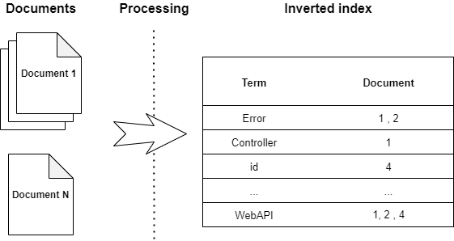 -->

<p align="center">
  
</p>

- Is a collection of documents that are related to each other.
- Elasticsearch stores data as JSON documents and creates an [inverted index](https://en.wikipedia.org/wiki/Inverted_index) on top of it.
- You can define as many indexes in Elasticsearch as you like.
- Indexes are identified by lowercase names
- Each index consists of one or more shards


Index size is a common cause of Elasticsearch problems. One way to handle this problem is to divide indexes horizontally into parts called **shards**. 

>**NOTE :** The data in Elasticsearch is organized into indexes. Each index is composed of one or more shards. 

In Elasticsearch, each query is executed in a single thread per shard. However, multiple shards can be processed in para

#### What is Kibana?
Kibana allows users to visualize data with charts and graphs in Elasticsearch. 

**Provides:**
- Visualization of data
- Exploration tool
- Time series analysis
- Application monitoring
- Operational Intelligence
- Reporting, etc.

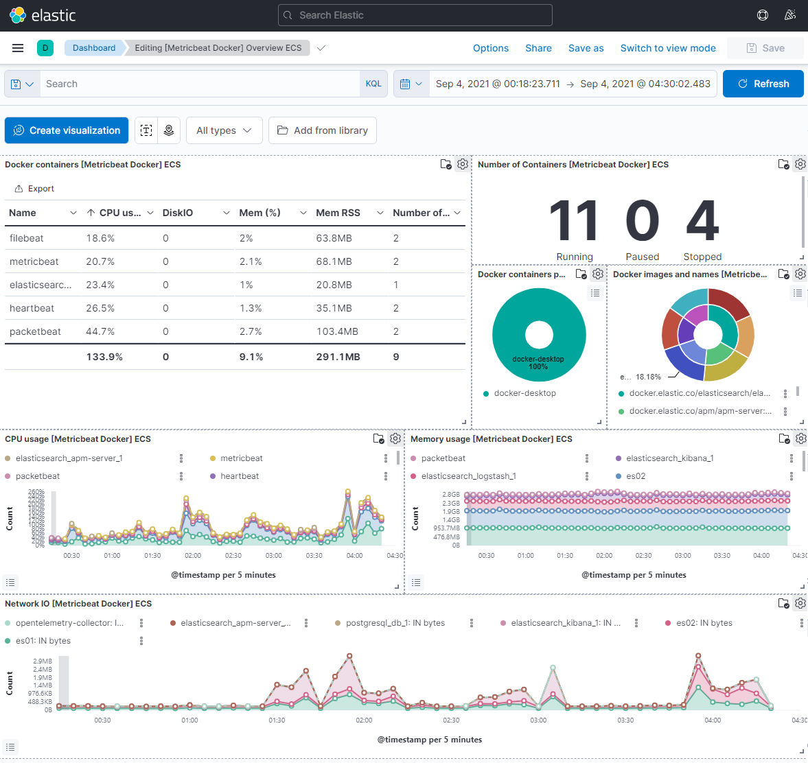

</br>

#### What is APM?
Elastic APM is application performance monitoring. It allows you to monitor software services and applications in real time by collecting detailed performance information. **This helps to troubleshoot problems quickly.**

- **APM** collects logs, metrics, and traces.

<p align="center">
  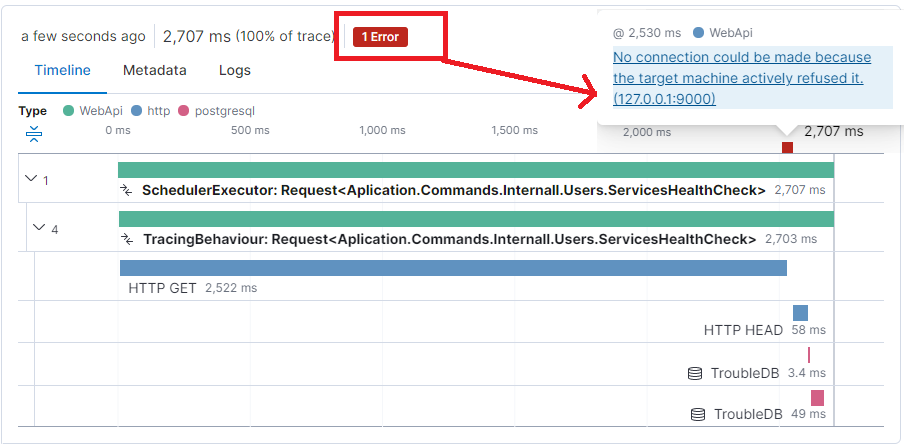
</p>

##### APM architecture

APM provides [agents for various languages](https://www.elastic.co/guide/en/apm/agent/index.html) and support input dirrectly from [opentelemerty protocol](https://www.elastic.co/guide/en/apm/get-started/current/open-telemetry-elastic.html) ( includes opnetelemetry collector ).
<p align="center">
  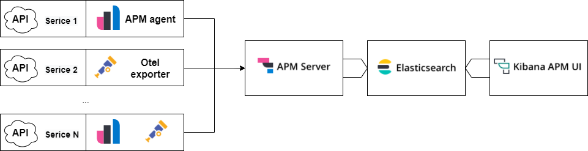
</p>


**Supported inputs are:**
 1) `Elastic protocol` - Elastic communication. 
 2) `Opentelemetry Protocol` - Open standard for telemetry data. 

 **Main advantage** compared to *Jaeger tracing* or *Zipkin* is that APM connects logs, metrics and traces via Elastic Stack and displays everything in one UI. This reduces the number of external applications and simplifies the search and analysis of the observed data.

##### APM Kibana Interface

The Kibana plugin for APM allows you to analyze traces and related logs in an easy and enjoyable way.


**APM Trace logs:**
<p align="center">
  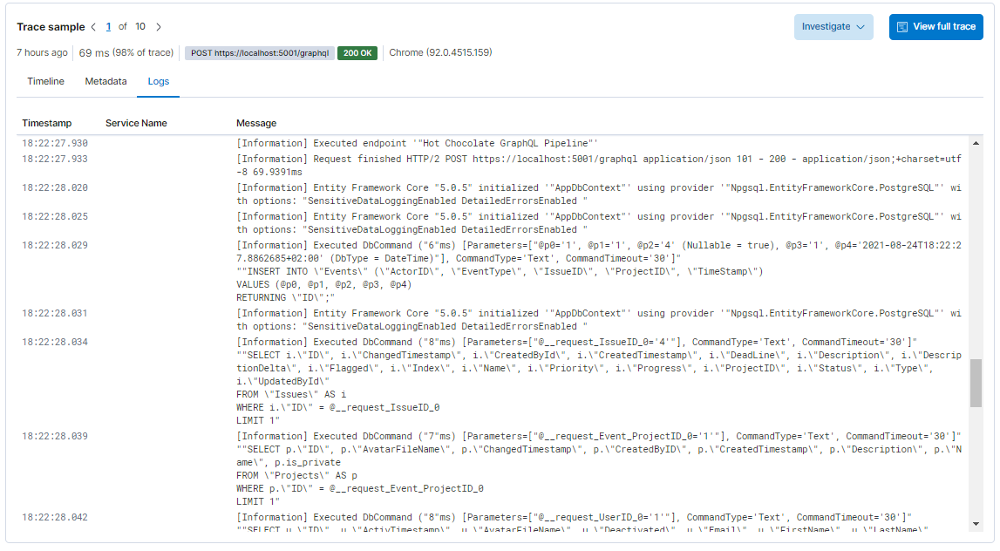
</p>

</br>


## Install in docker enviroment

#### Install options
There are 2 distribution ( licensed opensource and always free opensource)
1) [Official Elastic from 'elastic.co'](https://www.elastic.co/) - Opensource but all premium features like security are licenced.
2) [Opensearch](https://opensearch.org/) - 100% open source, with enterprise security, alerting, SQL, etc.. Previously called `OpenDistro for Elastic` which is now deprecated since *Elastic.co* changed licensing the Amazon created new fork `Opensearch` with big investments and longterm roadmap.


</p>

>**INFO** This demo uses **Standard Elasticsearch** because it has **better** performance analysis tools than *OpenSearch*.

#### Docker compose

`Elastic.co` provides several examples of stack installation (Elastic / Kibana...), but in the end you need to understand each part and be able to create a custom `docker-compose.yml` that fits your needs.

In this example, the following containers are created under the `Elastic` network:
 
- `Elastic nodes` -  1,2 (setup of 2 nodes).
- `Logstash` - Pipeline for log processing
- `Kibana` - Visualization UI
- `APM Server` - Elastic server and collector for performance analysis
- `Opentelemetry collector` - This is only needed if you want to merge traces from different sources through one collector. It is recommended to isolate the zones through it.
    - **APM supports** `otel-protocol` by default and traces can be sent directly without anything going ahead.

> &#10240;
> **WARNING** The example should not be used in real production! For that you need to configure the security plugin and set up at least 4 nodes. This is a recommendation!
> &#10240;

1) Create `docker-compose.yml` [../Src/Docker/ElasticSearch/docker-compose.yml](../Src/Docker/ElasticSearch/docker-compose.yml).

2) Run `docker-compose up`. This will create, (re)create, start and attach containers for a service.

    *Output:*
    ```shell
    Starting es01 ... done
    Starting es02 ... done
    Starting elasticsearch_kibana ... done
    Starting elasticsearch_logstash ... done
    Starting elasticsearch_apm-server ... done
    Starting opentelemetry-collector ... done
    ```

    This will take some time as the services are interdependent (one waiting for another to start). It may take `5-10 minutes`. The wait process is necessary to avoid connection errors between services during startup. Without this process you may get too many error logs. 

    ###### Build Process: 
    1) Elastic Nodes 1,2 are created and started. 
    2) Then composer waits for Elastic to start and be available (helatcheck). 
    3) Composer Builds Kibana and launches it 
    4) Composer Builds Logstash and starts it 
    5) APM server build waits for Kibana and Elastic to be available (helatcheck). 
    6) Composer Builds APM Server and starts it. 
    7) Opentelemetry Collector Build waits until APM Server is available (helatcheck). 
    8) Opentelemetry Collector build and launch.

<br/>

> &#10240;
> **NOTE:** If you are in a **'dev'** environment (local PC), sometimes you need to manually set the 'vm max_map_count' (elastic memory variable) due to an error:
    >```
    >Max virtual memory areas vm max_map_count 65530 is too low, increase to at least (262144)
    >```
    >
    >**Linux:**
    >```
    >sysctl -w vm.max_map_count=262144 
    >echo "vm.max_map_count=262144" >> /etc/sysctl.conf
    >```
    >
    >**Windows WSL:**
    > ```
    >wsl -d docker-desktop
    >sysctl -w vm.max_map_count=262144
    >```
    >
    >Sometimes with 'Microsoft WSL' there can be an issue with the persistence of this value and maybe you need to set the variable after each restart of Docker (system). 
    > &#10240;

<br/>

> &#10240;
> **NOTE:** In some scenarios, you may have trouble starting some containers because of memory allocation issues. You can control the memory parameters of containers via:
>
>The amount of resources affects the performance of the container.
>`docker-compose.yml:`
>  - elasticsearch - `ES _JAVA_ OPTS: "-Xmx512m -Xms512m"`
>  - logstash - `LS _JAVA_ OPTS: "-Xms512m -Xmx512m"`
> &#10240;


#### Explore containers
There should be 6 running containers available under your docker. You can use docker UI or the terminal 'docker ps' to see all running containers. Use `docker ps -a` to see all containers (running/non-running).


Or from the terminal: (`docker ps`)

```shell
# Docker Id is always different
eb079218800f   otel/opentelemetry-collector:0.33.0                    "/otelcol --config=/…"   About an hour ago   Up 30 minutes             4317/tcp, 0.0.0.0:14250->14250/tcp, 55678-55679/tcp, 0.0.0.0:55680->55680/tcp   opentelemetry-collector
e9baf2654ca2   docker.elastic.co/apm/apm-server:7.14.0                "/usr/bin/tini -- /u…"   About an hour ago   Up 30 minutes (healthy)   0.0.0.0:8200->8200/tcp                                                          elasticsearch_apm-server_1
2cdde0b6cbab   docker.elastic.co/kibana/kibana:7.14.0                 "/bin/tini -- /usr/l…"   About an hour ago   Up 31 minutes (healthy)   0.0.0.0:5601->5601/tcp                                                          elasticsearch_kibana_1
0c717972a9a2   docker.elastic.co/elasticsearch/elasticsearch:7.14.0   "/bin/tini -- /usr/l…"   About an hour ago   Up 33 minutes             9200/tcp, 9300/tcp                                                              es02
3369ffda2827   docker.elastic.co/elasticsearch/elasticsearch:7.14.0   "/bin/tini -- /usr/l…"   About an hour ago   Up 33 minutes (healthy)   0.0.0.0:9200->9200/tcp, 9300/tcp                                                es01
```

You can see the container status and how long it is runnig. To run container you can use `docker start container_name`

</br>

## NetCore Integration with ElasticSearch

For the full requirements regarding exporting *logs* or *distributed traces*, see the specific topics:

- [Configure Logging](./Logging.md)
- [Configure Tracing](./OpenTelemetry.md)

This links covers the full step-by-step configuration under the `NetCore` application.

> &#10240;
>**NOTE:** This part requires prior implementation
> &#10240;

</br>

## First startup

**Default Kibana Url** - `http://localhost:5601/` by default it's `http`

**Default Elastic Url** - `http://localhost:9200/` defaults to `http`

**Elastic Connection string Url** `http://localhost:9200` 

>**WARNING** Demo shows setup without security plugin! (No password and no TLS)

Kibana UI changes a lot over time, so there is no particular reason to repeat the initial showcase, because next month the UI may look different :)

After the initial load, you need to set up an index pattern. Kibana uses it to determine what kind of data you want to visualize.

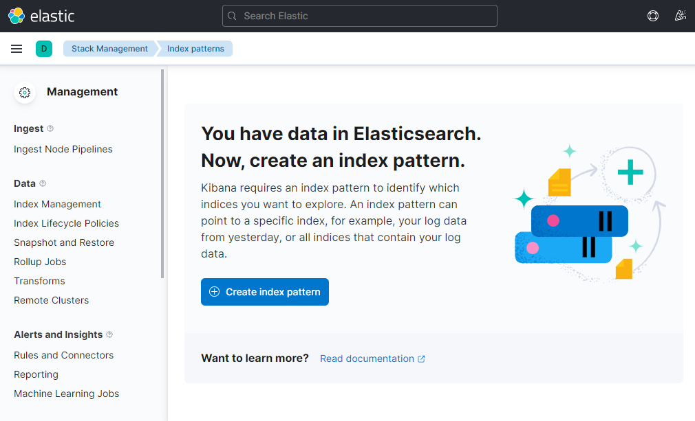

> &#10240;
>If you see some old/previous install data and the index is already set up, there is probably old data from Docker. You can delete the old volumes and find them as a directory under the path:
>
>**Path on WSL:**
>```Shell
>\\wsl$\docker-desktop-data\version-pack-data\community\docker\volumes
>```
>**Path on Linux:**
>```Shell
>/var/lib/docker/volumes/
>```
> &#10240;

#### Create a log index pattern:

For logs, create the pattern `webapi-*`. This connects all app logs from different environments.

**NOTE:** You can define your own pattern, however you want to combine the data...


**NOTE:** It is required that the application runs with logging and tracking settings. This will automatically generate index patterns and send some data to Elastic. Without data, it is not possible to set up index patterns in Kibana!

You should see these patterns in the recommendation list:

- `apm-*` (`apm-7.14.0-error`, `apm-7.14.0-metric` etc...)
- `webapi-*` (`webapi-development` or `api-production` or webapi-anything...)

The `apm` indexes are created by the APM server. The `webapi-*` indexes are created by the logging exporter (*Serilog ElasticSink*) and depend on our logging setup, where you can find this line:

```c#
//Application logs are indexed by enviroment (`api-development` or `api-production` ... ).
IndexFormat = $"{Assembly.GetExecutingAssembly().GetName().Name.ToLower().Replace(".", "-")}-{environment?.ToLower().Replace(".", "-")}-{DateTime.UtcNow:yyyy-MM}",
```

The next step is to select a primary index field. Usually you want to filter and sort by `@timestamp`.

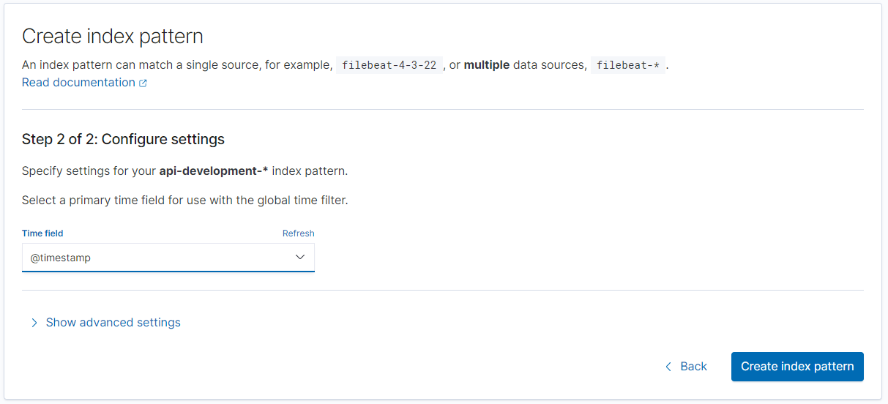

As you can see in the last screen, the elastic is `parsed > normalised > recoginze fields types` and provides information about search and aggregation field options.


If you now navigate to the discover page again, you should be able to see the latest logs sent by the application.

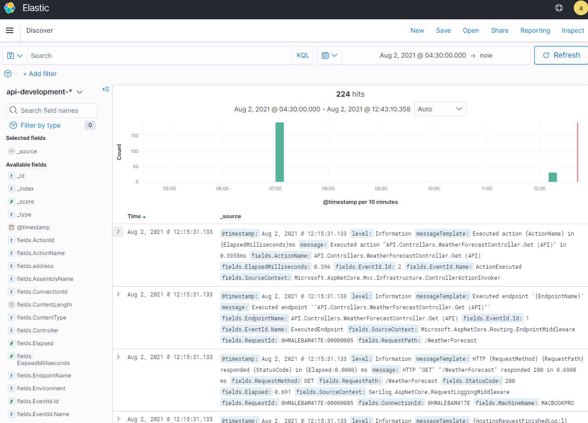

##### Logs structure

Each log may contain different data, but the main header is always the same. The contents of the 'fields` may change. This is an example of a log showing the hit of a concrete API endpoint:

```json
{
  "_index": "webapi-development-2021-08",
  "_type": "_doc",
  "_id": "EZX0mHsB9UlYcIijQLV6",
  "_score": 1,
  "_source": {
    "@timestamp": "2021-08-30T23:25:47.7022963+02:00",
    "level": "Information", // Log level
    "messageTemplate": "{HostingRequestStartingLog:l}",
    "message": "Request starting HTTP/2 GET https://localhost:5001/WeatherForecast - -",
      "fields": {
        "SourceContext": "Microsoft.EntityFrameworkCore.Infrastructure",
        "MachineName": "MACBOOKPRO",
        "SpanId": "d6024110ad7ceaad",
        "TraceId": "94e07d57236fb28408ceb5ff29134b52",
        "ParentId": "d444092df9e7e2d2",
        "Environment": "Development"
        // And others
      },
  },
  "fields": {
    "fields.TraceId": ["6f3407b91b8699c43b7d1058a2e39a09"],
    "fields.ElasticApmTraceId": ["6f3407b91b8699c43b7d1058a2e39a09"],
    "fields.ParentId": ["f22ea25d52a9e3ef"],
    "fields.SpanId": ["5b2f3176a1cd6c78" ],
    "fields.RequestId": ["0HMBBVIO258NG:00000013"],
    "fields.Environment": ["Development"],
    "fields.MachineName": ["MACBOOKPRO"],
    "fields.ElasticApmTransactionId": ["5b2f3176a1cd6c78"],
    // And others
  }
}
```

</br>

### APM Services

The APM server knows the list of available services from the traces data already collected: (`APM Services Menu`)

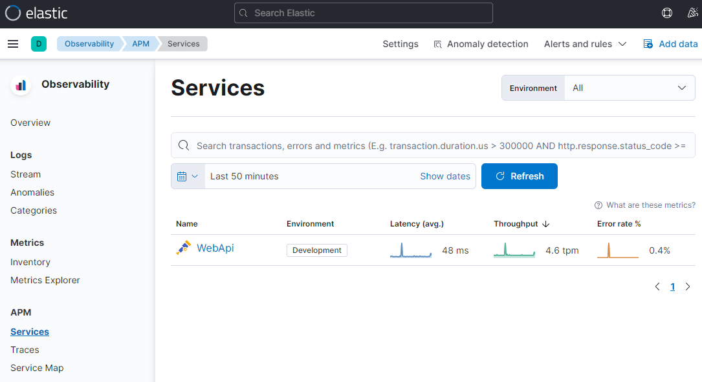

Service Detail provides various calculated statistics on trace data. (`APM Services WebAPI Menu`)

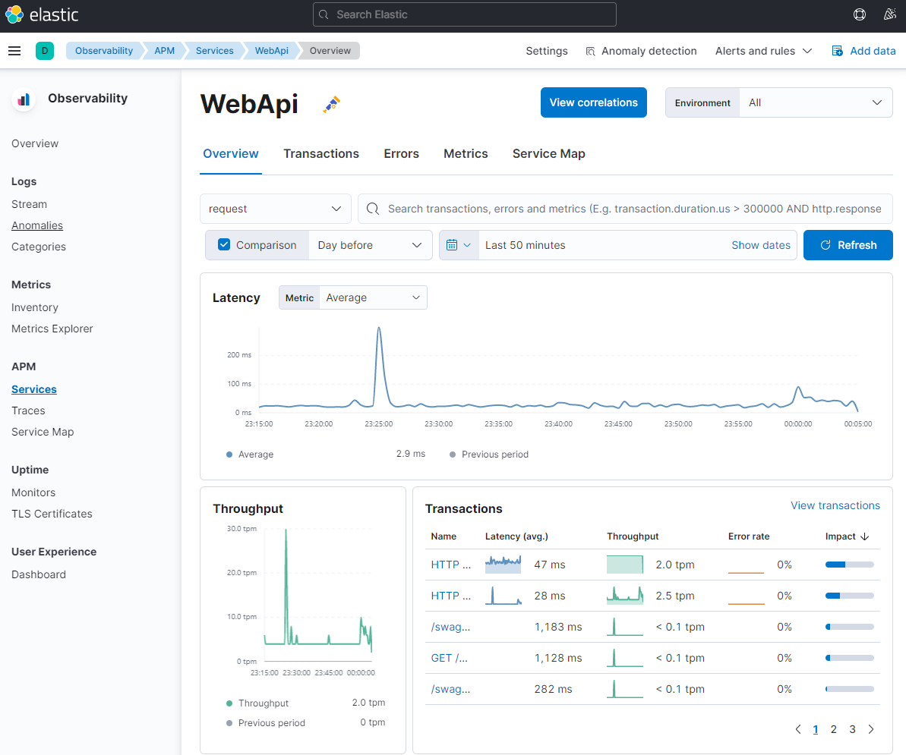

It also provides basic *metrics* for an application service. These are generated with the APM agent and exported (from the backend .net application)

```c# 
// program.cs 
app.UseElasticApm(configuration, new IDiagnosticsSubscriber [0]);
```

This includes APM middleware that exports basic service metrics under the hood. This agent is not used to export traces. Therefore, `new IDiagnosticsSubscriber [0]` means *"Do not register listeners "*. Traces are fully managed by the `opentelemry` SDK.

#### Connect traces and logs (**Trace vs. Logs**)

If you are working with distributed logging and distributed tracing. You need to be able to quickly search and lookup to determine what a problem is and where in the request it is.

- **Distributed tracing** can be visualised as a graph. You know where in the request the problem occurred, but you do not have comprehensive information because the traces are short and serve a different purpose.
- **Logs** have detailed information about the problem, but you do not always know which part of the request failed and which succeeded. Was the request aborted because a previous process failed, or did something happen within the request?

In production, there are too many logs to keep track of the root cause of the problem. To tie *tacing* and *logging* together, we have added some special fields to the logs to tie them together.

```
"@timestamp": "2021-08-02T12:15:31.1331494+02:00",
"level": "Information",
"SpanId": "a6478f899e2ffad9",
"TraceId": "c6888a1056d03b4e66cd79676e624f25",
"ParentId": "0000000000000000",
```

`@timestamp` - When the log was captured by the application
`level` - Log level
`SpanId` - Trace identifier for easier searching of logs from distributed tracing graphs (opentelemetry).
`TraceId` - Context trace ID
`ParentId` - Parrent SpanId - Associated Span Parrent. This makes more sense if you read more about opentelemetry.

This was done in [logger configuration](./Logging.md#L74).

```c#
logCfg = logCfg
    .Enrich.FromLogContext()
    .Enrich.WithExceptionDetails()
    .Enrich.WithMachineName()
    .Enrich.WithSpan() <-- This include Span and ParrentId in logs
```

**So what is the common process for determining the problem?**
1) First, we look in Tracing Graph to see where the problem lies. We collect the `SpanIds` and `TraceId` that we are interested in.
2) We use these `Ids` to filter and look for contextual logs about these `Ids` to get more details about what really happened.

> &#10240;
> **NOTE:** With Elastic APM, this pairing is done automatically and you can view corresponding logs in the trace view.
> &#10240;

Under `Elastic > APM > Logs` you need to configure the source index of the logs. (**Change Source Configuration**)

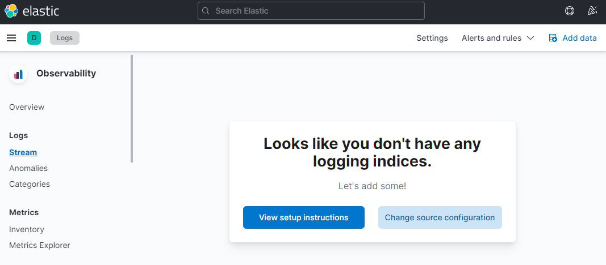

This will take you to the setup page where we select **Use Kibana index pattern**.

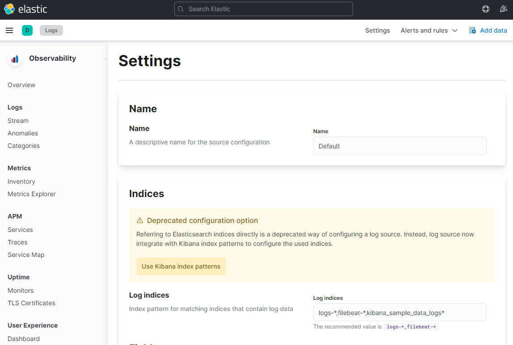

Then select from existing indexes:

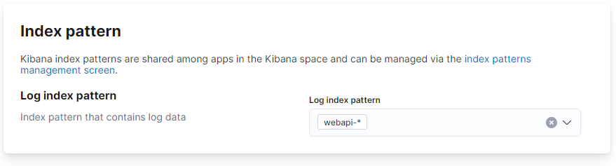

After this configuration, you can connect traces and logs and see them side by side.

**Trace timeline:**

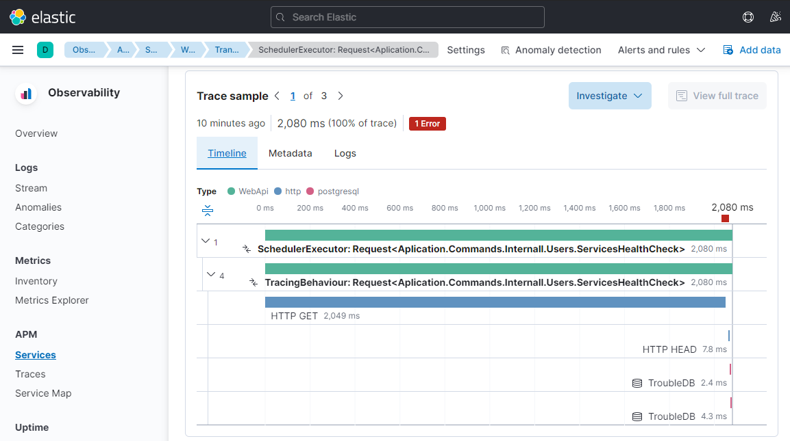

**Trace logs:**


>**NOTE:** To combine all logs indexes (sources) into one, you must combine them into an `index pattern`. You can do this at `Stack Management indexpattern`.

**Example summary pattern:** `logs-apm*,apm-*,filebeat-*,webapi-*`

(*Filebeat* etc. is configured below in the text).

</br>

### What is Logstash?

Logstash is a server-side data processing pipeline that collects data from a variety of sources simultaneously, parses it, transforms it, and then sends it to the Elastic

#### Configure Logstash index

Since `docker-compose.yml` contains the container **Logstash**, we need to add a new *index pattern* in Kibana UI to examine Logstash logs at *Discover View*.

Under `Stack Managment > Index patterns`

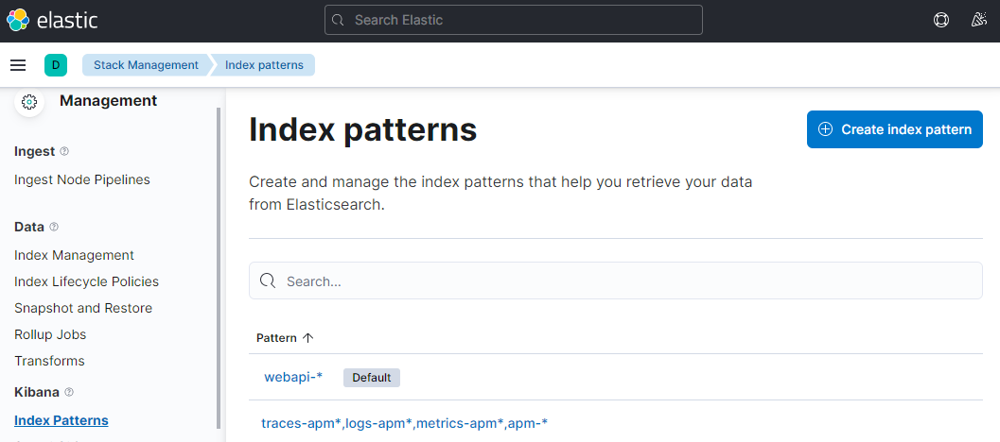

Creates `logstash-*` pattern


Now in *Discover* view you can switch between index patterns. Since no logs was sended over *Logstash* the empty result can be returned.


By our `docker-compose.yaml` and `logstash.conf` we defined to listen on `tcp`, `udp` and `http`.

#### logstash.conf
```shell
input {
	tcp {
		port => 5500
	}
	udp {
		port => 5500
	}
	http {
		host => "127.0.0.1" # default: 0.0.0.0
		port => 5501 # default: 8080
	}
}

# place for filters

output {
	elasticsearch {
		hosts => "elasticsearch01:9200"
	}
}

```

> &#10240;
> **NOTE :** You can listen to multiple inputs. The inputs are available as logstash plugins. For a complete list, see [offical elastic DOCS](https://www.elastic.co/guide/en/logstash/current/input-plugins.html).
We can send demo data with
>  &#10240;

You can test sending data to `logstash` with [PacketSender](https://packetsender.com/) to test `tcp` and `udp`. Or you can install [Postman](https://www.postman.com/) or use simple `curl` to test `http` input.

**PacketSender**


**Postman**


**Data from elastic dicover for `logstash`**


You can update the `logstash` configuration to inject the source processing defined in the 'filter' part.

You can see all available filter plugins [under the official documents](https://www.elastic.co/guide/en/logstash/current/filter-plugins.html).

#### Logstash pipeline (filters)

##### Mutate

Performs mutations on fields

```json
# Remove some field

filter {
    mutate {
        remove_field => ["headers"]
    }
}
```

```json
# Add custom field

filter {
  mutate {
     add_field => { "show" => "This data will be in the output" } 
  }
}
```

```json
# Rename field

filter {
  mutate {
      rename => {"shortHostname" => "hostname"}
  }
}

```

Some mutate operation:

`coerce` – this sets the default value of an existing field but is null
`rename` – rename a field in the event
`replace` – replace the field with the new value
`update` – update an existing field with new value
`convert` – convert the field value to another data type
`uppercase` – this converts a string field to its uppercase equivalent
`capitalize` – this converts a string field to its capitalized equivalent
`lowercase` – convert a string field to its lowercase equivalent
`strip` – remove the leading and trailing white spaces
`remove` - removes field
`split` – This splits an array using a separating character, like a comma
`join` – This will join together an array with a separating character like a comma

You can find more info for all suported mutate operations udned [official docs](https://www.elastic.co/guide/en/logstash/current/plugins-filters-mutate.html).

##### Date

Parses dates from fields to use as the Logstash timestamp for an event

```json
# Filter specific field and format

filter {
    date {
      match => [ "timestamp" , "dd/MMM/yyyy:HH:mm:ss Z" ]
  }
}
```

##### Conditional rules 
```json
# Conditionsal expression example (format)

if EXPRESSION {
  ...
} else if EXPRESSION {
  ...
} else {
  ...
}
```

You can use the following relational operators:

*Equality:* `==`, `!=`, `<`, `>`, `<=`, `>=`
*Regexp:* `=~`, `!~` (pattern on the right against a string value on the left)
*Inclusion:* `in`, `not in`
*Boolean operators:* `and`, `or`, `nand`, `xor`
*Unary operators:* `!`

```json
# Conditional filter mutate example

filter {
  if [action] == "login" {
    mutate { remove_field => "secret" }
  }
}
```

```json
# Conditional filter example

if [type] == "nginx" {
  filter {
    mutate {
      coerce => { "service_name" => "nginx" }
      add_field => {
          "logtype" => "nginx"
          "service_name" => "myservicename"
          "hostname" => "%{host}"
        }
    }
  }
}

```

```json
# Conditional filter example

filter {
  if "_sometag_" not in [tags] {
    mutate {
      replace => { "type" => "somelog_A" }
    }
  }
  ...
  if "syslog_A" in [tags] {
    mutate {
      replace => { "type" => "somelog_B" }
    }
  }
}
```

```json
# Conditional filter example

filter {
  if [foo] in [foobar] {
    mutate { add_tag => "field in field" }
  }
  if [foo] in "foo" {
    mutate { add_tag => "field in string" }
  }
  if "hello" in [greeting] {
    mutate { add_tag => "string in field" }
  }
  if [foo] in ["hello", "world", "foo"] {
    mutate { add_tag => "field in list" }
  }
  if [missing] in [alsomissing] {
    mutate { add_tag => "shouldnotexist" }
  }
  if !("foo" in ["hello", "world"]) {
    mutate { add_tag => "shouldexist" }
  }
}
```

## Beats

Beats are single-purpose data senders. They work as agents on your servers and send operational data to Elasticsearch.

For more information, see [Official Documentation](https://www.elastic.co/guide/en/beats/libbeat/current/beats-reference.html).

There are also many open source [comunity beats available](https://www.elastic.co/guide/en/beats/libbeat/current/community-beats.html).


This demo uses:
 - `Filebeat` - Used to send external logs to the system.
 - `Heartbeat` - Monitors services for availability with active probing
 - `Metricbeat` - Collects metrics from your systems and services
 - `Packetbeat` - Monitoring your network traffic is critical to the observability and security of your environment.
### Beats docker install

Beats as agents can be installed: - Properly on the system - As a Docker container

In this demo, `Beats` is set up as a separate Docker container group. It is important to understand that 'Beats' monitors other containers from the outside. (Host Network).

#### Compose Docker

The `./Src/Docker/Elastic/Beats` folder contains the global compose file for all beats. The folder also contains separate config files for each beat.

**`docker-compose.yml`**
<pre style="max-height: 400px; overflow-y:scroll !important">
<code>
version: '3'
services:
  filebeat:
    image: docker.elastic.co/beats/filebeat:7.14.0
    restart: on-failure
    container_name: filebeat
    # Need to override user so we can access the log files, and docker.sock
    user: root
    volumes:
      - ./filebeat-config.yml:/usr/share/filebeat/filebeat.yml:ro
      - filebeat:/usr/share/filebeat/data
      - /var/run/docker.sock:/var/run/docker.sock
      # This is needed for filebeat to load container log path as specified in filebeat.yml
      - /var/lib/docker/containers/:/var/lib/docker/containers/:ro
      # This is needed for filebeat to load logs for system and auth modules
      - /var/log/:/var/log/:ro
      # This is needed for filebeat to load logs for auditd module. you might have to install audit system
      # on ubuntu first (sudo apt-get install -y auditd audispd-plugins)
      - /var/log/audit/:/var/log/audit/:ro
    environment:
      - ELASTICSEARCH_HOST=localhost:9200
      - KIBANA_HOST=localhost:5601
    # disable strict permission checks
    command: --strict.perms=false -e  # -e flag to log to stderr and disable syslog/file output
    network_mode: "host"

  heartbeat:
    image: docker.elastic.co/beats/heartbeat:7.14.0
    restart: on-failure
    user: root
    container_name: heartbeat
    volumes:
      - ./heartbeat-config.yml:/usr/share/heartbeat/heartbeat.yml:ro
      - /var/run/docker.sock:/var/run/docker.sock
    network_mode: "host"
    environment:
      - ELASTICSEARCH_HOST=localhost:9200
      - KIBANA_HOST=localhost:5601
    command: --strict.perms=false -e  # -e flag to log to stderr and disable syslog/file output

  metricbeat:
    image: docker.elastic.co/beats/metricbeat:7.14.0
    restart: on-failure
    container_name: metricbeat
    user: root
    volumes:
      - ./metricbeat-config.yml:/usr/share/metricbeat/metricbeat.yml:ro
      - /var/run/docker.sock:/var/run/docker.sock
      - /sys/fs/cgroup:/hostfs/sys/fs/cgroup:ro
      - /proc:/hostfs/proc:ro
      - /:/hostfs:ro
    network_mode: "host"
    command: "--strict.perms=false -e"

  packetbeat:
    image: docker.elastic.co/beats/packetbeat:7.14.0
    restart: on-failure
    container_name: packetbeat
    user: root
    volumes:
      - ./packetbeat-config.yml:/usr/share/packetbeat/packetbeat.yml:ro
      - packetbeat:/usr/share/packetbeat/data
      - /var/run/docker.sock:/var/run/docker.sock
    environment:
      - ELASTICSEARCH_HOST=localhost:9200
      - KIBANA_HOST=localhost:5601
    cap_add:
      - NET_RAW
      - NET_ADMIN
    command: --strict.perms=false -e  # -e flag to log to stderr and disable syslog/file output
    network_mode: "host"

volumes:
  filebeat:
  packetbeat:
</code>
</pre>


1) Create/Copy `docker-compose.yml` [../Src/Docker/ElasticSearch/Beats/docker-compose.yml](../Src/Docker/ElasticSearch/Beats/docker-compose.yml).

2) Run `docker-compose up`. This will create, (re)create, start and attach containers for a service.

    *Output:*
    ```shell
    Creating packetbeat ... done
    Creating filebeat   ... done
    Creating metricbeat ... done
    Creating heartbeat  ... done

This will take some time to complete. If a container fails, it will try to start itself in a loop.

<br/>

#### Explore containers
There should be 4 running containers available under your docker. You can use docker UI or the terminal `docker ps` to see all running containers. Use `docker ps -a` to see all containers (running/non-running).


Or from terminal: (`docker ps`)

```shell
# Docker Id is always different
59a056442b16   docker.elastic.co/beats/metricbeat:7.14.0              "/usr/bin/tini -- /u…"   4 minutes ago   Up 3 minutes                                                                                           metricbeat
180ab1ee7e2c   docker.elastic.co/beats/heartbeat:7.14.0               "/usr/bin/tini -- /u…"   4 minutes ago   Up 3 minutes                                                                                           heartbeat
8c97d66008af   docker.elastic.co/beats/filebeat:7.14.0                "/usr/bin/tini -- /u…"   4 minutes ago   Up 3 minutes                                                                                           filebeat
ec046599bd38   docker.elastic.co/beats/packetbeat:7.14.0              "/usr/bin/tini -- /u…"   4 minutes ago   Up 3 minutes                                                                                           packetbeat
```

You can see the status of the container and how long it has left to run. To start a container, you can use the following `docker start container_name`

 
### Metricbeat

`Metricbeat` is a metrics shipper that acts as an agent (installed on the machine) to collect and send various system and service metrics, preprocess them and forward the supported outputs.

**Metrics example:** `CPU usage`, `Memory usage`, `System Uptime` etc.. 

The behaviour of `Metricbeat` is defined by its configuration file. The entire file used is available at `Src/Docker/Elasticsearch/Beats/metricbeat-config.yml`.

In this scenario, `Metricbeat` collects logs from all the containers and sends this data directly to Elastic. This helps us to shop all the logs associated with the containers in the Elastic engine.

> &#10240;
> **NOTE:** Metrics are also sent from the client application via the `Opentelemetry` log and the `APM` agent. This all together creates one source for all observational data and allows us to easily visualise it with Kibana dashboards.
> &#10240;

**Configuration `metricbeat-config.yml`**

<pre style="max-height: 400px; overflow-y:scroll !important">
<code>

# --------------Autodiscover--------------
# Autodiscover providers work by watching for events on the system and translating those events into internal autodiscover events with a common format
# https://www.elastic.co/guide/en/beats/metricbeat/current/configuration-autodiscover.html
metricbeat.autodiscover:
  providers:
    - type: docker
      # https://www.elastic.co/guide/en/beats/metricbeat/current/configuration-autodiscover-hints.html
      hints.enabled: true

# --------------Modules--------------
# The System module allows you to monitor your servers. Because the System module always applies to the local server, the hosts config option is not needed.
# System module reference: https://www.elastic.co/guide/en/beats/metricbeat/6.8/metricbeat-module-system.html
# The System core metricset provides usage statistics for each CPU core.

metricbeat.modules:
- module: system
  metricsets:
    - cpu             # CPU usage
    - load            # CPU load averages
    - memory          # Memory usage
    - network         # Network IO
    - process         # Per process metrics
    - process_summary # Process summary
    - uptime          # System Uptime
    - socket_summary  # Socket summary
    - core           # Per CPU core usage
    - diskio         # Disk IO
    - filesystem     # File system usage for each mountpoint
    - fsstat         # File system summary metrics
    - raid           # Raid
    #- socket         # Sockets and connection info (linux only)
  processes: ['.*']
  process.include_top_n:
    by_cpu: 5
    by_memory: 5
  period: 10s
  cpu.metrics:  ["percentages", "normalized_percentages"] # The other available options are normalized_percentages and ticks.
  core.metrics: ["percentages"] # The other available option is ticks.

- module: docker
  metricsets: ["container", "cpu", "diskio", "healthcheck", "info", "memory", "network"]
  period: 10s
  hosts: ["unix:///var/run/docker.sock"]

# --------------Output--------------
# Metricsbeat supports multuple outputs: https://www.elastic.co/guide/en/beats/metricbeat/current/configuring-output.html
output.elasticsearch:
  hosts: ["localhost:9200"]

# --------------Kibana settings--------------
# Kibana dashboards are loaded into Kibana via the Kibana API. This requires a Kibana endpoint configuration.
# Kibana setup reference: https://www.elastic.co/guide/en/beats/metricbeat/current/setup-kibana-endpoint.html


setup.kibana:
  host: "localhost:5601"

setup.dashboards:
  enabled: true
</code>
</pre>


##### Explore Metricsbeat in Kibana

See `Inventory of monitoring metrics` for the detected services. Based on the configuration file, these are displayed:

- Under Hosts - `docker-desktop` this is Docker global (measured with `module: system` ).
- Under Containers - All Docker containers (measured with `module: docker` )

1) Select Metrics Host / Container  </br>
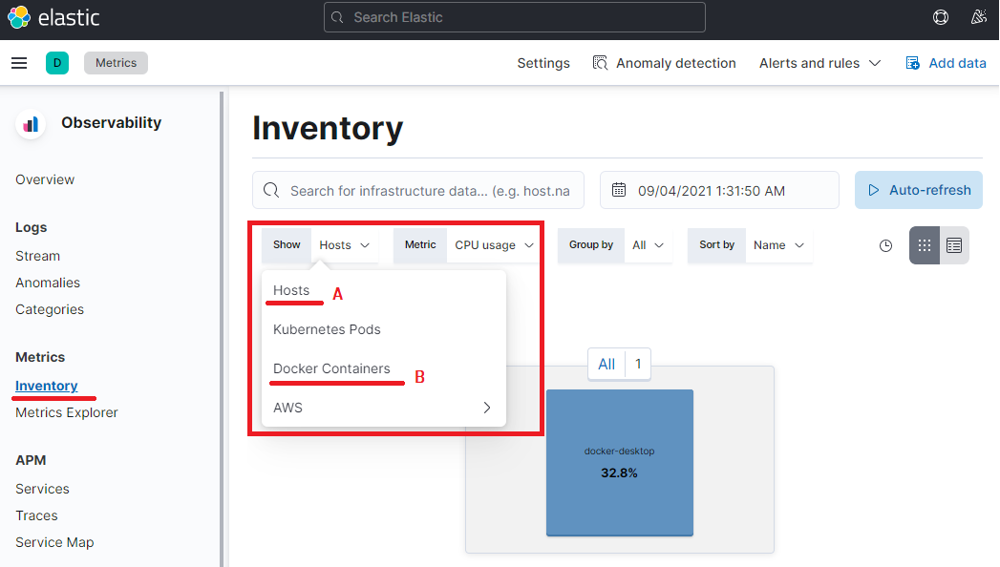

 </br>
 
2) Docker system metrics view  </br>


 </br>

3) Docker system metrics detail view </br>
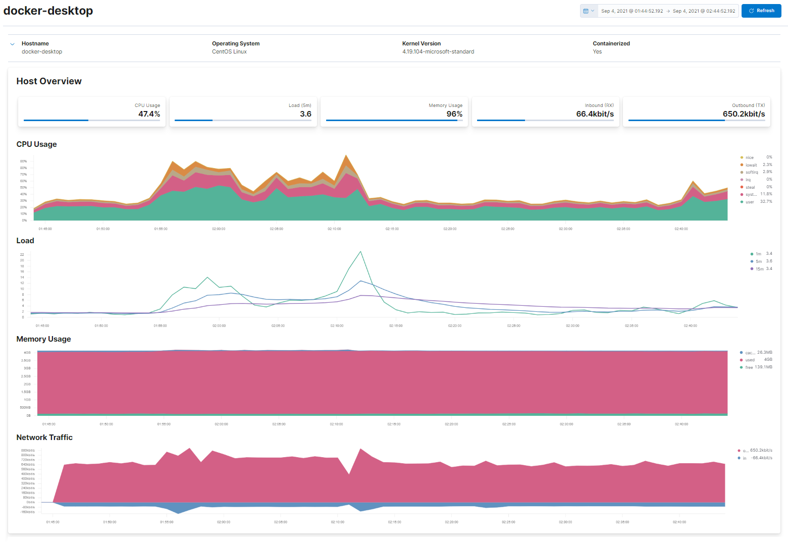

### Filebeat

`Filebeat` is a log shipper that is used as an agent (installed on the machine) that generates the log files, processes them and forwards one of the supported outputs.

The behaviour of `Filebeat` is defined by its configuration file. The full file can be found at `Src/Docker/Elasticsearch/Beats/filebeat-config.yml`.

In this scenario, `Filebeat` collects logs from all containers and sends this data directly to Elastic. This helps us to shop all the logs associated with the containers in Elastic engine.

**Configuration `filebeat-config.yml`**
<pre style="max-height: 400px; overflow-y:scroll !important">
<code>

# --------------Autodiscover--------------
# Autodiscover allows you to track pods and adapt settings as changes happen in your environment.
# https://www.elastic.co/guide/en/beats/filebeat/6.8/configuration-autodiscover.html

filebeat.autodiscover:
  # Providers are essential configurables that monitor system events and reformat them as internal autodiscover events. Providers must be defined in order for Autodiscover to work. 
  providers:
    - type: docker
      # https://www.elastic.co/guide/en/beats/filebeat/current/configuration-autodiscover-hints.html
      hints.enabled: true

# --------------Inputs--------------
# Inputs specify how Filebeat locates and processes input data.
# Filebeat support multiple inputs: https://www.elastic.co/guide/en/beats/filebeat/current/configuration-filebeat-options.html

# Full docker input reference: https://www.elastic.co/guide/en/beats/filebeat/current/filebeat-input-docker.html 
filebeat.inputs:     
- type: docker
  combine_partial: true
  exclude_lines: ['^DBG']  # Other options: '^ERR', '^WARN'
  containers:
    path: "/var/lib/docker/containers"
    stream: "stdout"
    ids:
      - "*" # or specify concrete id. * -> means all

# --------------Modules--------------
# Filebeat modules provide a quick way to get started processing common log formats
# Modules reference: https://www.elastic.co/guide/en/beats/filebeat/current/filebeat-modules.html
]


# --------------Output--------------
# Filebeat supports multuple outputs: https://www.elastic.co/guide/en/beats/filebeat/current/configuring-output.html
output.elasticsearch:
  hosts: ["localhost:9200"]

# --------------Kibana settings--------------
# Kibana dashboards are loaded into Kibana via the Kibana API. This requires a Kibana endpoint configuration.
# Kibana setup reference: https://www.elastic.co/guide/en/beats/filebeat/current/setup-kibana-endpoint.html

setup.kibana:
  host: "localhost:5601"

setup.dashboards:
  enabled: true
</code>
</pre>

##### Explore Filebeat in kibana

There are several ways you can view container logs under Kibana:
- Navigate via concrete views
- Direct logs view under `Observability/Logs/Streams`.

###### A) Navigate from concrete views

<ul>
Docker containers view

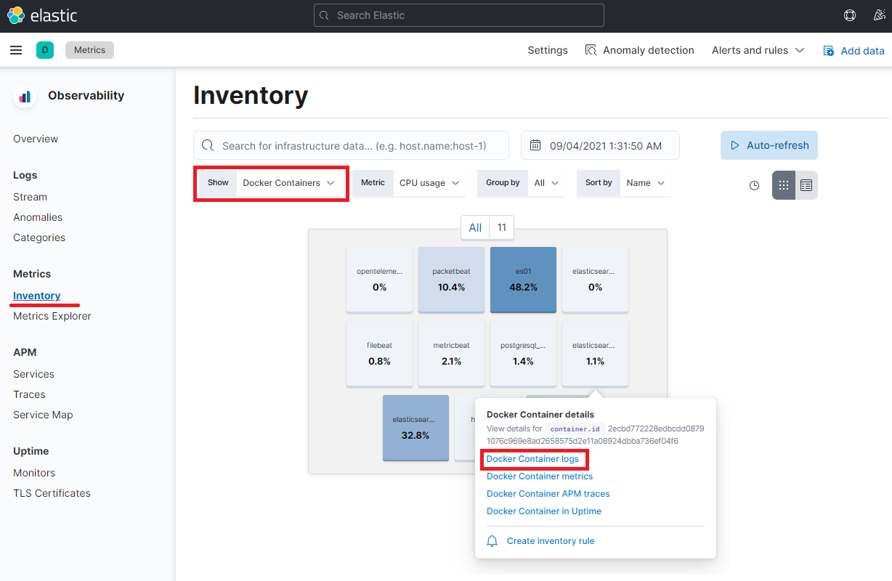

Docker host system view

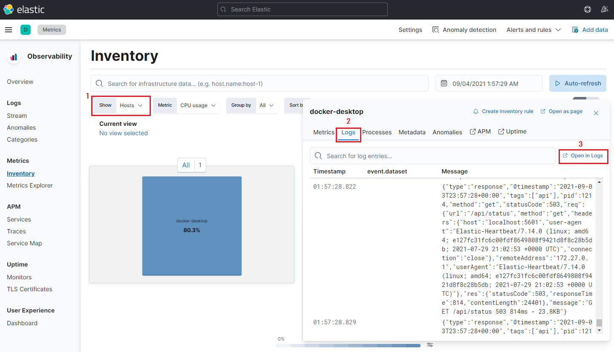

</ul>

###### B) Direct logs explore under `Observability/Logs/Streams`

Kibana provides nice intelisence:


  1) Select filter operation (`container.id`)  </br>
  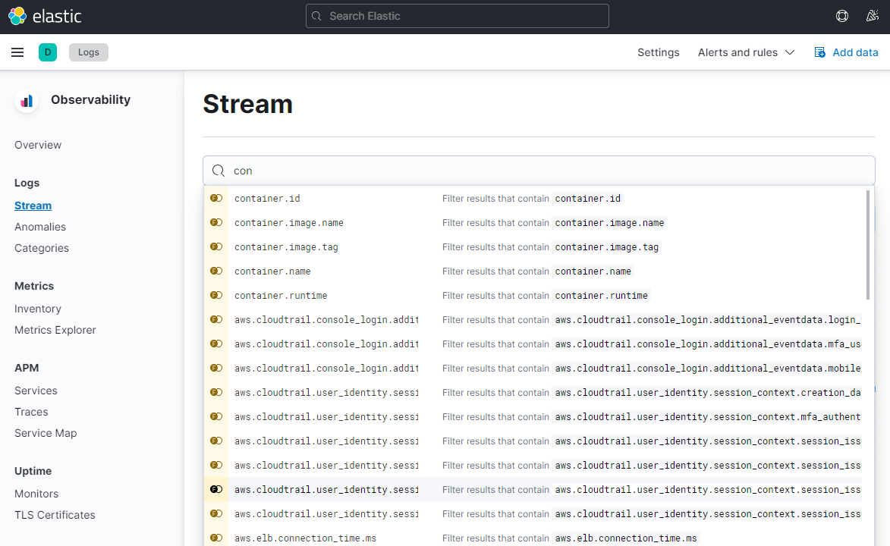

 </br>

  2) Select comparation operation (`equal`)   </br>
  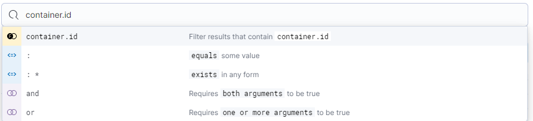

 </br>

  3) Select from awailable container ids (`id`)   </br>
  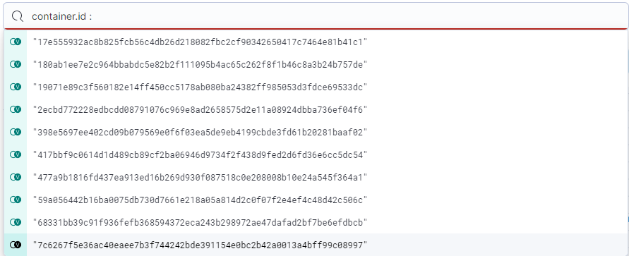

 </br>

  4) Logs filtred by concrete container:   </br>
  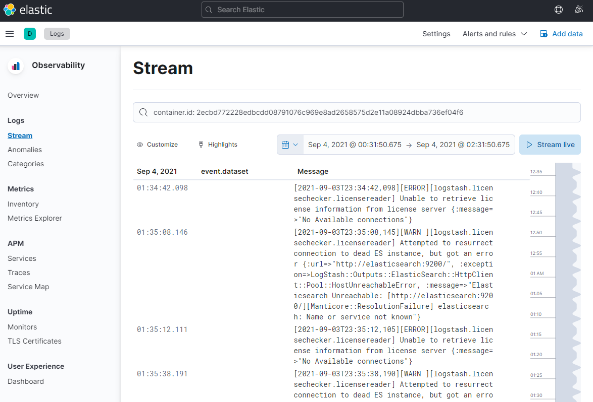


#### Heartbeat

`Heartbeat` is a health shipper that is used as an agent (installed on the machine) and monitors the uptime of services by pinging or calling them and forwarding the results to one of the supported outputs.

The behaviour of `Heartbeat` is defined by its configuration file. The full file can be found at `Src/Docker/Elasticsearch/Beats/heartbeat-config.yml`.

In this scenario, `Heartbeat` periodically collects the services data via `tcp` and `http` calls.

**From `heartbeat-config.yml`:**

```yml
- type: tcp
  name: Elasticsearch-TCP
  schedule: '@every 5s'
  hosts: ["localhost:9200"]
  ipv4: true
  ipv6: false
  mode: any
```

```yml
- type: http
  id: Elasticsearch-status
  name: Elasticsearch
  service.name: elasticsearch
  hosts: ["http://localhost:9200/_cluster/health"]
  check.response.status: [200]
  schedule: '@every 5s'
```


**Configuration `metricbeat-config.yml`**
<pre style="max-height: 400px; overflow-y:scroll !important">
<code>

# --------------Settings--------------
monitoring.enabled: true
logging.to_files: false

# --------------Monitors--------------
# Heartbeat define a set of monitors to check your remote hosts
# Reference: https://www.elastic.co/guide/en/beats/heartbeat/current/configuration-heartbeat-options.html
heartbeat.monitors:

# Elastic tcp session monitor
- type: tcp
  name: Elasticsearch-TCP
  schedule: '@every 5s'
  hosts: ["localhost:9200"]
  ipv4: true
  ipv6: false
  mode: any

# Kibana tcp session monitor
- type: tcp
  name: Kibana-TCP
  schedule: '@every 5s'
  hosts: ["localhost:5601"]
  ipv4: true
  ipv6: false
  mode: any

# Elastic server status monitor
- type: http
  id: Elasticsearch-status
  name: Elasticsearch
  service.name: elasticsearch
  hosts: ["http://localhost:9200/_cluster/health"]
  check.response.status: [200]
  schedule: '@every 5s'

# Kibana server status monitor
- type: http
  id: Kibana-status
  name: Kibana
  service.name: kibana
  hosts: ["http://localhost:5601/api/status"]
  check.response.status: [200]
  schedule: '@every 5s'

# --------------Processors--------------
processors:
- add_docker_metadata: ~

# --------------Output--------------
# Heartbeat supports multuple outputs: https://www.elastic.co/guide/en/beats/heartbeat/current/configuring-output.html

output.elasticsearch:
  hosts: ["localhost:9200"]

# --------------Kibana settings--------------
# Kibana dashboards are loaded into Kibana via the Kibana API. This requires a Kibana endpoint configuration.
# Kibana setup reference: https://www.elastic.co/guide/en/beats/heartbeat/current/setup-kibana-endpoint.html

setup.kibana:
  host: "localhost:5601"

setup.dashboards:
  enabled: true
</code>
</pre>

##### Explore Heartbeat (Monitors) in Kibana

1) Select monitor from navigation </br>
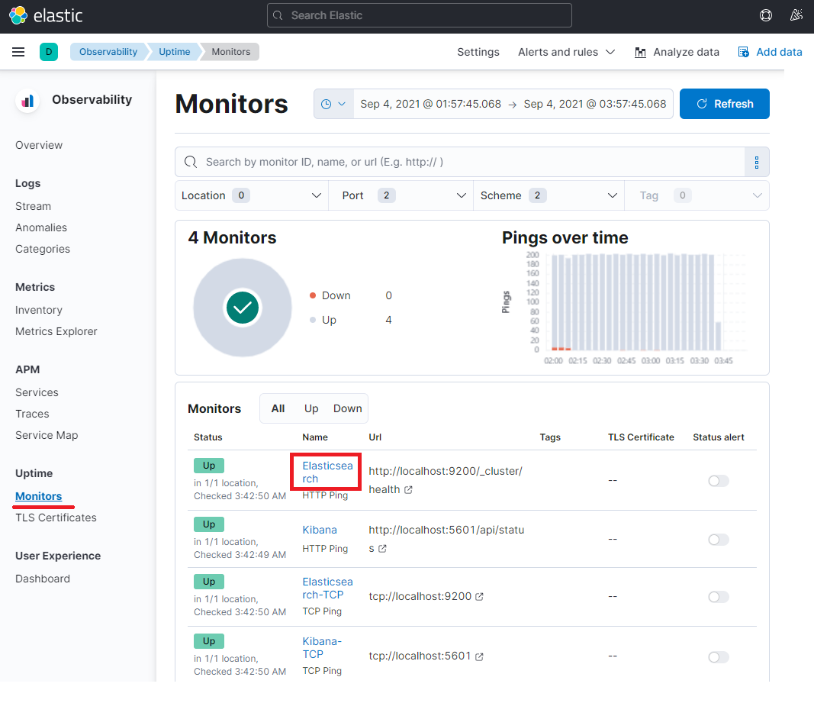

 </br>
 
2) Click on monitor detail </br>
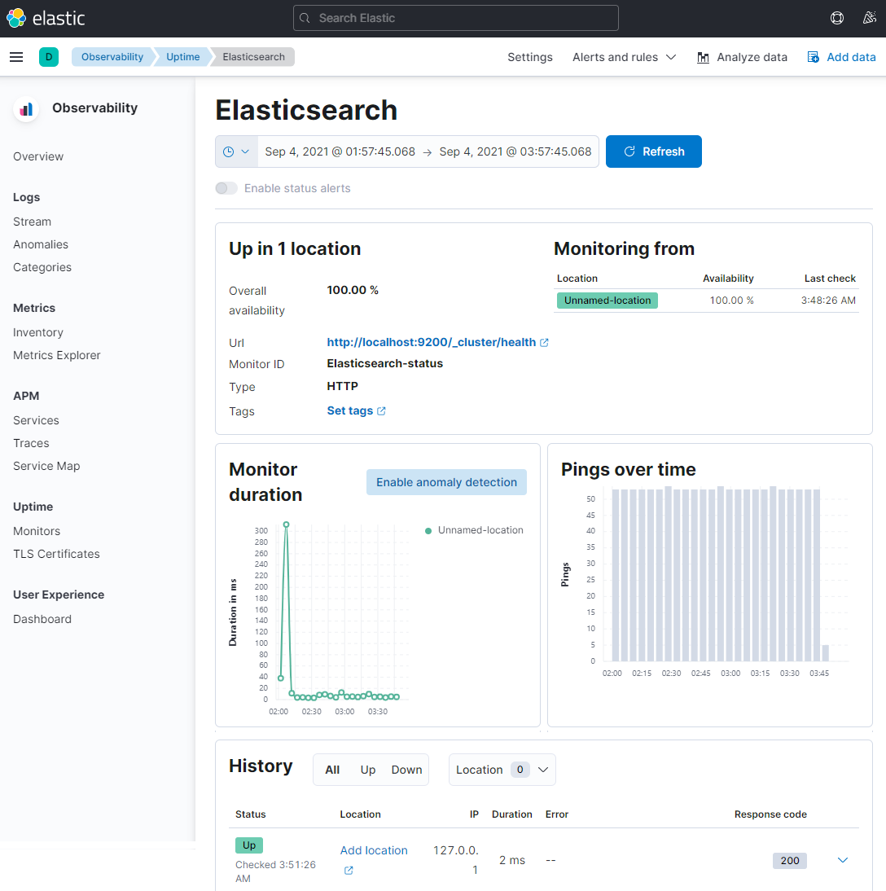

 </br>


#### Packetbeat

`Packetbeat` is a real-time network packet analyzer that providing an application monitoring and performance analytics. Works by capturing the network traffic between your application servers, decoding the application layer protocols and forwards results to one of supported outputs.

Behaviour of `Packetbeat` is defined by its configuration file. The full used file is available under `Src/Docker/Elasticsearch/Beats/packetbeat-config.yml`

In this scenario `Packetbeat` collect network traffic inside docker host network. This covers all cross container comunication.

**Configuration `packetbeat-config.yml`**
<pre style="max-height: 400px; overflow-y:scroll !important">
<code>

# --------------Settings--------------
# Reference: https://www.elastic.co/guide/en/beats/packetbeat/6.8/configuration-interfaces.html#configuration-interfaces
packetbeat.interfaces.device: any
packetbeat.interfaces.buffer_size_mb: 100

# --------------Flows--------------
# Reference: https://www.elastic.co/guide/en/beats/packetbeat/master/exported-fields-flows_event.html
packetbeat.flows:
  timeout: 30s
  period: 10s

# --------------Transaction protocols--------------
# Protocol reference: https://www.elastic.co/guide/en/beats/packetbeat/current/configuration-protocols.html

packetbeat.protocols:
- type: http
  ports: [80, 5601, 9200, 8080, 8081, 5000, 8002]
  send_headers: true
  send_all_headers: true

- type: pgsql
  ports: [6543]

- type: icmp
  enabled: true

- type: dhcpv4
  ports: [67, 68]

- type: dns
  ports: [53]
  include_authorities: true
  include_additionals: true

- type: tls
  ports: [443, 993, 995, 5223, 8443, 8883, 9243]

# --------------Processors--------------
processors:
  - add_cloud_metadata: ~
  - add_docker_metadata: ~
  - dns:
      type: reverse
      fields:
        source.ip: source.hostname
        destination.ip: destination.hostname

# --------------Output--------------
# Packetbet supports multuple outputs: https://www.elastic.co/guide/en/beats/packetbeat/current/configuring-output.html

output.elasticsearch:
  hosts: ["localhost:9200"]

# --------------Kibana settings--------------
# Kibana dashboards are loaded into Kibana via the Kibana API. This requires a Kibana endpoint configuration.
# Kibana setup reference: https://www.elastic.co/guide/en/beats/packetbeat/master/setup-kibana-endpoint.html

setup.kibana:
  host: "localhost:5601"

setup.dashboards:
  enabled: true
</code>
</pre>

##### Explore Network monitoring

1) Select `Security > Network`</br>
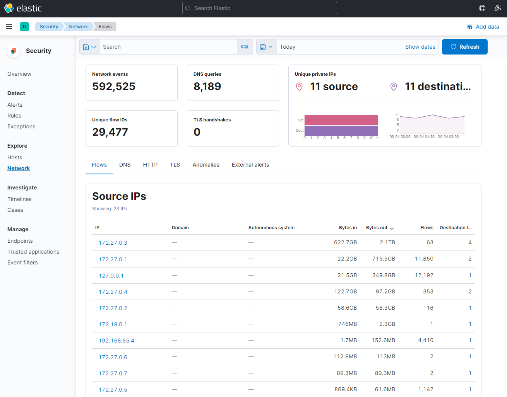

 </br>


### Kibana Dashboards

1) `Dashboard > [Metricbeat Docker] Overview ECS` </br>


</br>

2) `Dashboard > [Metricbeat System] Host overview ECS` </br>


</br>

3) `Dashboard > [Packetbeat] Overview ECS > HTTP transactions` </br>
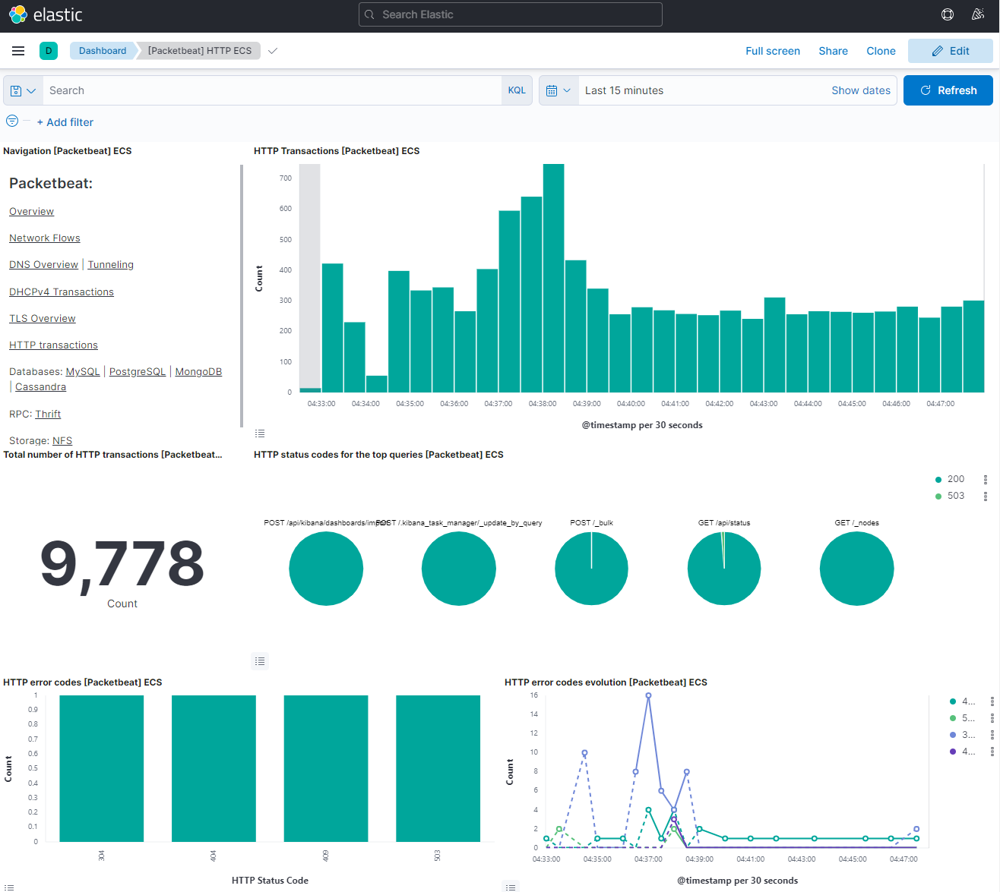

</br>

4) `Dashboard > [Packetbeat] Overview ECS > Overview` </br>


</br>