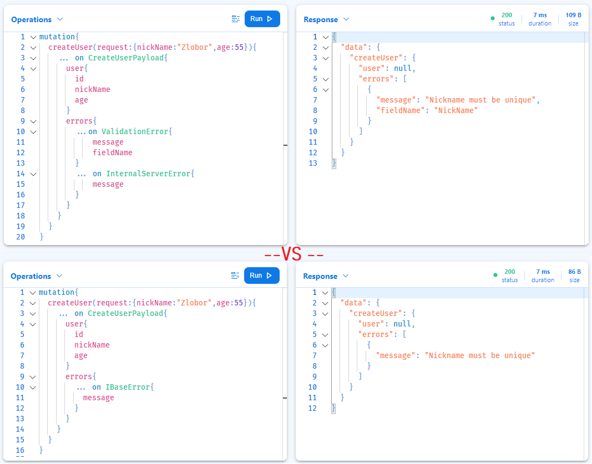

## Intro

Dealing with errors in Graphql is a topic on which there are numerous articles and recommendations, but there are not many real-world examples of how to implement a concrete approach under a given language and GraphQL server.

This article tries to show the concrete implementation of **stage 6a** mutation error handling from *Marc-Andre Giroux* [Guide to graphql errors](https://productionreadygraphql.com/2020-08-01-guide-to-graphql-errors) under **Hotchocolate** (.Net) GraphQL Server including some base integration with MediatR.

These are the advantages of the 6a approach:
✅Pro: Expressive and Discoverable Schema
✅Pro: Support for Multiple Errors
✅Pro: Easier Evolution

Before we begin, let me show you an example from the playground of **6a** error. The pattern allows you to choose whether to use one concrete type as the `union` or group them all together using the common `IBaseError` interface:



> &#10240;
> **NOTE:** Please make sure you have already [read his](https://productionreadygraphql.com/2020-08-01-guide-to-graphql-errors) article, because my article does not explain the advantages or disadvantages of the different approaches. I only take the most recommended approach (**6a**) and show the implementation under Hotchocolate GraphQL Server.
> &#10240;

### Content

- [Intro](#intro)
  - [Content](#content)
- [GraphQL Errors](#graphql-errors)
- [Mutation Errors](#mutation-errors)
- [Stage 6a Integration](#stage-6a-integration)
  - [Abstraction](#abstraction)
    - [Validation errors](#validation-errors)
    - [Authorization errors](#authorization-errors)
  - [Hotchocolate integration](#hotchocolate-integration)
- [Clinet](#clinet)
- [Repository](#repository)

> &#10240;
>**The full demo sources** with frontend and backend can be found at the end of this article!
> &#10240;

## GraphQL Errors

Before I explain the specific mutation error handling and schema design, let us first understand what kinds of errors we may face in Fronted. To explain this, think of the errors as different groups with different purposes. I have classified them as follows:

- **Network Errors** - An error probably occurred during the transfer and the endpoint was not reached, or a serious problem occurred before execution began. This error may be returned, for example, if the service is down. The correct error code is returned via the http status code. This does not have much to do with graphql and is more related to the transport or services (proxies) before the API. In this scenario, you should probably display the error page with the option to retry the operation at UI or automatically retrigger it, as it could be a temporary connection problem.

- **GraphQL Top-Level Errors** - (syntax, validation, and execution errors). The Graphql server response status code is OK200 because the request was processed and the specific error is returned with Graphql `Error[]` in the Graphql response. Depending on the error type, you should react differently. These errors are usually developer errors, which you generally do not want to show to users as they are not very helpful as they provide developer-related context to the problem. They are important if you have public APIs or want to test your Graphql server interactively, as they provide information about missing fields, wrong types or errors in execution.
    - Syntax - incorrect query syntax.
    - Validation - query includes field that does not exist
    - Execution errors - exceptions, timeouts, etc.

- **Mutation Errors** - User-defined errors for concrete mutations (mutation-specific errors). It is best to group this erros in `Error[]` field in the payload of each mutation. This can be done using interfaces or unions. The network status code is always OK200.

- **Query Error** - A query usually asks for several pieces of data, and some parts may possibly fail. There are the following options on how to handle these failed parts (errors).
    - Errors can be grouped in the default graphql response `Error[]` or in a separate custom field for them. The network status code is always OK200.
    - Using unios and interfaces so that a concrete field can return not only the response type, but also multiple errors as separate types. This must be handled at the Qurey level in your client applications. The network status code is always OK200.

## Mutation Errors

Each mutation can return multiple errors. For example, the most common errors you can get back are:
- *ValidationError* - if some fields in the InputObjects type are invalid.
- *AuthorizationError* - if you do not have permission to trigger a specific side-effect or access a resource defined in the InputObject.
- *InternalServerError* - something bad happened during the mutation process.

You can also specify any other contextual error, such as *UserDeactivated* or *PostIsNotPublished*, depending on the state of the object in your system. This way, you can control the user experience in UI and respond differently depending on the error type returned. And each error type can contain different fields.

> &#10240;
> **NOTE:** To learn more about the different approaches to dealing with mutation errors, please read the article by *Marc-Andre Giroux* [Guide to graphql errors](https://productionreadygraphql.com/2020-08-01-guide-to-graphql-errors) before reading on. This should help you understand the advantages and disadvantages of each option he presents.
> &#10240;

These are the theoretical concepts and in this article I will show you the basic implementation of the most recommended pattern 6a using unions and interfaces.

## Stage 6a Integration

There are some packages you need to use with my demo. The main ones are:
- [Hotchocolate](https://github.com/ChilliCream/hotchocolate) GraphQL server. This is the most advanced server for a .Net environment. This article does not go into the basics and assumes some framework knowledge.
- [MediatR](https://github.com/jbogard/MediatR) as a handler for the application logic, leaving the mutations a thin layer on top. This can be helpful if you share your business logic with more than just GraphQL.
- [FluentValidator](https://github.com/FluentValidation/FluentValidation) for validating and authorising certain fields.

Let me go back to *Marc's* example of the 6a schema from the article I mentioned:

```graphql
type CreateUserPayload {
  user: User
  Errors: [CreateUserError!]!
}

union CreateUserError = UserNameTaken | UnAuthorised | MustBeOver18

type UserNameTaken implements IBaseError {
  message: String!
  path: String!
  suggestion: String!
}

interface IBaseError {
  message: String!
  path: String!
}
```

**These are 3 important points from schema definition**
- Mutation returns an object called a payload (`CreateUserPayload`).
- Each payload contains the `Errors[]` - (union error array).
- Each error type implements the common interface `IBaseError`.

### Abstraction

Since `MediatR` is used to fire and process the commands, you can create a generic abstraction that can help you with authorization and validation and provide a `PayloadBase` abstraction.

A few lines below is an example of application command `Create_WebHook`and these are parts of that file:
- Command definition - Command itself
- Command Authorization Rules - rules for authorization before the command is processed.
- Command validation rules - rules for validating fields before processing the command
- Command handler - logic of the command handler.

As you can see, everything related to a command is in a file. This helps with orientation if your system has multiple commands to keep the context in one place.

`Src/APIServer/Aplication/Commands/Public/Hooks/Create_WebHook.cs`
```c#
namespace APIServer.Aplication.Commands.WebHooks {

    /// <summary> Command for creating webhook </summary>
    [Authorize] // <-- Activate Auth check for command
    // [Authorize(FieldPolicy = true)] <-- Uncommend to activate Field Auth check for command
    public class CreateWebHook : IRequest<CreateWebHookPayload> {

        public CreateWebHook() {
            this.HookEvents = new HashSet<HookEventType>();
        }

        /// <summary> Url </summary>
        public string WebHookUrl { get; set; }

        /// <summary> Secret </summary>
        public string? Secret { get; set; }

        /// <summary> IsActive </summary>
        public bool IsActive { get; set; }

        /// <summary> HookEvents </summary>
        public HashSet<HookEventType> HookEvents { get; set; }
    }

    /// <summary> CreateWebHook Validator </summary>
    public class CreateWebHookValidator : AbstractValidator<CreateWebHook> {

        private readonly IDbContextFactory<ApiDbContext> _factory;

        public CreateWebHookValidator(IDbContextFactory<ApiDbContext> factory){
            _factory = factory;

            RuleFor(e => e.WebHookUrl)
            .NotEmpty()
            .NotNull();
            
            RuleFor(e => e.WebHookUrl)
            .Matches(Common.URI_REGEX)
            .WithMessage("Does not match URI expression");

            RuleFor(e => e.WebHookUrl)
            .MustAsync(BeUniqueByURL)
            .WithMessage("Hook endpoint allready exist");

            RuleFor(e => e.WebHookUrl)
            .MustAsync(CheckMaxAllowedHooksCount)
            .WithMessage("Max allowed hooks count detected");

            RuleFor(e => e.HookEvents)
            .NotNull();
        }

        public async Task<bool>  BeUniqueByURL(string url, CancellationToken cancellationToken) {
            
            await using ApiDbContext dbContext = 
                _factory.CreateDbContext();

            return await dbContext.WebHooks.AllAsync(e => e.WebHookUrl != url);
        }

        public async Task<bool> CheckMaxAllowedHooksCount(string url, CancellationToken cancellationToken) {
            
            await using ApiDbContext dbContext = 
                _factory.CreateDbContext();

            const long  MAX_HOOK_COUNT = 3;
            
            return (await dbContext.WebHooks.CountAsync()) <= MAX_HOOK_COUNT;
        }
    }

    /// <summary> Authorization validators for CreateWebHook </summary>
    public class CreateWebHookAuthorizationValidator : AuthorizationValidator<CreateWebHook> {

        private readonly IDbContextFactory<ApiDbContext> _factory;
        public CreateWebHookAuthorizationValidator(IDbContextFactory<ApiDbContext> factory) {

            _factory = factory;

            // Add Field authorization cehcks.. (use  [Authorize(FieldPolicy = true)] to activate)
        }
    }


    /// <summary> ICreateWebHookError </summary>
    public interface ICreateWebHookError { }

    /// <summary> CreateWebHookPayload </summary>
    public class CreateWebHookPayload : BasePayload<CreateWebHookPayload, ICreateWebHookError> {

        /// <summary> Created WebHook </summary>
        public GQL_WebHook hook { get; set; }
    }

    /// <summary>Handler for <c>CreateWebHook</c> command </summary>
    public class CreateWebHookHandler : IRequestHandler<CreateWebHook, CreateWebHookPayload> {

        /// <summary>
        /// Injected <c>IDbContextFactory<ApiDbContext></c>
        /// </summary>
        private readonly IDbContextFactory<ApiDbContext> _factory;

        /// <summary>
        /// Injected <c>IPublisher</c>
        /// </summary>
        private readonly SharedCore.Aplication.Interfaces.IPublisher _publisher;

        /// <summary>
        /// Injected <c>ICurrentUser</c>
        /// </summary>
        private readonly ICurrentUser _current;

        /// <summary>
        /// Injected <c>IMapper</c>
        /// </summary>
        private readonly IMapper _mapper;

        /// <summary>
        /// Main constructor
        /// </summary>
        public CreateWebHookHandler(
            IDbContextFactory<ApiDbContext> factory,
            SharedCore.Aplication.Interfaces.IPublisher publisher,
            ICurrentUser currentuser,
            IMapper mapper) {

            _mapper = mapper;

            _factory = factory;

            _publisher = publisher;

            _current = currentuser;
        }

        /// <summary> Command handler for <c>CreateWebHook</c> </summary>
        public async Task<CreateWebHookPayload> Handle(CreateWebHook request, CancellationToken cancellationToken) {

            await using ApiDbContext dbContext = 
                _factory.CreateDbContext();

                WebHook hook = new WebHook {
                    WebHookUrl = request.WebHookUrl,
                    Secret = request.Secret,
                    ContentType = "application/json",
                    IsActive = request.IsActive,
                    HookEvents = request.HookEvents != null ? request.HookEvents.Distinct().ToArray() : new HookEventType[0]
                };

                dbContext.WebHooks.Add(hook);

                await dbContext.SaveChangesAsync(cancellationToken);

                try {

                    await _publisher.Publish(new WebHookCreatedNotifi() {
                        ActivityId = Activity.Current.Id
                    }, PublishStrategy.ParallelNoWait, default(CancellationToken));

                } catch { }

                var response = CreateWebHookPayload.Success();

                response.hook = _mapper.Map<GQL_WebHook>(hook);

                return response;
        }
    }
}
```

**Notes:**
- As you can see in the example, the command contains the payload object `BasePayload`.
- This payload object is derived from `BasePayload` class. This base class provides support for the Union Error Array, which is required for the *Stage 6a* error pattern.
- The command itself can additionally contain any other fields.

The `BasePayload<U, T>` implementation:

`/Src/Shared/Aplication/Core/PayloadBase.cs`

```c#
namespace ErrorHandling.Aplication.Payload  {

    public abstract class BasePayload<U, T> : IBasePayload where U : BasePayload<U, T>, new() {

        public BasePayload() {
            this.errors = new List<T>();
        }

        ///List of possible union errors
        public List<T> errors { get; set; }

        // Add errors collection and return itself
        [GraphQLIgnore]
        public U PushError(params T[] errors) {
            this.errors.AddRange(errors);

            return (U)this;
        }

        // Return new instance with errors
        /// <param name="errors"></param>
        [GraphQLIgnore]
        public static U Error(params T[] errors) {
            U u = new U();
            u.errors.AddRange(errors);
            return u;
        }

        // Returns new instance
        [GraphQLIgnore]
        public static U Success() {
            return new U();
        }

        [GraphQLIgnore]
        public void AddError(object o) {

            if (o is T) {
                T tmp = (T)o;
                this.errors.Add(tmp);
            } else {
                throw new NotSupportedException("Error type does not match base payload supported types");
            }
        }
    }

}
```

The `BasePayload` contains two generic parameters.:
- *T* - The type of command to which the payload belongs.
- *U* - The union marker interface, which contains no methods or constants. It provides type information about objects at runtime. This is used to interpret union in typed languages like C#, since there is no native support for unions.

The `BasePayload` implements `IBasePayload`. This ensures that all commands support the most important features that help you add errors!

Payload base interface:

`/Src/Shared/Aplication/Core/PayloadBase.cs`
```c#
  public interface IBasePayload { // <-- Base payload interface
      void AddError(object o);
  }
```

All payloads allow you to add some errors to it. The errors are defined in a grouped file. This is an example of an error definition. (For large projects, you can put it in a subclass depending on the context).

`/Src/APIServer/Aplication/Shared/Errors/GlobalErrors.cs`

```c#

public class UnAuthorised : BaseError, ICreateWebHookError {
    public UnAuthorised() {
        this.message = "Unauthorised to process or access resource";
    }

    public UnAuthorised(string s) {

        this.message = s;
    }

    public UnAuthorised(object content, string message) {

        this.message = message;
    }
}

public class InternalServerError : BaseError, ICreateWebHookError {

    public InternalServerError() {
        this.message = "Internal server error";
    }

    public InternalServerError(string s) {
        this.message = s;
    }
}

public class ValidationError : BaseError, ICreateWebHookError {
    public ValidationError() {
        this.message = "Some parameter/s (fields) are invalid";
    }

    public ValidationError(string s) {
        this.message = s;
    }

    public ValidationError(string propName, string message) {
        this.message = message;
        this.FieldName = propName;
    }
    #nullable enable
    public string? FieldName { get; set; }
    #nullable disable
}
```

As you can see each error is derived from the `BaseError` class

`/Src/Shared/Aplication/Graphql/BaseError.cs`

```c#
namespace ErrorHandling.Aplication.GraphQL.Errors {
    public class BaseError : IBaseError {
            public string message { get; set; }
    }
}
```

And this class implements the common error interface `IBaseError`, which allows you to simply search for common fields like `message` instead of specifying a concrete type.

`/Src/Shared/Aplication/Graphql/IBaseError.cs`

```c#
namespace ErrorHandling.Aplication.GraphQL.Interfaces {

    public interface IBaseError {
        string message { get; set; }
    }
}
```

`MediatR` supports the integration of custom pipelines. This allows you to create custom validation and authorization handlers for each command triggered by the mediator. This helps us to create a small abstraction and reuse the authorization and validation logic for all commands.

This also allows the authentication and validation errors to be handled automatically by the pipeline.

#### Validation errors

The validation behavior selects all validators available for the specific command and performs the validation process. 
- If an error occurs during validation and the request (in this case the command) is derived from `BasePayload`, it automatically adds `new ValidationError("message")` to the `Error[]` of the command payload.
- If the request is not a command but a query, it throws a `ValidationException` which is handled by the Graphql error filter.

You can customize this logic to your needs!

`/Src/APIServer/Aplication/Shared/Behaviours/ValidationBehaviour.cs`

```c#
namespace ErrorHandling.Aplication.Shared.Behaviours {

    /// Validation behaviour for MediatR pipeline
    public class ValidationBehaviour<TRequest, TResponse> : IPipelineBehavior<TRequest, TResponse> {
        private readonly IEnumerable<IValidator<TRequest>> _validators;
        private readonly ILogger _logger;

        public ValidationBehaviour(
            ICurrentUser currentUserService,
            IEnumerable<IValidator<TRequest>> validators,
             ILogger logger) {
            _validators = validators;
            _logger = logger;
        }

        public async Task<TResponse> Handle(TRequest request, CancellationToken cancellationToken, RequestHandlerDelegate<TResponse> next) {

            if (_validators.Any()) {
                var activity = Sources.DemoSource.StartActivity(
                        String.Format("ValidationBehaviour: Request<{0}>", request.GetType().FullName), ActivityKind.Server);

                try {

                    activity?.Start();
                    var context = new ValidationContext<TRequest>(request);

                    var validationResults = await Task.WhenAll(
                        _validators.Where(v => !(v is IAuthorizationValidator))
                        .Select(v => v.ValidateAsync(context, cancellationToken)));

                    var failures = validationResults
                    .SelectMany(r => r.Errors)
                    .Where(f => f != null)
                    .ToList();

                    if (failures.Count != 0) {
                        return HandleValidationErrors(failures);
                    }

                } catch (Exception ex) {

                    SharedCore.Aplication.Shared.Common.CheckAndSetOtelExceptionError(ex,_logger);

                    // In case it is Mutation Response Payload = handled as payload error union
                    if (SharedCore.Aplication.Shared.Common.IsSubclassOfRawGeneric(typeof(BasePayload<,>), typeof(TResponse))) {
                        return Common.HandleBaseCommandException<TResponse>(ex);
                    } else {
                        throw;
                    }

                } finally {
                    activity?.Stop();
                    activity?.Dispose();
                }
            }

            return await next();
        }

        private static TResponse HandleValidationErrors(List<ValidationFailure> error_obj) {

            // In case it is Mutation Response Payload = handled as payload error union
            if (SharedCore.Aplication.Shared.Common.IsSubclassOfRawGeneric(typeof(BasePayload<,>), typeof(TResponse))) {
                IBasePayload payload = ((IBasePayload)Activator.CreateInstance<TResponse>());

                foreach (var item in error_obj) {

                    payload.AddError(new ValidationError(item.PropertyName, item.ErrorMessage));
                }

                return (TResponse)payload;
            } else {

                if (error_obj != null) {

                    var first_item = error_obj.First();
                    if (first_item != null) {
                        throw new SharedCore.Aplication.Shared.Exceptions.ValidationException(string.Format("Field: {0} - {1}", first_item.PropertyName, first_item.ErrorMessage));
                    }

                }
                throw new SharedCore.Aplication.Shared.Exceptions.ValidationException("Validation error appear");

            }
        }
    }
}

```

#### Authorization errors


The authorization bahaviour iterates over all available `[Authorize]` attributes marked on the command using reflection and selects all validators available for it, and runs the authorization process.
-  If an error occurs and the request (in this case the command) is derived from BasePayload, it automatically adds `new UnAuthorised("message")` to the Error[] association of the command payload.
- If the request is not a command but a query, it throws an `UnAuthorisedException` which is handled by the Graphql error filter.

You can customize this logic to your needs!

`/Src/APIServer/Aplication/Shared/Behaviours/AuthorizationBehaviour.cs`

```c#
namespace ErrorHandling.Aplication.Shared.Behaviours {

    // Authorization marker interface for Fluent validation
    public interface IAuthorizationValidator { }

    // Authorization validator wrapper
    /// <typeparam name="TRequest"></typeparam>
    public class AuthorizationValidator<TRequest> : AbstractValidator<TRequest>, IAuthorizationValidator {

    }

    // Authorization behaviour for MediatR pipeline
    public class AuthorizationBehaviour<TRequest, TResponse> : IPipelineBehavior<TRequest, TResponse> {
        private readonly ICurrentUser _currentUserService;
        private readonly IEnumerable<IValidator<TRequest>> _validators;
        private readonly ILogger _logger;

        public AuthorizationBehaviour(
            ICurrentUser currentUserService,
            IEnumerable<IValidator<TRequest>> validators,
             ILogger logger) {
            _currentUserService = currentUserService;
            _validators = validators;
            _logger = logger;
        }

        public async Task<TResponse> Handle(TRequest request, CancellationToken cancellationToken, RequestHandlerDelegate<TResponse> next) {

            var authorizeAttributes = request.GetType().GetCustomAttributes<AuthorizeAttribute>();

            if (authorizeAttributes.Any()) {

                var activity = Sources.DemoSource.StartActivity(
                String.Format("AuthorizationBehaviour: Request<{0}>", request.GetType().FullName), ActivityKind.Server);

                try {
                    activity?.Start();

                    // Must be authenticated user
                    if (!_currentUserService.Exist) {
                        return HandleUnAuthorised(null);
                    }

                    // Role-based authorization
                    var authorizeAttributesWithRoles = authorizeAttributes.Where(a => !string.IsNullOrWhiteSpace(a.Roles));
                    if (authorizeAttributesWithRoles.Any()) {
                        foreach (var roles in authorizeAttributesWithRoles.Select(a => a.Roles.Split(','))) {
                            var authorized = false;

                            foreach (var role in roles) {

                                if (_currentUserService.HasRole(role.Trim())) {
                                    authorized = true;
                                    break;
                                }
                            }

                            // Must be a member of at least one role in roles
                            if (!authorized) {
                                return HandleUnAuthorised("Role authorization failure");
                            }
                        }
                    }

                    // Policy-based authorization
                    var authorizeAttributesWithPolicies = authorizeAttributes.Where(a => !string.IsNullOrWhiteSpace(a.Policy));
                    if (authorizeAttributesWithPolicies.Any()) {
                        foreach (var policy in authorizeAttributesWithPolicies.Select(a => a.Policy)) {
                            if (!_currentUserService.HasRole(policy.Trim())) {
                                return HandleUnAuthorised($"Policy: {policy} authorization failure");
                            }
                        }
                    }

                    // Inner command validator autorization checks
                    var authorizeAttributesWithInnerPolicies = authorizeAttributes.Where(a => a.InnerPolicy == true);
                    if (authorizeAttributesWithInnerPolicies.Any()) {
                        IValidator<TRequest>[] authValidators = _validators.Where(v => v is IAuthorizationValidator).ToArray();
                        ValidationFailure[] authorization_validator_failures = await CommandAuthValidationFailuresAsync(request, authValidators);

                        if (authorization_validator_failures.Any()) {
                            return HandleUnAuthorised(authorization_validator_failures);
                        }
                    }
                } catch (Exception ex) {
                    SharedCore.Aplication.Shared.Common.CheckAndSetOtelExceptionError(ex,_logger);

                    // In case it is Mutation Response Payload = handled as payload error union
                    if (SharedCore.Aplication.Shared.Common.IsSubclassOfRawGeneric(typeof(BasePayload<,>), typeof(TResponse))) {
                        return Common.HandleBaseCommandException<TResponse>(ex);
                    } else {
                        throw ex;
                    }
                } finally {
                    activity?.Stop();
                    activity?.Dispose();
                }
            }

            // Continue in pipe
            return await next();
        }

        private static TResponse HandleUnAuthorised(object error_obj) {

            // In case it is Mutation Response Payload = handled as payload error union
            if (SharedCore.Aplication.Shared.Common.IsSubclassOfRawGeneric(typeof(BasePayload<,>), typeof(TResponse))) {
                IBasePayload payload = ((IBasePayload)Activator.CreateInstance<TResponse>());

                if (error_obj is ValidationFailure[]) {
                    foreach (var item in error_obj as ValidationFailure[]) {
                        payload.AddError(new UnAuthorised(item.CustomState, item.ErrorMessage));
                    }
                } else if (error_obj is string) {
                    payload.AddError(new UnAuthorised(error_obj as string));
                } else {
                    payload.AddError(new UnAuthorised());
                }

                return (TResponse)payload;
            } else {
                // In case it is query response = handled by global filter
                if (error_obj is ValidationFailure[]) {
                    throw new AuthorizationException(error_obj as ValidationFailure[]);
                } else if (error_obj is string) {
                    throw new AuthorizationException(error_obj as string);
                } else {
                    throw new AuthorizationException();
                }
            }
        }

        private static async Task<ValidationFailure[]> CommandAuthValidationFailuresAsync(TRequest request, IEnumerable<IValidator<TRequest>> authValidators) {
            var validateTasks = authValidators
                .Select(v => v.ValidateAsync(request));
            var validateResults = await Task.WhenAll(validateTasks);
            var validationFailures = validateResults
                .SelectMany(r => r.Errors)
                .Where(f => f != null)
                .ToArray();

            if (validationFailures == null) {
                return new ValidationFailure[0];
            } else {
                return validationFailures;
            }

        }
    }
}

```

### Hotchocolate integration

Until now all was +- related to the application logic, which prepared everything that was important to integrate proper error handling into the GraphQL layer.

For schema configuration, I will use the pure code approach. I like this the best because everything is tightly defined in your code. The downside is that multiple objects need to be defined.

</br>


We need to create the extension `WebHookMutations` of the base class `Mutation` and add some mutations to it:

`/Src/APIServer/Aplication/Graphql/Mutations/WebHookMutations.cs`
```c#
namespace ErrorHandling.Aplication.GraphQL.Mutation {

    // User Mutation extension
    [ExtendObjectType(OperationTypeNames.Mutation)]
    public class WebHookMutations {

        /// <summary>
        /// Crate new  webhook
        /// </summary>
        public class CreateWebHookInput {

            /// <summary> Url </summary>
            public string WebHookUrl { get; set; }

            /// <summary> Secret </summary>
            public string? Secret { get; set; }

            /// <summary> IsActive </summary>
            public bool IsActive { get; set; }

            /// <summary> HookEvents </summary>
            public HookEventType[] HookEvents { get; set; }
        }

        /// <summary> Create new  webhook </summary>
        public async Task<CreateWebHookPayload> CreateWebHook(
            CreateWebHookInput request,
            [Service] IMediator _mediator) {

            return await _mediator.Send(new CreateWebHook() {
                WebHookUrl = request.WebHookUrl,
                Secret = request.Secret,
                IsActive = request.IsActive,
                HookEvents = request.HookEvents != null ? new HashSet<HookEventType>(request.HookEvents) : new HashSet<HookEventType>(new HookEventType[0]),
            });
        }
    }
}
```

As you can see from the code, the mutation `CreateWebHook` takes an input object and transfers it to the command `MediatR`. This command returns ICreateWebHookPayload`, which is returned as the response type.

Now we need to define concrete GraphQl ObjectTypes:

`/Src/APIServer/Aplication/Graphql/Types/ObjectTypes/WebHook/WebHookType.cs`

```c#
namespace ErrorHandling.Aplication.GraphQL.Types {

    /// Graphql WebHookType
    public class WebHookType : ObjectType<GQL_WebHook> {

        protected override void Configure(IObjectTypeDescriptor<GQL_WebHook> descriptor) {

            descriptor.AsNode().IdField(t => t.ID).NodeResolver((ctx, id) =>
                ctx.DataLoader<WebHookByIdDataLoader>().LoadAsync(id, ctx.RequestAborted));

            descriptor.Field(t => t.ID).Type<NonNullType<IdType>>();

            descriptor.Field("systemid").Type<NonNullType<LongType>>().Resolve((IResolverContext context) => {
                return context.Parent<GQL_WebHook>().ID;
            });

            descriptor.Field(t => t.Records)
            .UseDbContext<ApiDbContext>()
            .Resolve(async  ctx => {

                ApiDbContext _context = ctx.Service<ApiDbContext>();

                ICurrentUser _current = ctx.Service<ICurrentUser>();

                long hook_id = ctx.Parent<GQL_WebHook>().ID;

                if (!_current.Exist) {
                    return null;
                }

                if (hook_id <= 0) {
                    return new List<GQL_WebHookRecord>().AsQueryable();
                }

                return _context.WebHooksHistory
                .AsNoTracking()
                .Where(e => e.WebHookID == hook_id)
                .ProjectTo<GQL_WebHookRecord>(_mapper.ConfigurationProvider)
                .OrderByDescending(e => e.Timestamp);

            })
            .UsePaging<WebHookRecordType>()
            .UseFiltering();

        }

        private class WebHookResolvers {

        }
    }
}

```

And mutation types are:

```c#
namespace ErrorHandling.Aplication.GraphQL.Types {
    public class CreateWebHookPayloadType : ObjectType<CreateWebHookPayload> {
        protected override void Configure(IObjectTypeDescriptor<CreateWebHookPayload> descriptor) {
            descriptor.Field(e => e.hook).Type<WebHookType>();
        }
    }

    public class CreateWebHookErrorUnion : UnionType<ICreateWebHookError> {
        protected override void Configure(IUnionTypeDescriptor descriptor) {
            descriptor.Type<ValidationErrorType>();
            descriptor.Type<UnAuthorisedType>();
            descriptor.Type<InternalServerErrorType>();
        }
    }
}
```

Define the schema `BaseError` ObjectType and define the common interface `IBaseError`.

```c#
namespace ErrorHandling.Aplication.GraphQL.Types {

    public class BaseErrorType : ObjectType<BaseError> {
        protected override void Configure(IObjectTypeDescriptor<BaseError> descriptor) {

            descriptor.Implements<BaseErrorInterfaceType>();
        }
    }

    public class BaseErrorInterfaceType : InterfaceType<IBaseError> {
        protected override void Configure(IInterfaceTypeDescriptor<IBaseError> descriptor) {
            descriptor.Field(e => e.message).Type<StringType>();
        }
    }
}
```

Define ObjectTypes for each Erros. In general, they can contain custom resolvers and fields. To keep this demo simple, implement only the `IBaseError` interface.

```c#
namespace ErrorHandling.Aplication.GraphQL.Types {

    public class InternalServerErrorType : ObjectType<InternalServerError> {
        protected override void Configure(IObjectTypeDescriptor<InternalServerError> descriptor) {
            descriptor.Implements<BaseErrorInterfaceType>();
        }
    }
}
```

```c#
namespace ErrorHandling.Aplication.GraphQL.Types {

    public class UnAuthorisedType : ObjectType<UnAuthorised> {
        protected override void Configure(IObjectTypeDescriptor<UnAuthorised> descriptor) {
            descriptor.Implements<BaseErrorInterfaceType>();
        }
    }
}
```

```c#
namespace ErrorHandling.Aplication.GraphQL.Types {

    public class ValidationErrorType : ObjectType<ValidationError> {
        protected override void Configure(IObjectTypeDescriptor<ValidationError> descriptor) {
            descriptor.Implements<BaseErrorInterfaceType>();
        }
    }
}
```

Finally, set up all the created ObjectTypes, Unios and Interfaces in your GraphQL server configuration: (Thic contains just minimal needed objects. Please use what is in sources!)

`src/APIServer/API/Program.cs`

```c#
namespace Device.Configuration {
    public static partial class ServiceExtension {
        public static IServiceCollection AddGraphql(
            this IServiceCollection serviceCollection, IWebHostEnvironment env) {

            serviceCollection.AddGraphQLServer()
                    .SetPagingOptions(
                        new PagingOptions { IncludeTotalCount = true, MaxPageSize = 100 })
                    .ModifyRequestOptions(requestExecutorOptions => {
                        if (env.IsDevelopment() ||
                            System.Diagnostics.Debugger.IsAttached) {
                            requestExecutorOptions.ExecutionTimeout = TimeSpan.FromMinutes(1);
                        }
                        
                         requestExecutorOptions.IncludeExceptionDetails = !env.IsProduction();

                    })

                    .AddGlobalObjectIdentification()
                    .AddQueryFieldToMutationPayloads()

                    .AddFiltering()
                    .AddSorting()

                    .AddQueryType<Query>()
                        .AddTypeExtension<WebHookQueries>()
                        .AddTypeExtension<UserQueries>()
                        .AddTypeExtension<SystemQueries>()
                    .AddMutationType<Mutation>()
                        .AddTypeExtension<WebHookMutations>()

                    .BindRuntimeType<DateTime, DateTimeType>()
                    .BindRuntimeType<int, IntType>()

                    .AddType<BadRequestType>()
                    .AddType<InternalServerErrorType>()
                    .AddType<UnAuthorisedType>()
                    .AddType<ValidationErrorType>()
                    .AddType<BaseErrorType>()
                    .AddType<UserDeactivatedType>()
                    .AddType<BaseErrorInterfaceType>()
                    .AddType<WebHookNotFoundType>()
                    .AddType<WebHookRecordType>()
                    .AddType<WebHookType>()
                    .AddType<UserType>()
                    .AddType<UpdateWebHookUriPayloadType>()
                    .AddType<UpdateWebHookUriErrorUnion>()
                    .AddType<UpdateWebHookTriggerEventsPayloadType>()
                    .AddType<UpdateWebHookTriggerEventsErrorUnion>()
                    .AddType<UpdateWebHookSecretPayloadType>()
                    .AddType<UpdateWebHookSecretErrorUnion>()
                    .AddType<UpdateWebHookPayloadPayloadType>()
                    .AddType<UpdateWebHookPayloadErrorUnion>()
                    .AddType<UpdateWebHookActivStatePayloadType>()
                    .AddType<UpdateWebHookActivStateErrorUnion>()
                    .AddType<RemoveWebHookPayloadType>()
                    .AddType<RemoveWebHookErrorUnion>()
                    .AddType<CreateWebHookPayloadType>()
                    .AddType<CreateWebHookErrorUnion>()

                    .AddDataLoader<UserByIdDataLoader>()
                    .AddDataLoader<WebHookByIdDataLoader>()
                    .AddDataLoader<WebHookRecordByIdDataLoader>()

                    .UsePersistedQueryPipeline()
                    .UseReadPersistedQuery()
                    .AddReadOnlyFileSystemQueryStorage("./persisted_queries");
                
            return serviceCollection;
        }
    }
}
```

## Clinet

Take this part as example!

This is an example of `CreateNewUserMutation`, which already uses the shared `IBaseError` to get the `message` field and publish this error with the toast component.

</br>

```tsx

const [
commit_create,
isInFlight,
] = useMutation<CreateNewUserMutation>(graphql`
mutation CreateNewUserMutation(
    $request: CreateUserInput
    $connections: [ID!]!
    ) {
    createUser(request: $request) {

        user @prependNode(
            connections: $connections
            edgeTypeName: "GQL_User"
        ){
            id
            nickName
            age
        }
        ... on CreateUserPayload {
            errors {
                ... on IBaseError {
                    message
                }
            }
        }
    }
}
`);

```


</br>

This is an example of a validation error returned via the `IBaseError` interface (in case of error):


```json
{
  "data": {
    "createUser": {
      "user": null,
      "errors": [
        {
          "message": "Nickname must be unique"
        }
      ]
    }
  }
}
```
</br>

This will give you a proper typed error object with Typescript to respond to this response.

These are generated types when only `IBaseError` is used:

```tsx
export type CreateUserInput = {
    nickName?: string | null;
    age: number;
};
export type CreateNewUserMutationVariables = {
    request?: CreateUserInput | null;
    connections: Array<string>;
};
export type CreateNewUserMutationResponse = { // <-- Look on response object
    readonly createUser: {
        readonly user: {
            readonly id: string;
            readonly nickName: string | null;
            readonly age: number;
        } | null;
        readonly errors: ReadonlyArray<{
            readonly message?: string | null;
        } | null> | null;
    } | null;
};
export type CreateNewUserMutation = {
    readonly response: CreateNewUserMutationResponse;
    readonly variables: CreateNewUserMutationVariables;
};

```

</br>

You can also rewrite your mutation to query for specific error types if they contain some error-specific fields:


```graphql
mutation{
  createUser(request:{nickName:"SomeName",age:55}){
    ... on CreateUserPayload{
      user{
        id
        nickName
        age
      }
      errors{
        __typename
        ...on ValidationError{
            message
            fieldName
        }
        ... on InternalServerError{
            message
        }
        ... on UnAuthorised{
            message
        }
      }
    }
  }
}
```

This is a json response and `fieldName` is a special field that is only present with type `ValidationError`!

```json

{
  "data": {
    "createUser": {
      "user": null,
      "errors": [
        {
          "message": "Nickname must be unique",
          "fieldName": "NickName"
        }
      ]
    }
  }
}
```

And these are the types generated by RelayCompiler

```tsx
export type CreateUserInput = {
    nickName?: string | null;
    age: number;
};
export type CreateNewUserMutationVariables = {
    request?: CreateUserInput | null;
    connections: Array<string>;
};
export type CreateNewUserMutationResponse = {
    readonly createUser: {
        readonly user: {
            readonly id: string;
            readonly nickName: string | null;
            readonly age: number;
        } | null;
        readonly errors: ReadonlyArray<({
            readonly __typename: "ValidationError";
            readonly fieldName: string | null;
            readonly message: string | null;
        } | {
            readonly __typename: "InternalServerError";
            readonly message: string | null;
        } | {
            readonly __typename: "UnAuthorised";
            readonly message: string | null;
        } | {
            /*This will never be '%other', but we need some
            value in case none of the concrete values match.*/
            readonly __typename: "%other";
        }) | null> | null;
    } | null;
};
export type CreateNewUserMutation = {
    readonly response: CreateNewUserMutationResponse;
    readonly variables: CreateNewUserMutationVariables;
};
```

## Repository

The here is separate repo just for testing error hadnling under:

https://github.com/damikun/hotchocolate-mutation-errors

