# Table of contents
- [Table of contents](#table-of-contents)
  - [Identity and security overview](#identity-and-security-overview)
    - [Authentication vs Authorization](#authentication-vs-authorization)
    - [Tokens vs Cookie and Sessions](#tokens-vs-cookie-and-sessions)
      - [Cookies](#cookies)
        - [What is origin?](#what-is-origin)
        - [Another cookie definitions:](#another-cookie-definitions)
      - [Sessions](#sessions)
      - [Tokens](#tokens)
        - [JWT Tokens](#jwt-tokens)
    - [Identity protocols](#identity-protocols)
      - [OAuth](#oauth)
        - [Token exchange flows](#token-exchange-flows)
      - [OpenID Connect](#openid-connect)
    - [Backend for Frontend pattern (BFF)](#backend-for-frontend-pattern-bff)
      - [Security reasons](#security-reasons)
      - [Architectural reasons](#architectural-reasons)
        - [BFF vs API gateway](#bff-vs-api-gateway)
      - [BBF cookies termination and token isolation](#bbf-cookies-termination-and-token-isolation)
  - [Implementing indentity in .NetCore](#implementing-indentity-in-netcore)
    - [Duende IndentityServer](#duende-indentityserver)
      - [Alternatives](#alternatives)
      - [Demo architecture](#demo-architecture)
    - [Demo Microservices overview](#demo-microservices-overview)
    - [IdentityServer project configuration](#identityserver-project-configuration)
      - [Nuget Packages:](#nuget-packages)
      - [ConfigureServices](#configureservices)
        - [AddCorsConfiguration](#addcorsconfiguration)
        - [AddAppIdentityDbContext](#addappidentitydbcontext)
        - [AddIdentityServer](#addidentityserver)
        - [Data Stores](#data-stores)
        - [User data store:](#user-data-store)
      - [Initial data](#initial-data)
        - [Configure Clients](#configure-clients)
        - [Configure resources](#configure-resources)
          - [Identity resources](#identity-resources)
          - [Api scopes](#api-scopes)
          - [Api resources](#api-resources)
      - [Setup migrations](#setup-migrations)
        - [Creating migrations](#creating-migrations)
        - [Apply existing migrations](#apply-existing-migrations)
      - [Running identiyserver project](#running-identiyserver-project)
    - [BFF project configuration](#bff-project-configuration)
      - [Nuget Packages:](#nuget-packages-1)
      - [ConfigureServices](#configureservices-1)
        - [AddIdentityConfiguration](#addidentityconfiguration)
        - [AddBff configuration](#addbff-configuration)
    - [API project configuration](#api-project-configuration)
      - [Nuget Packages:](#nuget-packages-2)
      - [ConfigureServices](#configureservices-2)
    - [Running microservices](#running-microservices)
          - [Idnetityserver](#idnetityserver)
          - [BFF](#bff)
          - [APIServer](#apiserver)
    - [Idnetity server UI interface](#idnetity-server-ui-interface)
  - [Login and Logout integration to UI](#login-and-logout-integration-to-ui)
    - [Login](#login)
    - [Logout](#logout)
  - [Authentication machine-to-machine using Client Credentials flow](#authentication-machine-to-machine-using-client-credentials-flow)
    - [Using IdentityModel](#using-identitymodel)
      - [Most common](#most-common)
        - [Handle Discovery endpoint](#handle-discovery-endpoint)
        - [Handle Token endpoint](#handle-token-endpoint)
      - [IdentityModel for workers and web](#identitymodel-for-workers-and-web)
        - [Setup Token managment](#setup-token-managment)

## Identity and security overview

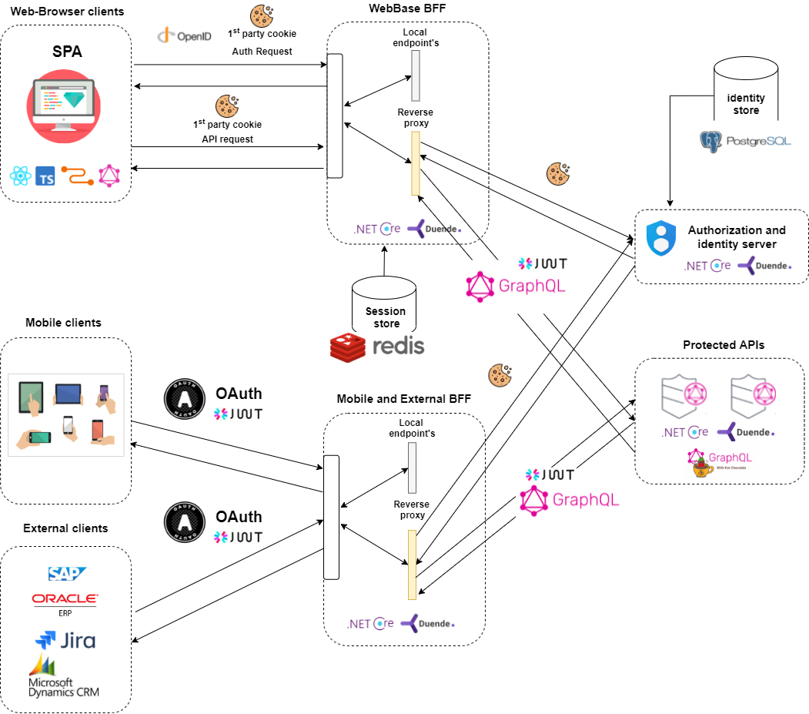

When it comes to security. There is a lot of guidance and also advice and commentary on why you should or should not use each approach. It's hard to understand all the different options and security issues they have.

You also have different clients (mobile/web/app) and each has different security requirements for managing, storing and processing data in the form of tokens, cookies or sessions.

At the end, your app may scale and not all options can be deployed as multiple instance nodes without additional changes to the app and infrastructure.

This means that you really need to make decisions at the beginning and ask questions like: *What are your customers?* and *What are your requirements?* and *What can be added to the system in the future?* and *How is it possible to deal with the chosen approach?* etc. etc..

### Authentication vs Authorization

- `Authentication` - process of verifying who a user is (identity).
- `Authorization` - process of checking what a user has access to (checking permissions to access a particular resource).

### Tokens vs Cookie and Sessions

Tokens, cookies and sessions can be interpreted as resources or tools used by various protocols/standards/patterns (OAuth, OpenID, BFF) to perform identity-related tasks.

It is important to understand the basics as they end up being used in combination with the environment, clients used and security level.

In the end, you can wrap the JWT token in a cookie and use it with session data for `authorization` and `authentication`.


#### Cookies

Cookies can be understood as small blocks of data created by the server that are written once in the response and automatically resent with each subsequent request from the web browser until their lifetime expires.

They can be used for authentication/authorization or tracking and marketing purposes. And much more...

*IndentityServer cookies example:*


There are 3 main properties of cookies:
- `HttpOnly` - An http-only cookie cannot be accessed by client-side APIs, such as JavaScript. The browser will not allow you to access this cookie from the front-end code.
- `Secure` A secure cookie can only be transferred over an encrypted HTTPS connection.
- `SameSite` 3 option values `Strict`, `Lax` or `None` - this tells the browser which domain and address the cookie can be sent to.

##### What is origin?

The origin is usually ip and port or domain name and subdomain name.

```
// This are different origins since subdomain are different
https://developer.mozilla.org
https://mozilla.org

// This are also different origins since port number is different
https://localhost:5001
https://localhost:7001
```
 
##### Another cookie definitions:
- `Session cookies` - Created only for the browser session (in memory) and deleted/lost after closing.
- `Third-party cookies` - Usually the domain attribute of a cookies matches the domain displayed in the address bar of the web browser. as `first-party cookies`. The `third-party cookies` does not match the current domain and is used as `tracking cookies` to track user activity.

#### Sessions

Session is used to temporarily store information on the server for use across multiple pages of the site. It is usually associated with a cookie that is used to identify the session stored on the server, but does not contain any data.

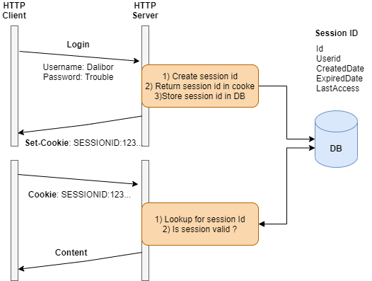


#### Tokens

Tokens are data elements that allow application systems to perform the authorization and authentication process. They are usually encoded as base64 strings.

There are several types of tokens:
- `access token` - Includes user claims and signs them with a secret. It uses JWT tokens.
- `refresh token` - Used to *"refresh "* and get a new 'access token' after its lifetime expires.
- `id token` - JSON encoded data about user profile information
- etc, etc...
- 
##### JWT Tokens

JSON Web Token is an open standard that defines how information can be securely transferred between parties as a JSON object. 

They are used for `authorization` and `information exchange` as they provide a security proof that the information wrapped in them is valid and written by a trusted source.

You can easily write arbitrary data to tokens, sign that data, and then have clients use it to access server resources. The server can verify that the token was signed and is still valid.

**Basic JWT token flow example:**

</br>

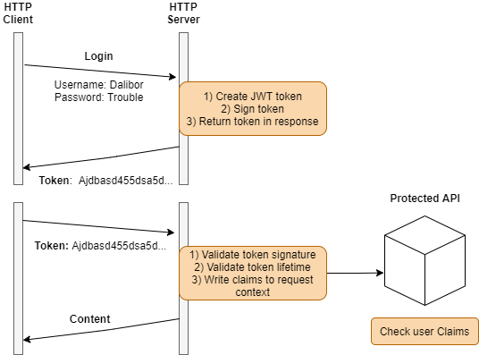

**JWT content:**


**JWT consist of 3 parts:**

- `Header` - Holds information as type of the token (JWT) and the signing algorithm being used, such as HMAC SHA256 or RSA.
    </br>
    ```json
    {
    "alg": "HS256",
    "typ": "JWT"
    }
    ```
- `Payload` - Securly signed data (claims)
    </br>
    ```json
    {
    "sub": "1234567890",
    "name": "John Doe",
    "admin": true
    }
    ```
- `Signature` - Encrypted header, the encrypted payload, a secret and signed by an algorithm specified in the header.
    </br>
    ```js
    HMACSHA256(
    base64UrlEncode(header) + "." +
    base64UrlEncode(payload),
    secret
    ```

     More additional info about JWT tokens can be found at [official documentation](https://jwt.io/introduction).

    </br>
 
    The most commonly used token for authorizing access to APIs is the `Bearer` token.

    </br>

    

### Identity protocols

There are several protocols/specifications available to manage your identity or authorization process.

This was necessary to standardize authentication and authorization between services and clients. So we can use different global identity/authentication providers like Facebook, Google (external/internal) and also standardize the way the process is implemented.


This demo focuses on the most commonly used protocols `OAuth` and `OpenID Connect`.

Both protocols use a JWT token by default to encrypt and sign sensitive data, or to verify that the request was sent from a trusted source. It is also possible to use cookies on the front end and let the back end do the session and token authorization for you.

You can also watch and learn from various talks:
- [OAuth 2.0 and OpenID Connect - [Nate Barbettini]](https://www.youtube.com/watch?v=996OiexHze0)
- [Introduction to OAuth 2.0 and OpenID Connect - [Philippe De Ryck]](https://www.youtube.com/watch?v=GyCL8AJUhww)

#### OAuth
Primarily used to authorize an app's access to a specific resource. This is done without having to share your password with external sites.

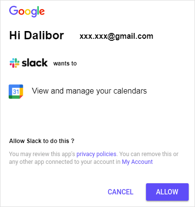

If you have ever signed in to a new app and agreed to access your contacts, calendar, etc., you have used *OAuth 2.0*. This protocol does not provide any information about the user's endpoint, just a token to access certain resources. You can read more about [OAuth at this document](https://auth0.com/docs/authorization/protocols/protocol-oauth2).

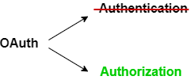


OAuth generally provides clients with *"secure delegated access "* to certain resources. Imagine you are a Google user and an app wants to access your calendar data. This can be an example of a flow:

`OAuth` flow example:

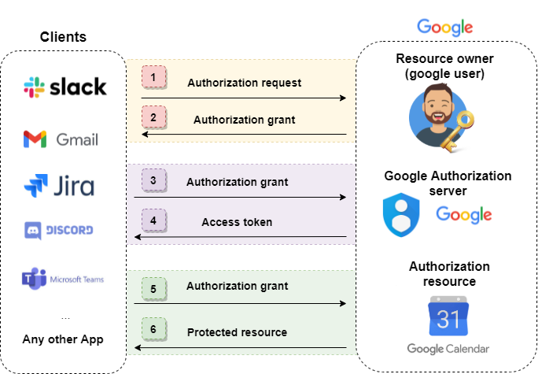

In the above example, an application like Slack, Jira, etc. only gets permission to access a specific resource (e.g. the calendar), but not the user itself, so profile data like username and email are not transferred and remain protected.

If you want to learn more about OAuth, you can watch the following presentations:
- [Introduction to OAuth 2.0 Flow - [Philippe De Ryck]](https://youtu.be/GyCL8AJUhww?t=655)

##### Token exchange flows

There are several ways in which `grant` can be substituted. The choice depends on what kind of client is requesting access and how much that client is trusted.

- Authorization code flow
- Flow of authorization code with PKCE
- Implicit Flow
- Client credentials flow

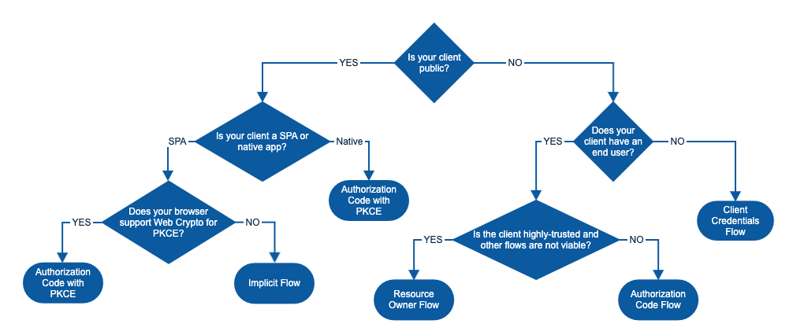 Image from [Okta](developer.okta.com)

#### OpenID Connect

OpenID is a protocol for decentralized authentication
A login used by multiple internal/external applications. If you used your Google or Facebook etc. to log in to an external web or app, then you used *`OpenID Connect`*.

OpenID Connect is based on *OAuth 2.0.* (OAuth is the underlying protocol and OpenId is the identity layer built on top of it) and also uses a JWT token called `id_token` which encapsulates identity claims in JSON format. For more information about OpenId, see [under this specification](https://openid.net/connect/).

`id_token` example:


```json
{
"iss": "http://server.example.com",
"sub": "248289761001",
"aud": "s6BhdRkqt3",
"nonce": "n-0S6_WzA2Mj",
"exp": 1311281970,
"iat": 1311280970,
"name": "Dalibor Kundrat",
"given_name": "Dalibor",
"family_name": "Kundrat",
"gender": "male",
"birthdate": "0000-10-31",
"email": "d.kundrat@example.com",
"picture": "http://example.com/somepicture_of_dalibor.jpg"
}
```
</br>

`OpenId` flow example:

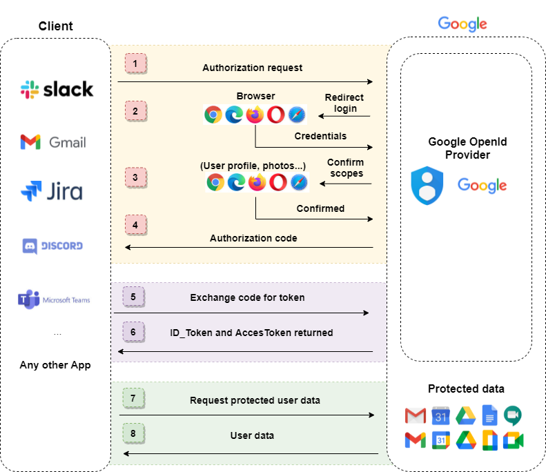

</br>

There are several flows that can be used with `OpenId`. You can read more about them [under this article](https://darutk.medium.com/diagrams-of-all-the-openid-connect-flows-6968e3990660).

Each `OpenId` server by specification provides multiple endpoints to interact with.

The URLs of all endpoints can be explored using the **global discovery endpoint**. Often referred to as *disco*. It is available under the path: `/.well-known/openid-configuration` and returns JSON *OpenID Connect* metadata related to the specified authorization server.

Example *disco* response:

```json
  {
   "issuer":"https://localhost:5001",
   "jwks_uri":"https://localhost:5001/.well-known/openid-configuration/jwks",
   "authorization_endpoint":"https://localhost:5001/connect/authorize",
   "token_endpoint":"https://localhost:5001/connect/token",
   "userinfo_endpoint":"https://localhost:5001/connect/userinfo",
   "end_session_endpoint":"https://localhost:5001/connect/endsession",
   "check_session_iframe":"https://localhost:5001/connect/checksession",
   "revocation_endpoint":"https://localhost:5001/connect/revocation",
   "introspection_endpoint":"https://localhost:5001/connect/introspect",
   "device_authorization_endpoint":"https://localhost:5001/connect/deviceauthorization",
   "frontchannel_logout_supported":true,
   "frontchannel_logout_session_supported":true,
   "backchannel_logout_supported":true,
   "backchannel_logout_session_supported":true,
   "scopes_supported":["profile","openid","email","role", "offline_access" //etc..],
   "claims_supported":["name","family_name","profile","email", etc..],
   "grant_types_supported":["authorization_code","client_credentials", "refresh_token", //etc..],
   "response_types_supported":["code","token", "id_token","id_token token" //etc..],
   "response_modes_supported":["form_post","query","fragment"],
   "token_endpoint_auth_methods_supported":["client_secret_basic","client_secret_post" ],
   "id_token_signing_alg_values_supported":["RS256"],
   "subject_types_supported":["public" ],
   "code_challenge_methods_supported":["plain","S256"],
   "request_parameter_supported":true,
   "request_object_signing_alg_values_supported":["RS256","RS384" //etc..],
   "authorization_response_iss_parameter_supported":true
}
```

Most important OpenId Endpoints:

- `/authorization_endpoint` - Interact with the resource owner and obtain an authorization grant
- `/token_endpoint`- Obtain an access and/or ID token by presenting an authorization grant (code) or refresh token
- `/revocation_endpoint` - Revoke an access or refresh token.
- `/end_session_endpoint` - End the session associated with the given ID token
- `/userinfo_endpoint` - Return claims about the authenticated end user.

> &#10240;
> **NOTE:** All of these values in the discovery endpoint refer to the current server configuration. You can adjust or  enable/disable certain options in your code during idnetityserver configuration.
> &#10240;

### Backend for Frontend pattern (BFF)

BBF is a backend used by a particular front-end application.

Since endpoint APIs may have multiple clients with different requests, BFF can provide a client-specific backend mediator and act as a proxy that forwards and merges multiple requests to different service APIs.

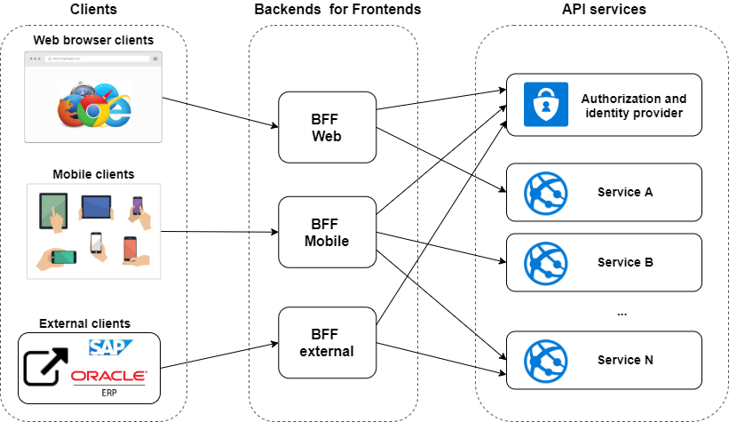

> &#10240;
>Ok, we have cookies, tokens, and sessions. We use them for various authentication/authorization protocols (OpenId, OAuth, etc.) **and what the hack BFF is good for.**?
>
> Answer is:
>- Security reasons
>- Architecture reasons 
> &#10240;

#### Security reasons

In recent years, it was common to implement OpenID Connect for SPAs in Javascript (React, Angular, Vue...), and this is no longer recommended:
- Using access tokens in the browser has more security risks than using secure cookies.
- A SPA is a public client and cannot keep a secret, as such a secret would be part of the JavaScript and could be accessible to anyone inspecting the source code.
- Recent browser changes to prevent tracking may result in 'third-party cookies' being dropped.
- It is not possible to store something securely in the browser for a long period of time, as it can be stolen by various attacks.

Due to the above issues, the best security recommendation for SPA is to **avoid storing tokens in the browser** and create a lightweight backend to help with this process, called Backend for Frontend pattern (BFF).

This way, you can still use `acces_tokens` to authorize access to all your APIs, but clients can use cookies or tokens, for example, depending on the type (browser, mobile device), as required for security reasons.

BFF can be:
- `statefull` - stores tokens in memory and uses a session to manage them.
- `stateless` - stores the tokens in encrypted HTTP-only, same-page cookies.

#### Architectural reasons

When you design your application, you have several options on how to access APIs from clients (web/mobile/external).

1) A single API gateway that provides a single API for all clients 
2) A single API gateway that provides an API for each type of client
3) A per-client API gateway that provides an API to each client.

##### BFF vs API gateway

While an `API Gateway` **is a single entry point** into to the system for all clients, a `BFF` is only responsible for a **single type of client**.

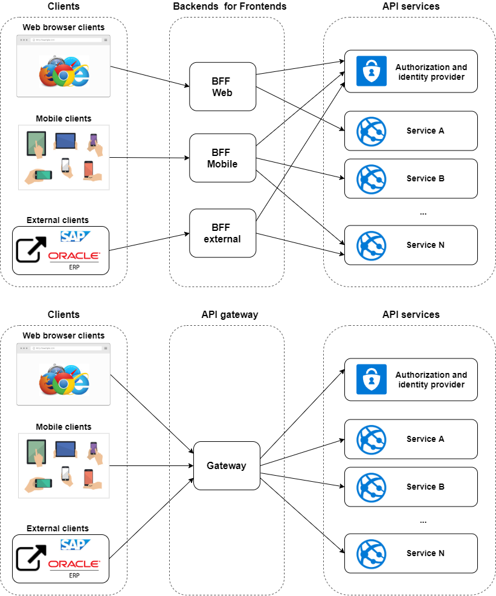

#### BBF cookies termination and token isolation

As mentioned in the text, the most important thing:
- Avoid storing tokens in the browser. (**No tokens in the browser** policy).
- Store tokens on the server side and use encrypted/signed HTTP-only cookies.
</br>

Recommended BFF pattern to secure SPA frontends:

 cookie and tokens flow + proxy")

- Using this, all communication from the SPA Frontend to the Authorization Server will now go through the BFF, and tokens will not reach the SPA.
- The BFF now issues session cookies. This are par of request to APIs and are exchanged for an access token on proxy level.
- Client side cookies gets terminated by BFF proxy.

## Implementing indentity in .NetCore


NetCore host application has builded in support for [Authentication and Authorization]((https://docs.microsoft.com/en-us/aspnet/core/security/?view=aspnetcore-5.0).). You can setup bacis Token, Cookie and Session Auth withou big afford and much to know about it.

To successfully implement an Identity Server covered by BFF, it is better to use some libraries that provide you with these integrations (do not try to build them yourself). These external implementations usually use parts of the Microsoft Auth base to keep the code flexible and connect to the existing code base.

> &#10240;
>**There is no reason to study and spend time to implement custom auth** between this layers and is recomendted to use some maintained library.
> &#10240;

One of this libs available with full identity and auth handling is [*IndentityServer*](duendesoftware).

### Duende IndentityServer


**Duende identity server** is framework which implements `OpenId Connect` and `OAuth2` protocols under the `.NetCore` enviroment. It also provides aditional tooling as BFF pattern integration or softly prepared UI interface that you can rewrite to your needs.

> &#10240;
>Duende identity server is licensed version of previous `IdentityServer v4` that was by authors moved under new company *Duende* with [corresponding licensing](https://duendesoftware.com/products/isv) now, often referred as `IdentityServer v5`.
>
>**It is not free** for production **only for development and testing**!
> &#10240;

If you are a commercial entity, you should probably pay for security. Also, there is an official commitment from Microsoft to keep Duende Identityserver as part of the official templates for .Net6, since it is still open source and the framework does a good job. [.Net6 Authentication Servers](https://devblogs.microsoft.com/aspnet/asp-net-core-6-and-authentication-servers/)

If you want to understand specific reasons why a license should be granted, you can [read this article](https://leastprivilege.com/2020/10/01/the-future-of-identityserver/).

#### Alternatives

I think it's fair to say that there is at least one alternative for the .Net environment:

[Openiddict](https://github.com/openiddict/openiddict-core) is a low-level library that can help you process OpenId and Oauth requests. You can use it to create your own Identity Server, but unlike duende Identityservr, it will not give you a running solution. 

> &#10240;
> **NOTE:** OpenIddict is not a solution but a framework that requires writing custom code
> &#10240;

#### Demo architecture

This is identity flow architecture for this demo:


</br>

**IdentityServer** will help you to define how your clinets *(Web,Mobile,External)* access the protected APIs and how user identity *(Name,Email,Profileinfo)* is managed, stored and accesed in centalised way for all internal and external services that needs to comunicate and use your system.

> &#10240;
>**Note** The Identity Server is not primarily designed for user management, but can be connected to the ASPNet User Store.
> &#10240;

IdentityServer helps you to:
- Integrate witn NetCore user identity
- Integrate IdentityServer `OpenId` and `Oauth` to NetCore App
- Issue tokens
- Secure WebAPIs and protect your resources
- Store identity data to Entity Framework (EF Integration)
- Provide tooling for BFF pattern 
- Secure Frontend comunication over revers proxy
- Manage identiy clients/resources
etc...

You can read more under official documentation:
- [Officail Duende documentaion](https://docs.duendesoftware.com/identityserver/v5)
- [Old IdnetityServer v4 documentation](https://identityserver4.readthedocs.io/en/latest/)

</br>


### Demo Microservices overview

This is the simplified microservice architecture used in demo:

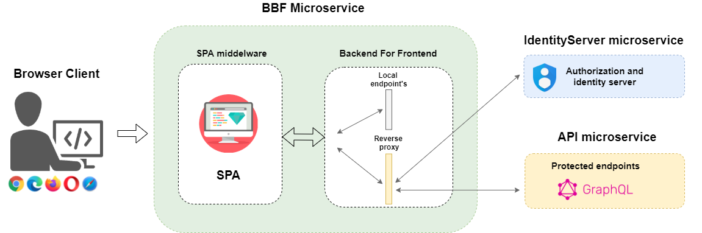

>This picture hiddes infrastructure, logging tracing and external DB storages or services like scheduler etc.

Architecture contains 3 separate `.net` projects:
 - `IdentityServer` - Providing, storing and managing Identity and authorization.
- `BBF` - Backend for frontend include React aplication frontend served from static page middleware
- `API microservice` - API server with aplication logic.

</br>

### IdentityServer project configuration
</br>

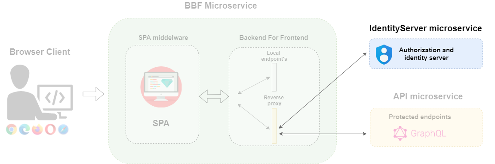

Project is allready fully configured and this is just quickly explanation of the most important steps and guides you over the structure. 

Besic configuration as logging or Telemetry are part of previous tutorials and this projects use equal approach:
- [Configure Logging](./Logging.md)
- [Configure Tracing](./OpenTelemetry.md)

</br>

#### Nuget Packages:

This packages are required to perform identity on API microservice. Other packages are hidden and not displayed in this list.

1) Main package
- `dotnet add package Duende.IdentityServer --version 5.2.2`

2) Extensions NetCore Identity
- `dotnet add package Duende.IdentityServer.AspNetIdentity --version 5.2.2`

3) Extensions Entity Framework
- `dotnet add package Duende.IdentityServer.EntityFramework --version 5.2.2`

4) Extensions Entity Framework .Netcore
- `dotnet add package Microsoft.AspNetCore.Identity.EntityFrameworkCore --version 5.0.9`

5) MVC runtime compilation for Razor Pages
- `dotnet add package Microsoft.AspNetCore.Mvc.Razor.RuntimeCompilation --version 5.0.9`

6) Entity framework
- `dotnet add package Microsoft.EntityFrameworkCore --version 5.0.9`

7) Enity Framework migration tools
- `dotnet add package Microsoft.EntityFrameworkCore.Tools --version 5.0.9`

</br>

#### ConfigureServices
`Startup.cs` contains following content:

```c#
    public void ConfigureServices(IServiceCollection services)
    {   
        // See more under AddCorsConfiguration implementation
        services.AddCorsConfiguration(Environment);

        services.AddControllersWithViews().AddRazorRuntimeCompilation();

        // See more under AddAppIdentityDbContext implementation
        services.AddAppIdentityDbContext(Configuration,Environment);

        // See more under AddIdentityServer implementation
        services.AddIdentityServer(Configuration,Environment);

        services.AddHealthChecks();

        services.AddMvc();

         // See more under AddTelemerty implementation
        services.AddTelemerty(Configuration,Environment);
    }

    public void Configure(IApplicationBuilder app, IWebHostEnvironment env) {

        if (Environment.IsDevelopment()){
            app.UseDeveloperExceptionPage();

            ServiceExtension.InitializeDbTestData(app);
        }

        app.UseElasticApm(Configuration, new IDiagnosticsSubscriber [0]);

        app.UseCookiePolicy();

        app.UseCors("cors_policy");

        app.UseHealthChecks("/health");

        app.UseStaticFiles();

        app.UseRouting(); 
        
        app.UseIdentityServer(); // Enable handling of OpenId Connect and OAuth.

        app.UseAuthentication();

        app.UseAuthorization();

        app.UseEndpoints(endpoints => {
            endpoints.MapControllerRoute(name: "default", pattern: "{controller=Home}/{Action=Index}/{id?}");
            endpoints.MapRazorPages();
        });
    }
```

</br>

##### AddCorsConfiguration

CORS is Cross Origin Resource Sharing. It is a W3C standard that allows a server to make cross-domain calls from the specified domains. Demo apply this requirements and define `allowed_origins ` array and does not allow reading data from another origins.

If you forgot what is origin return back to [origin definiton](#what-is-origin?).

We must use UseCors before the UseMvc call then only the CORS middleware will execute before any other endpoints. in `Program.cs`.

> &#10240;
>**NOTE:** This must be adjusted for production enviroment with valid production origins.
> &#10240;

`./Src/IdentityServer/API/Configuration/AddCorsConfig.cs`

```c#
public static partial class ServiceExtension {
    public static IServiceCollection AddCorsConfiguration(
    this IServiceCollection serviceCollection,
    IWebHostEnvironment Environment) {

        string[] allowed_origins = null;

        if(Environment.IsDevelopment()){
            allowed_origins = new string[]{ 
                "https://localhost:5001",
                "https://localhost:5015",
                "https://localhost:5021"
            };
        }else{
                // Add your production origins hire
            allowed_origins = new string[]{ 
                "https://localhost:5001"
            };
        }
        
        serviceCollection.AddCors(options =>
        {
            options.AddPolicy("cors_policy", policy =>
            {
                policy.AllowAnyHeader();
                policy.AllowAnyMethod();
                //------------------------------------
                policy.WithOrigins(allowed_origins);
                //policy.AllowAnyOrigin()
                //------------------------------------
                policy.AllowCredentials();
                policy.SetPreflightMaxAge(TimeSpan.FromSeconds(10000));
            });
        });

        // This is IdentityServer part
        serviceCollection.AddSingleton<ICorsPolicyService>((container) =>
        {
            var logger = container.GetRequiredService<ILogger<DefaultCorsPolicyService>>();

            return new DefaultCorsPolicyService(logger) 
            {
                AllowedOrigins = allowed_origins
                //AllowAll = true
            };
        });

        return serviceCollection;

    }
}
```

</br>

##### AddAppIdentityDbContext

`./Src/IdentityServer/API/Configuration/AddDbContext.cs`
```c#

public static IServiceCollection AddAppIdentityDbContext(
    this IServiceCollection serviceCollection,
    IConfiguration Configuration, IWebHostEnvironment Environment) {

    serviceCollection.AddDbContext<AppIdnetityDbContext>(option => {

        option.UseNpgsql(Configuration["ConnectionStrings:AppIdnetityDbContext"], opt => {
            opt.EnableRetryOnFailure();
        });

        if (Environment.IsDevelopment()) {
            option.EnableDetailedErrors();
            option.EnableSensitiveDataLogging();
        }

    }, ServiceLifetime.Transient);


    return serviceCollection;

}
```

</br>

##### AddIdentityServer

 `./Src/IdentityServer/API/Configuration/AddIdentityServer.cs`
```c#
 public static IServiceCollection AddIdentityServer(
    this IServiceCollection serviceCollection,
    IConfiguration Configuration,
    IWebHostEnvironment Environment) {

        // app user 
        serviceCollection.AddIdentity<ApplicationUser, IdentityRole>(options => {
            options.Password.RequireDigit = false;
            options.Password.RequiredLength = 6;
            options.Password.RequireNonAlphanumeric = false;
            options.Password.RequireUppercase = false;
            options.Password.RequireLowercase = false;
        }).AddEntityFrameworkStores<AppIdnetityDbContext>()
        .AddDefaultTokenProviders();

        var identityServerBuilder = serviceCollection.AddIdentityServer(options => options.KeyManagement.Enabled = true);
        
        if (Environment.IsDevelopment()) {
            identityServerBuilder.AddDeveloperSigningCredential();
        }

        // codes, tokens, consents
        identityServerBuilder.AddOperationalStore<AppPersistedGrantDbContext>(options =>
            options.ConfigureDbContext = builder =>
                builder.UseNpgsql(Configuration["ConnectionStrings:AppIdnetityDbContext"]));
                
        // clients, resources
        identityServerBuilder.AddConfigurationStore<AppConfigurationDbContext>(options =>
            options.ConfigureDbContext = builder =>
                builder.UseNpgsql(Configuration["ConnectionStrings:AppIdnetityDbContext"]))
                .AddInMemoryCaching();

        identityServerBuilder.AddAspNetIdentity<ApplicationUser>();
        
        return serviceCollection;
    }
}
```
</br>

##### Data Stores

IdentityServer requires to define data stores. This stores can be presised in Database or just loaded in-memory from hardcoded configuration.

```c#
// codes, tokens, consents
identityServerBuilder.AddOperationalStore(options =>
    options.ConfigureDbContext = builder =>
        builder.UseNpgsql(Configuration["ConnectionStrings:AppDBConnection"]));
        
identityServerBuilder.AddConfigurationStore(options =>
    options.ConfigureDbContext = builder =>
        builder.UseNpgsql(Configuration["ConnectionStrings:AppDBConnection"]))
        .AddInMemoryCaching();;

```

This Demo use EntityFramework implementation of:
- `Operational data` stores *tokens*, *codes*, etc...
- `Configuration data` stores *Client*, *Resources*, *ApiScopes* etc...

To read more about StoreConfiguration please fllow offical documentation: [Using EntityFramework Core for configuration and operational data](https://docs.duendesoftware.com/identityserver/v5/quickstarts/4_ef/)

> &#10240;
> **NOTE:** Use `AddInMemoryCaching()` for the **Configuration Data Store** to cache the default settings and prevent loading static data from the database on every `access_token` request.
>
>By static data, I mean the `claims` and the `system configuration data`, which usually does not change often during runtime. To better understand what happens without caching, look at this first request, where the server tries to provide a new token, but also loads the entire configuration from DB.
>
> **Example of Configuration data store hit:**
>
>
>
> I have also asked the authors of *IdentityServer* why this happens and if it is not a problem of perf. This is the simple answer I received:
>
> Response:
>>*In short, the high number of DB requests (which is bad) is what you get when you design an abstraction around the store of config data (which is good), and have well factored services in the multi-layered DI system (which is also good). The solution to that is to enable the caching which amortizes the high number of DB requests for the initial load of the config data.*
> &#10240;
>
> As result use `AddInMemoryCaching()` to prevent this scenarions!
> &#10240;

##### User data store:

With *NetCore* whe normally use its Identity to define `User` object. This is part of `Microsoft Identity`. IdentityServer extends this and build aditional layers around and is able to use `User` to emit claims into tokens.

class `ApplicationUser` can than contains any aditional user data.
```c#
serviceCollection.AddIdentity<ApplicationUser, IdentityRole>(options => {
    // options config...
    }).AddEntityFrameworkStores<AppIdnetityDbContext>()
    .AddDefaultTokenProviders();

serviceCollection.AddIdentityServer().AddAspNetIdentity<ApplicationUser>();
```

Idnetyty servers do not provide user management by default. Some implementations extend these services to handle this under the protected API endpoint, others use a separate service to manage this and keep the idnetity server to only issue tokens and access.

</br>

#### Initial data

All dummy test data are available uder class `Src/IdentityServer/API/Config.cs`. This data are on initial startup loaded and written to database. After that only data from DB are used.

Since this is initially configured via code, it is often referred as *code configuration*. You can predefine the basic settings and set up specific `scopes` and `resources` using custom management UI.

> &#10240;
>**NOTE:** This are the test data in real app you probably wanna create custom interface with UI to manage all this users by yourself.
> &#10240;

The configuration consists of 2 parts:
- Clients
- Resources

##### Configure Clients

 - Clients - `OpenId` or `OAuth` Application Client that can request tokens from your IdentityServer:

 This is our Frontend SPA React app client configuration:

 ```c#
    new Client
    {
        ClientId = "spa",
        ClientSecrets = { new Secret("secret".Sha256()) },
        
        AllowedGrantTypes = GrantTypes.CodeAndClientCredentials,

        RedirectUris = { "https://localhost:5015/signin-oidc" },
        
        BackChannelLogoutUri = "https://localhost:5015/bff/backchannel",
        
        PostLogoutRedirectUris = { "https://localhost:5015/signout-callback-oidc" },

        AllowedCorsOrigins = new List<string>
        {
            "http://localhost:3000", "http://localhost:5001",
        },

        AllowOfflineAccess = true,
        AllowedScopes = { "openid", "profile", "api" }
    }
 ```

##### Configure resources

The resource configuration consists of 3 parts:

- Identity resources
- Api scopes
- Api resources


So what is the difference between these 3 configuration options. It's one of the hardest thoughts to remember, but also one of the most important, since it's your configuration and everything is built on it!

###### Identity resources

This represents details of the user such as `Name`, `UserId`, `Email`, `Role`, etc. Using the configuration example below, you can see that each record represents a group of user claims, where a group can contain one or more user claims.

This is related to `OpenId Connect` and this specification has introduced some standardised scopes as `new IdentityResources.OpenId()` or `new IdentityResources.Profile()` that can be easily imported as a prepared function call.

The identity resources correspond to the `identity_token` and the scopes you defined are included in it. So if you want to add another scopes to this token, you should define it at this point.

Config example of Identity resources:

```c#
 public static IEnumerable<IdentityResource> GetIdentityResources() {
    return new[] {
        new IdentityResources.OpenId(),
        new IdentityResources.Profile(),
        new IdentityResources.Email(),
        new IdentityResource
        {
            Name = "role",
            UserClaims = new List<string> {"role"}
        }
    };
}
```
The client application then asks for specific identity scopes during the authentication process.

> &#10240;
> **NOTE:** The `id_token` is size-optimized (by default) and contains only the required information in its payload, all others must be additionally requested from `userinfo_endpoint`.
>
> `AlwaysIncludeUserClaimsInIdToken = true` force to include all defined scopes by default in `id_token`.
> &#10240;

So in case we wanna add role to `idToken` and use that from clinet as requested scope you need to:

1) define an IdentityResource that grants access to the role claim.
    ```c#
    new IdentityResource
    {
        Name = "role",
        UserClaims = new List<string> {"role"} // <-- THIS
    }
    ```
2) Include that new IdentityResource in the client's AllowedScopes
    ```c#
    new Client
    {
        ClientId = "spa",
        AllowedScopes = { "openid", "profile", "role" } // <-- THIS
        //etc...
    }
    ```
3) Have the client request your new IdentityResource as a scope.
    ```c#
    .AddOpenIdConnect("oidc", options =>
    {
        options.Authority = "https://localhost:5001";
        
        options.ClientId = "spa";
        options.ClientSecret = "secret";
        options.ResponseType = "code";
        options.ResponseMode = "query";

        options.MapInboundClaims = true;
        options.GetClaimsFromUserInfoEndpoint = true;
        options.SaveTokens = true;

        options.Scope.Clear();
        options.Scope.Add("openid");
        options.Scope.Add("profile");
        options.Scope.Add("role"); // <-- THIS
        //etc..
    });
    ```

###### Api scopes

Scopes are the what clients ask to access. Scopes are for authorizing clients only. A scope can be associated with one or more ApiResources if it is shared. 

These are some options:
- One scope covering multiple physically APIs ("MainScope").
- One scope per physical API ("PaymentScope", "OrderScope").
- Multiple scopes per physical API (e.g. one for reading and one for writing, or perhaps one for normal users and one for admin users.

Config example of main api scope:
```c#
new ApiScope[]{
    new ApiScope("api", new[] { 
        JwtClaimTypes.Name,
        JwtClaimTypes.Role,
        JwtClaimTypes.Email,
        JwtClaimTypes.ClientId,
        JwtClaimTypes.SessionId
    }),
};
```

###### Api resources

This represents a physical or logical API (namespace) that groups one or more scopes. These ApiResources are an extension of IdentityServer, as OAuth defines everything around scopes.

When a user sends a request with requested Scopes (not ApiResource), IdentityService detects which ApiResources the user wants to access (from the requested Scopes).

Config example of Api resources:

```c#
public static IEnumerable<ApiResource> GetApiResources()
{
    return new[]
    {
        new ApiResource
        {
            Name = "api",
            DisplayName = "API #1",
            Description = "Allow the application to access API",
            Scopes = new List<string> {"api.read", "api.write"},
            ApiSecrets = new List<Secret> {new Secret("ScopeSecret".Sha256())}, // change me!
            UserClaims = new List<string> {
                JwtClaimTypes.Name,
                JwtClaimTypes.Role,
                JwtClaimTypes.Email,
                JwtClaimTypes.ClientId,
                JwtClaimTypes.SessionId
                }
            
        }
    };
}
```

</br>

#### Setup migrations

To proces migrations ensure you have installed `dotnet-tools`:

```
dotnet tool install --global dotnet-ef
```

Also make sure your database exist. Demo use separate database under main server called `IdenityDB` with this parameters:

- Hostname: `localhost`
- Port: `5432`
- Database: `IdentityDB`
- Username: `postgres`
- Password: `postgres`

> &#10240;
>**NOTE:** Please change username and password for production enviroment.
> &#10240;

Connestion string shoud be awailable under `appsettings.json`

```c#
"ConnectionStrings": {
  "AppDBConnection": "Host=localhost;Port=5432;Database=IndetityDB;Username=postgres;Password=postgres",
}
```

PostgreSQL adding another database:

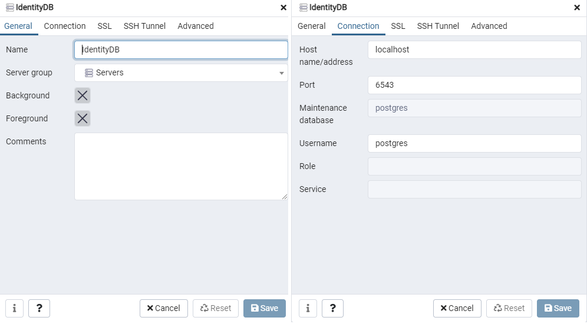

##### Creating migrations

Migrations for demo are pre-created and sits in folder: `Src/IdentityServer/Persistence/Migrations`

They was created using following command:

```sh
dotnet ef migrations add Init_ConfigurationDbContext -c AppConfigurationDbContext
dotnet ef migrations add Init_PersistedGrantDbContext -c AppPersistedGrantDbContext
dotnet ef migrations add Init_PersistedGrantDbContext -c AppIdnetityDbContext
```

##### Apply existing migrations

To fill your empty database with new migrations please follow this steps:

Go to dirrectory: `Src/IdentityServer/Persistence` and run following commands:
```sh
 dotnet ef database update --context AppConfigurationDbContext
 dotnet ef database update --context AppPersistedGrantDbContext
 dotnet ef database update --context AppIdnetityDbContext
```
</br>

#### Running identiyserver project

Navigae to `Src/IdentityServer/API` and run `dotnet watch run` ensure the database and elasticsearch are running. (if not proper exception will be thrown that connection is not established).

This demo identityServer runs on `https://localhost:5001`

You can view the openid configuration at ***discovery endpoint url**. As a result, you get a JSON listing of the OpenID/OAuth endpoints, the scopes and claims supported, the public keys used to sign the tokens, and other details

`https://localhost:5001/.well-known/openid-configuration`

```json
  {
   "issuer":"https://localhost:5001",
   "jwks_uri":"https://localhost:5001/.well-known/openid-configuration/jwks",
   "authorization_endpoint":"https://localhost:5001/connect/authorize",
   "token_endpoint":"https://localhost:5001/connect/token",
   "userinfo_endpoint":"https://localhost:5001/connect/userinfo",
   "end_session_endpoint":"https://localhost:5001/connect/endsession",
   "check_session_iframe":"https://localhost:5001/connect/checksession",
   "revocation_endpoint":"https://localhost:5001/connect/revocation",
   "introspection_endpoint":"https://localhost:5001/connect/introspect",
   "device_authorization_endpoint":"https://localhost:5001/connect/deviceauthorization",
   "frontchannel_logout_supported":true,
   "frontchannel_logout_session_supported":true,
   "backchannel_logout_supported":true,
   "backchannel_logout_session_supported":true,
   "scopes_supported":[
      "profile",
      "openid",
      "email",
      "role",
      "api",
      "offline_access"
   ],
   "claims_supported":[
      "zoneinfo",
      "updated_at",
      "locale",
      "name",
      "family_name",
      "given_name",
      "middle_name",
      "nickname",
      "preferred_username",
      "profile",
      "picture",
      "website",
      "gender",
      "birthdate",
      "sub",
      "email",
      "email_verified",
      "role",
      "sid",
      "client_id"
   ],
   "grant_types_supported":[
      "authorization_code",
      "client_credentials",
      "refresh_token",
      "implicit",
      "password",
      "urn:ietf:params:oauth:grant-type:device_code"
   ],
   "response_types_supported":[
      "code",
      "token",
      "id_token",
      "id_token token",
      "code id_token",
      "code token",
      "code id_token token"
   ],
   "response_modes_supported":[
      "form_post",
      "query",
      "fragment"
   ],
   "token_endpoint_auth_methods_supported":[
      "client_secret_basic",
      "client_secret_post"
   ],
   "id_token_signing_alg_values_supported":[
      "RS256"
   ],
   "subject_types_supported":[
      "public"
   ],
   "code_challenge_methods_supported":[
      "plain",
      "S256"
   ],
   "request_parameter_supported":true,
   "request_object_signing_alg_values_supported":[
      "RS256",
      "RS384",
      "RS512",
      "PS256",
      "PS384",
      "PS512",
      "ES256",
      "ES384",
      "ES512",
      "HS256",
      "HS384",
      "HS512"
   ],
   "authorization_response_iss_parameter_supported":true
}
```

</br>

### BFF project configuration

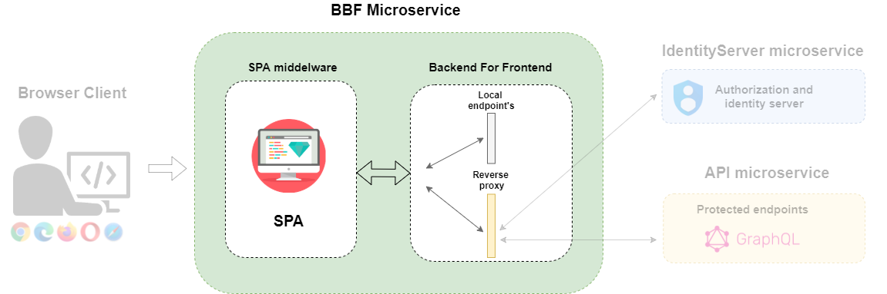

#### Nuget Packages:

This packages are required to perform identity on API microservice. Other packages are hidden and not displayed in this list.

1) BFF main package
- `dotnet add package Duende.BFF --version 1.0.0-rc.3`

2) SPA extension middleware
- `dotnet add package Microsoft.AspNetCore.SpaServices.Extensions --version 5.0.9`

3) Extension .NetCore OpenId Connect 
- `ddotnet add package Microsoft.AspNetCore.Authentication.OpenIdConnect --version 5.0.9`

</br>

#### ConfigureServices
`Startup.cs` contains following content:

```c#
public void ConfigureServices(IServiceCollection services){

    services.AddControllersWithViews();

    // In production, the React files will be served from this directory
    services.AddSpaStaticFiles(configuration => {
        configuration.RootPath = "ClientApp/build";
    });

    // Add BFF services to DI - also add server-side session management
    serviceCollection.AddBff(options =>
    {
        options.ForwardedHeaders = new HashSet<string>() {
            CustomProxyHttpMessageInvoker.CorrelationContextHeaderName,
            CustomProxyHttpMessageInvoker.TraceParentHeaderName,
            CustomProxyHttpMessageInvoker.TraceStateHeaderName,
            CustomProxyHttpMessageInvoker.RequestIdHeaderName
        };
        options.AntiForgeryHeaderValue = "1";
        options.AntiForgeryHeaderName = "X-CSRF";
        options.ManagementBasePath = "/system";
    }).AddServerSideSessions();

    services.AddIdentityConfiguration();

    services.AddHealthChecks();

    services.Configure<ForwardedHeadersOptions>(options =>
    {
        options.ForwardedHeaders = ForwardedHeaders.XForwardedFor | ForwardedHeaders.XForwardedProto;
    });
    
    services.AddTelemerty(Configuration,Environment);
}

public void Configure(IApplicationBuilder app, IWebHostEnvironment env)
{
    if (env.IsDevelopment()){
        app.UseDeveloperExceptionPage();
    }else{
        app.UseExceptionHandler("/Error");

        app.UseHsts();
    }

    app.UseElasticApm(Configuration, new IDiagnosticsSubscriber [0]);

    app.UseHealthChecks("/health");

    app.UseHttpsRedirection();

    app.UseDefaultFiles();

    app.UseStaticFiles();

    app.UseSpaStaticFiles();

    app.UseAuthentication();

    app.UseRouting();

    app.UseBff();

    app.UseAuthorization(); // adds authorization for local and remote API endpoints

    app.UseEndpoints(endpoints =>{
        // local APIs
        endpoints.MapControllers()
            .RequireAuthorization()
            .AsBffApiEndpoint();
            
        
        endpoints.MapBffManagementEndpoints();   // login, logout, user, backchannel logout...
        
        endpoints.MapRemoteBffApiEndpoint("/graphql", "https://localhost:5022/graphql",true)
            .WithOptionalUserAccessToken()
            
            .AllowAnonymous();
    
    });

    app.UseSpa(spa =>{
        spa.Options.SourcePath = "ClientApp";

        if (env.IsDevelopment()){
            spa.UseReactDevelopmentServer(npmScript: "start");
        }
    });
}
```

</br>


##### AddIdentityConfiguration

This method define that authentication mechanism for frontend will use cookie with with `OpenId Connect` also defining all its parameters.

> &#10240;
>**NOTE** This configuration contains dummy test data as secrets. Dont use it in production!
> &#10240;

`./Src/APIServer/API/Configuration/AddIdentityConfiguration.cs`
```c# 
 public static partial class ServiceExtension {
    public static IServiceCollection AddIdentityConfiguration(
    this IServiceCollection serviceCollection) {

        // cookie options
        serviceCollection.AddAuthentication(options =>
        {
            options.DefaultScheme = "cookie";
            options.DefaultChallengeScheme = "oidc";
            options.DefaultSignOutScheme = "oidc";
        })
        .AddCookie("cookie", options =>
        {
            // set session lifetime
            options.ExpireTimeSpan = TimeSpan.FromHours(8);
            
            // sliding or absolute
            options.SlidingExpiration = false;
            
            // host prefixed cookie name
            options.Cookie.Name = "__SPA_FF";
            
            // strict SameSite handling
            options.Cookie.SameSite = Microsoft.AspNetCore.Http.SameSiteMode.Strict;
        })
        .AddOpenIdConnect("oidc", options =>
        {
            options.Authority = "https://localhost:5001";
            
            // confidential client using code flow + PKCE
            options.ClientId = "spa";
            options.ClientSecret = "secret";
            options.ResponseType = "code";
            options.ResponseMode = "query";

            options.MapInboundClaims = false;
            options.GetClaimsFromUserInfoEndpoint = true;
            options.SaveTokens = true;

            // request scopes + refresh tokens
            options.Scope.Clear();
            options.Scope.Add("openid");
            options.Scope.Add("profile");
            options.Scope.Add("api");
            options.Scope.Add("offline_access");
        });

        return serviceCollection;
    }
}
```

</br>

##### AddBff configuration
</br>

**Cross-Site Request Forgery (CSRF)** is protection mechanism that BFF require to include from called in header. This means your frontend app must set this values with all request. The value or Header name cam be adjusted as on example:

Example fetch function from Frontend React app to BFF

```json
return fetch(`${BASE_SERVER_URL}/${GQL_ENDPOINT}`, {
    credentials: "include",
    method: "POST",
    mode: 'cors',
    headers: {
      Accept: "application/json",
      "Content-Type": "application/json",
      'X-CSRF': '1' //  <---- THIS IS CSRF HEADER
    },

    body: JSON.stringify({
      id: operation.id, 
      query: operation.text,
      variables,
      operationName: operation.name,
    }),
  })
    .then((response) => {
      return response.json();
    })
    .then((json) => {
      return json;
    }).catch((ex)=>console.log(ex));
}
```

**ManagementBasePath** defines frontend endpoints used to comunicate with identityserver. Frontend client use this to perform identity tasks as Login or logout as example: `https://frontendurl/system/login` or  `https://frontendurl/system/logout` etc..

```c#
services.AddBff(options =>
{
    options.AntiForgeryHeaderValue = "1";
    options.AntiForgeryHeaderName = "X-CSRF";
    options.ManagementBasePath = "/system";
})
.AddServerSideSessions();
```
</br>

### API project configuration

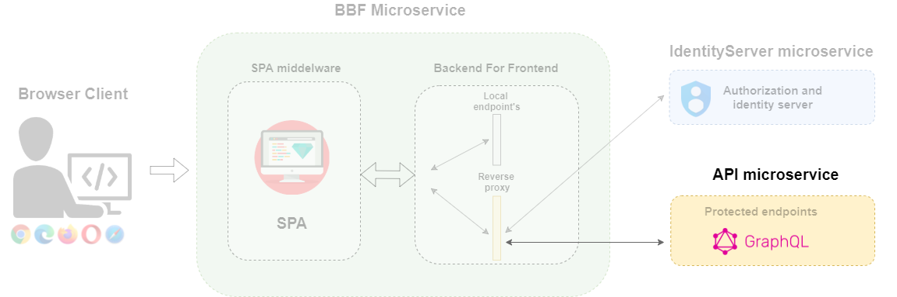
</br>

#### Nuget Packages:

This packages are required to perform identity on API microservice. Other packages are hidden and not displayed in this list.


1) Extension .NetCore JWT Bearer
- `dotnet add package Microsoft.AspNetCore.Authentication.JwtBearer --version 5.0.9`

</br>

#### ConfigureServices

There is no much from API protected  project to be configured. This API is protecteed using JWT token. `Startup.cs` require to add following configuration to API project.

From code you can use standard `[Authorize]` attribute to perform all auth checks.

> &#10240;
>**NOTE:** This configuration display only identity relevant parts:
> &#10240;

```c#
public void ConfigureServices(IServiceCollection services){

    services.AddAuthentication("token")
        .AddJwtBearer("token", options =>
        {
            options.Authority = "https://localhost:5001";
            options.MapInboundClaims = false;

            options.TokenValidationParameters = new TokenValidationParameters()
            {
                ValidateAudience = false,
                ValidTypes = new[] { "at+jwt" },
                
                NameClaimType = "name",
                RoleClaimType = "role"
            };
        });

    services.AddAuthorization(options =>{ });

    // And  Other services related to API ...
    // etc etc ..
}

public void Configure(IApplicationBuilder app, IWebHostEnvironment env)
{
    // And  Other middleware related to API ...
    // etc etc ..

    app.UseForwardedHeaders(new ForwardedHeadersOptions
    {
        ForwardedHeaders = ForwardedHeaders.XForwardedFor | ForwardedHeaders.XForwardedProto | ForwardedHeaders.XForwardedHost,
    });

    app.UseAuthentication();
    app.UseAuthorization();

    // And  Other middleware related to API ...
    // etc etc ..
}
```

</br>

### Running microservices

You can run all services from their work dirrectory or pack them to docker container.

> &#10240;
>**NOTE:** Please ensure all DBs are created and has initial migration done.
> &#10240;

###### Idnetityserver

Navigate to: `Src/Idnetityserver/API/`
Run: `dotnet watch run`

###### BFF

Navigate to: `Src/BFF/API/`
Run: `dotnet watch run`

###### APIServer

Navigate to: `Src/APIServer/API/`
Run: `dotnet watch run`

</br>

### Idnetity server UI interface


Endpoint `https://localhost:5001/Account/Login`

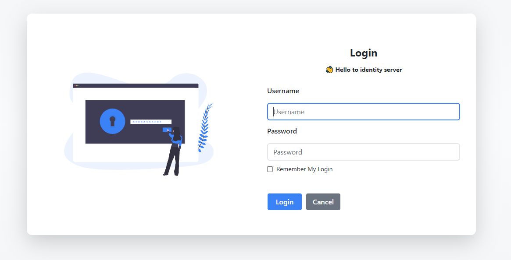

</br>

Endpoint `https://localhost:5001/Account/Logout`


</br>

Endpoint `https://localhost:5001/diagnostics`

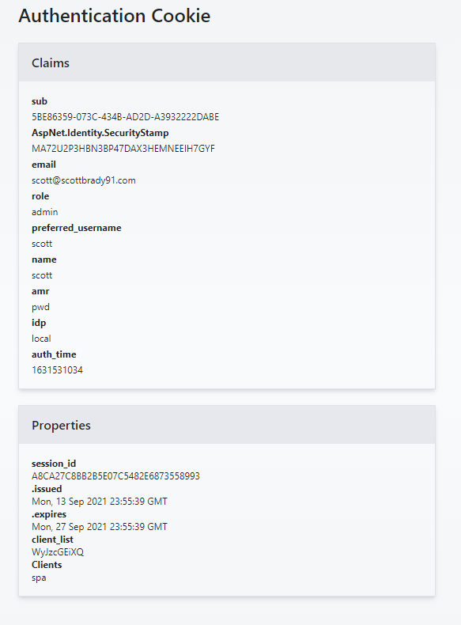

</br>

Endpoint `https://localhost:5001/diagnostics`

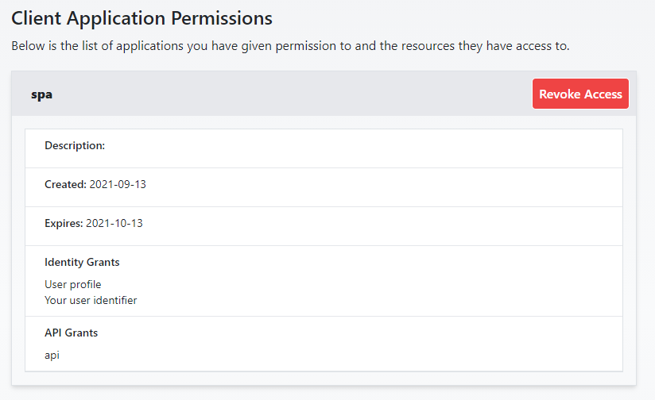

## Login and Logout integration to UI

Frontend App in this demo was built with React and uses the POST fetch function to call the BFF, which makes a request to the GraphQL server. This is the standard flow for communication between client and API. GraphQL API is accessible to anonymous users. If you are not authorised, a concrete error will be returned for the data you requested, but in some cases it will simply return `null`. This is up to the backend SW engineer on how he implemented this error and auth handling.

To perform loging and logout from clinet this works bit differently. BFF maps special endpoint for this and expose it on this urls:

- `https://your_app_url:port/system/login`
- `https://your_app_url:port/system/logout`

### Login

At the top level of the frontend query, you normally request the user data as a `me` query. This is called when the app is first rendered.

```tsx
// UserProvider.tsx
query UserProviderQuery {
    me {
        id
        name
        sessionId
    }
}
```

This function returns the user data or `null` if the user is not authenticated, and you can use this to redirect the user to the correct component in your routing.

```tsx

if (!userStore?.user?.me) {
    return (
      <Routes>
        <Route path="/*" element={<Login/>} />
      </Routes>
    );
  } else {
    return (
      <Routes>
        <PrivateRoute  path={"/*"} element={<Settings />} />
        // Another routes
      </Routes>
    );
  }

```

Then your `<Login/>` component can navigate you to the BFF endpoint, which is called: `https://your_app_url:port/system/login`. This navigation must happenend out of React router!

```tsx
// This is the simole login redirect
export default function Login() {

      useEffect(() => {
        window.location.href = LOGIN_ENDPOINT;
      }, [])

      return <></>
  }
```

After the app encounters this BFF, the request is automatically forwarded to the IdentityServer with all the contextual data of the request. You perform the login and the server redirects you back to the post-login URL of the app.

### Logout

When it comes to logging out, it's a little more complicated. The user usually clicks on an Logout button, which in turn redirects to a `<Logout/>` component:

```tsx
// example logout 
export default function Logout() {

  const store = useUserStore();
    
      useEffect(() => {
        if(store?.user?.me?.sessionId){
          window.location.href = `${LOGOUT_ENDPOINT}?sid=${store?.user?.me?.sessionId}`;
        }else{
          window.location.href = LOGOUT_ENDPOINT;
        }

      }, [])

      return <></>
  }
}
```
</br>

As you can see in the code, this request needs to provide `sid`, which stands for SessionId. 

```
`${LOGOUT_ENDPOINT}?sid=${store?.user?.me?.sessionId}
```
The question is how to get this information? You can see it btw in the secured cookie, but you can not read the secured cookie, so those are some of your options:

- Use a custom cookie sessionid middelware and manually write that data into the context.
- You can call the user endpoint (of the idnetity server) from the frontend and get the data from there.
- You can put the data in jwt token claims and provide it in a graphql schema for querying.

This demo uses the sessionId provided by the GraphQL server from the token claim. So each token contains this `sid` value and these tokens are only used on the backend side behind the proxy.

If you do not provide the correct `sid` identity, the server will respond with an exception:

```sh
Exception: Invalid Session Id
Duende.Bff.DefaultLogoutService.ProcessRequestAsync(HttpContext context) in DefaultLogoutService.cs, line 49

Stack Query Cookies Headers Routing
Exception: Invalid Session Id
Duende.Bff.DefaultLogoutService.ProcessRequestAsync(HttpContext context) in DefaultLogoutService.cs
Microsoft.AspNetCore.Routing.EndpointMiddleware.<Invoke>g__AwaitRequestTask|6_0(Endpoint endpoint, Task requestTask, ILogger logger)
Microsoft.AspNetCore.Authorization.AuthorizationMiddleware.Invoke(HttpContext context)
Duende.Bff.Endpoints.BffMiddleware.Invoke(HttpContext context) in BffMiddleware.cs
Microsoft.AspNetCore.Authentication.AuthenticationMiddleware.Invoke(HttpContext context)
Microsoft.AspNetCore.Builder.Extensions.MapWhenMiddleware.Invoke(HttpContext context)
Microsoft.AspNetCore.Diagnostics.DeveloperExceptionPageMiddleware.Invoke(HttpContext context)
```
</br>

## Authentication machine-to-machine using Client Credentials flow

Client Credentials flow is the simplest and most direct form of authentication. It is recommended for server-side machine-to-machine communication where no users are involved and `acces_token` can be stored securely.

For example, we can think of a client as a machine. The client makes the first call with the correct  `ClientId` and `Secret`. This is the minimum needed to get an `access_token` directly fromthe IdentityServer. 


This flow is also often used by the application itself to avoid calls between services, the creation of a specific user to authenticate. So it can be interpreted as a deamon or Internall Agent.

**Flow step:**

1) The client (App) which wanna access makes a call to the token server and request `access_token` with its `clientId` and `Secret`.
    - The token server validates the `clientId` and `Secret`.
2) The token server returns an `access_token` with optional details about the scopes and expiryTime
3) The client (APP) passes the `access_token` it has just obtained in an Authorization header when making a request for the protected resource.
    - The API picks up the `access_token` passed in the Header and validates it.
4) If the validation is success, the API allows the request to access its resource, else returns a 401 UnAuthorized response.

> &#10240;
> **NOTE:** This flow require that `access_tokens` are stored safe and in this case `machine` prottects it well. 
> &#10240;

Identity server `Client credential flow` client definition:

```c#
new Client
{
    ClientId = "machine",

    ClientSecrets = { new Secret("secret".Sha256())},

    ClientName = "Some machine or server using clinet credentials",

    AllowedGrantTypes = GrantTypes.ClientCredentials,

    AllowedScopes = { "api" }
}
```

> &#10240;
> **NOTE:** The client credentials flow never has a user context, so you can not request OpenID scopes.
> &#10240;

### Using IdentityModel 

To interact with *IdetityServer* from custom clients and applications, you can use the [IdentityModel](https://github.com/IdentityModel/IdentityModel) lib. It is maintained by the same authors as duende *IdentityServer* and helps you interact with *OpenId Connect* and *Oauth* endpoints.

#### Most common

This are minimal APIs to help you:

##### Handle Discovery endpoint

`GetDiscoveryDocumentAsync(...)` helps you process requests to the identity server discovery endpoint, where the server publishes its metadata.

```c#
    var client = new HttpClient();
    string authority = "https://localhost:5001/"
    var disco = await client.GetDiscoveryDocumentAsync(authority);
    if (disco.IsError){
         /* Handle error */ 
        System.Console.WriteLine(disco.Error);
    }
```

##### Handle Token endpoint

`RequestClientCredentialsTokenAsync(...)` helps you request tokens from the token endpoint of a concrete server.

```c#
var client = new HttpClient();
var response = await client.RequestClientCredentialsTokenAsync(new ClientCredentialsTokenRequest
{
    Address = "https://localhost:5001/connect/token",

    ClientId = "client",
    ClientSecret = "secret",
    Scope = "api1"
});
```

#### IdentityModel for workers and web

The above APIs can help with direct interaction with *IdentityServer*. They are low-level and not very comprehensive and if you are developing an application, you will need to control the whole process as checking if the `access_token` has not expired etc..

This library should help you with:
- automatic renew of expired access tokens
- caching abstraction for access tokens 
- token lifetime automation for HttpClient

**How does it works?**. The library registers `HttpClinet` and wraps it with a custom handler that check if `access_token` exists. If the token has not yet been requested, the library calls the token endpoint and requests the new `access_token`. The returned token is used to process the request and the token is stored in the `InMemoryCache` and managed by the IdentityModel abstraction.

When a new request is triggered, IdentityModel knows if the token has expired or returned an unauthorised response if the token has been removed (revocate). If so, it requests a new token from the token endpoint.

This way, you do not have to write the entire flow yourself. But you need to configure it exactly and understand the IdentityModel API.

**API hit with requesting the token (first request)**

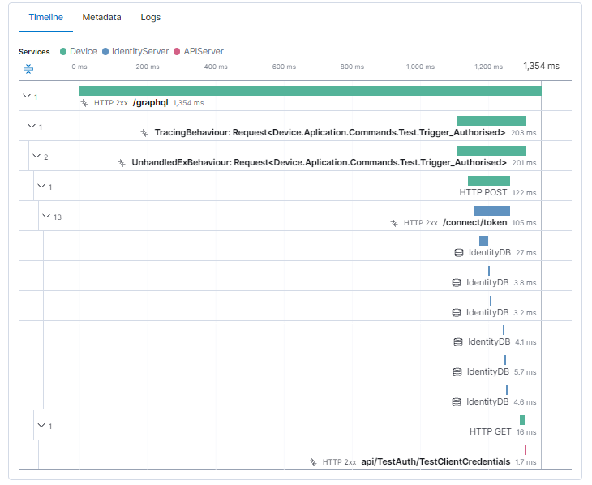

**API hit with cache token managment**

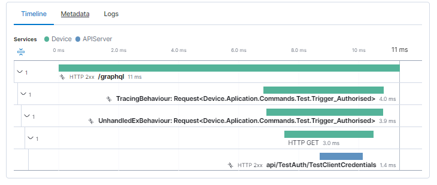

##### Setup Token managment

The most basic setup may be done by extension method:

```c#
public static partial class ServiceExtension {

    // This is your API base addres (You probably wanna move this under Configuration)
    private const string BaseAPIAddress = "https://localhost:5022/api/";

    public static IServiceCollection AddTokenManagment(this IServiceCollection services) {


        services.AddClientAccessTokenManagement(options =>
        {
            options.Clients.Add("identityserver", new ClientCredentialsTokenRequest
            {
                Address = "https://localhost:5001/connect/token",
                ClientId = "device",
                ClientSecret = "secret",
                Scope = "api"
            });

        });

        services.AddClientAccessTokenHttpClient("test_auth_client", configureClient: client =>
        {
            client.BaseAddress = new Uri(BaseAPIAddress);
        });

        return services;
    }
}

```

Then you can request concrete clinet from your code using `HttpClientFactory`

```c#
public async Task<Trigger_AuthorisedPayload> Handle(Trigger_Authorised request, CancellationToken cancellationToken) {

    var client = _clientFactory.CreateClient("test_auth_client");

    var client_response = await client.GetAsync("Test/TestClientCredentials", cancellationToken);

    if(client_response.IsSuccessStatusCode ){
        var response = Trigger_AuthorisedPayload.Success();
        return response;
    }else{
        var response = Trigger_AuthorisedPayload.Error(new InternalServerError(
            string.Format("Failed to process api call status code: {0}",client_response.StatusCode)));
        
        return response;
    }
}
```

The demo contains an example of `client-credential-flow` under the directory `src/Device`.

This project contains a separate application with a test front-end where you can press keys and call the API with/without valid `access_token` and token management.

To run this demo, make sure all other applications are running!

- `/src/APIServer/API/` then run `dotnet watch run`
- `/src/BFF/API/` then run `dotnet watch run`
- `/src/IdentityServer/API/` then run `dotnet watch run`
- `/src/Device/API/` then run `dotnet watch run`

</br>

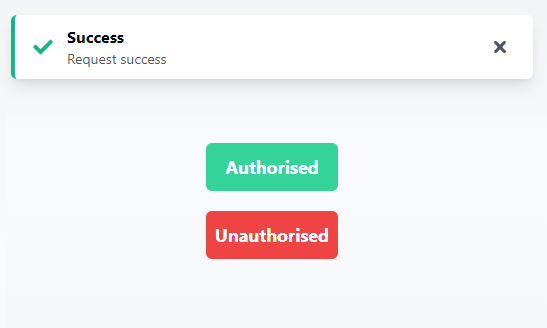
