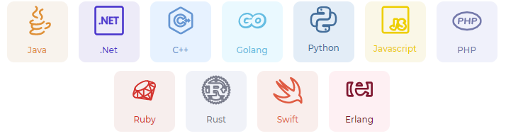
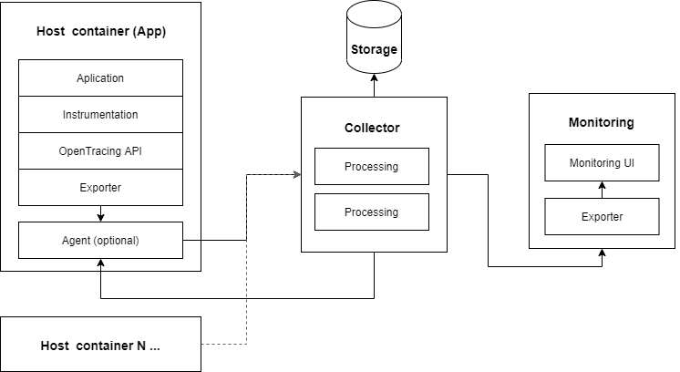
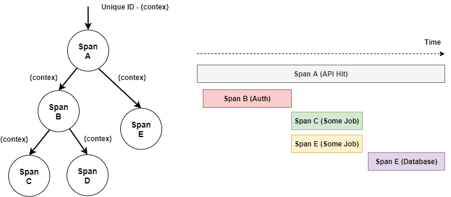
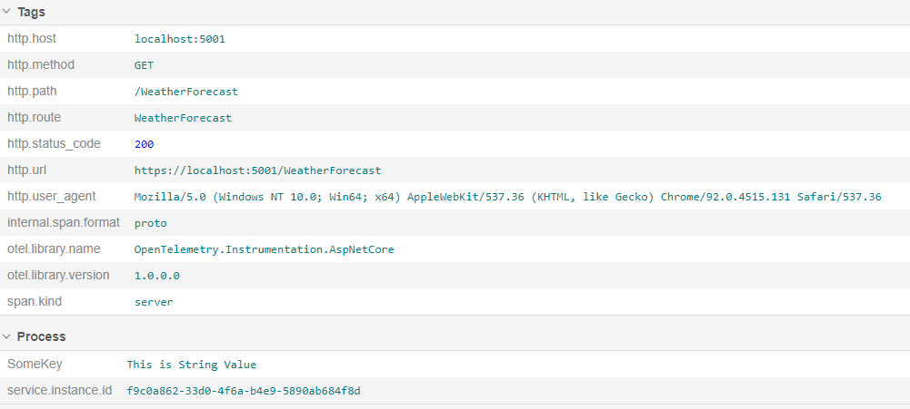
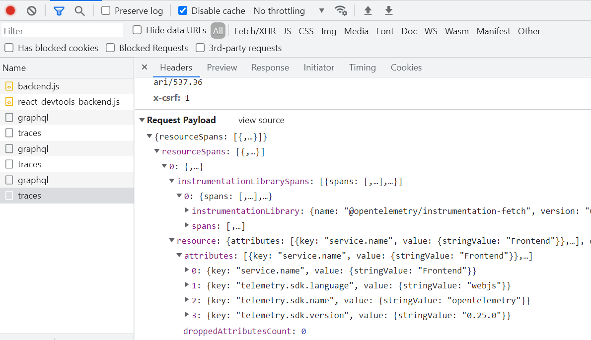

# Table of contents

- [Table of contents](#table-of-contents)
  - [OpenTelemetry](#opentelemetry)
    - [OpenTelemetry components](#opentelemetry-components)
    - [Flow](#flow)
    - [Distributed trace](#distributed-trace)
      - [Tracing signal](#tracing-signal)
      - [Spans](#spans)
      - [Span Context](#span-context)
      - [Span Attributes](#span-attributes)
      - [Span Kind](#span-kind)
      - [LifeCicle](#lifecicle)
  - [Logs vs Telemtry](#logs-vs-telemtry)
    - [Backend .Net Setup](#backend-net-setup)
      - [What is instrumentation](#what-is-instrumentation)
      - [Configuration](#configuration)
    - [Frontend React Setup](#frontend-react-setup)
  - [Jaeger](#jaeger)
    - [Docker Jaeger](#docker-jaeger)
  - [Collector docker](#collector-docker)
    - [Collector compose](#collector-compose)
    - [Collector config](#collector-config)

## OpenTelemetry


Is a collection of tools, APIs and SDKs. Used to collect telemetry data from distributed systems to troubleshoot, debug, and understand software performance and behavior.

**So what that means?**

Many modern applications are based on microservices. These are essentially an interconnected network of services, so understanding system performance from multiple sources is a major challenge. A single call in an application can trigger dozens of events. 

How can developers and engineers isolate a problem when something goes wrong or a request runs slowly?

That's why *Open Telemetry* exists as a new standard, and as of 2021, *OpenTelemetry* has reached a major milestone, the [OpenTelemetry Tracing Specification](https://github.com/\open-telemetry/opentelemetry-specification/blob/main/specification/overview.md) version 1.0.

> &#10240;
>**Opentelemetry** is a standardised way to understand the entire chain of events and the complex interaction between microservices.
> &#10240;

**This is what you wil get at the end**

This real example from this demo that includes frontend to backend tracing and monitoring. You can see all operations in time, with the option to see every detail and logs for all spans.

<p align="center">


</p>

### OpenTelemetry components

- `APIs and SDKs` per programming language for generating and emitting traces  (SDK for `Java`,`.Net`,`C++`,`Golang`,`Python`,`Javascript`,`PHP`,`Ruby` etc...)

<p align="center">
  
</p>

- `Collectors` - provides a vendor-independent implementation for receiving, processing and exporting telemetry data.

- `OTLP protocol`  specification describes the encoding, transport, and delivery mechanism of telemetry data. [You can read more](https://github.com/open-telemetry/opentelemetry-specification/blob/main/specification/protocol/otlp.md).


### Flow

The client instrumented application sends trace data over one of the various available transports. (http, grpc, etc.) to the collector, which processes the trace data and forwards it to the store in our case (Elasticsearch or Jeager).

**Thsis is common tracing architecture example:**

<p align="center">
  
</p>

</br>

In this demo, the opentelemetry collector is hosted as a separate Docker container. All the steps to do this will be explained later in the Monitoring section. This document only explains how to collect and export traces for backend and frontend applications.

In the image below you can see the architecture for this project. All other containers are presented in the monitoring part of this demo. For now, you can ignore them.

</br>

<p align="center">
  
</p>

</br>

Take a look at the opentelemetry part. As you can see, our app exports data via the `otel` protocol to the opentelemetry collector, which can also receive the data externally and send it back to the APM server after processing.

This communication is done via `http` or `grpc`.
- `http` is used to send data from the frontend client to backend over proxy
- `grpc` is used for all other communications between backend and collector and collector and APM server. (Can be also used to frontend > collector/backend)

</br>

### Distributed trace

A distributed trace is a series of events raised as a result of a single logical operation (*Example Request = CreateWebHook*) and consolidated across different components of an application.

#### Tracing signal

`Traces` in OpenTelemetry are implicitly defined by their `spans` (building blocks). These can be projected as contiguous asynchronous diagrams, usually based on the time axis. (*right image*). 

- A `Span` can be connected to zero or more other `Spans`.
- Links can point to `spans` within a single `trace` or across different `traces`.

<p align="center">
  
</p>

#### Spans

A span is the building block of a `trace` and represents part of the workflow in the distributed system. (*WriteToDB, SendNotification, HandleCommand*)

A span represents an operation within a transaction and encapsulates:
 - An operation name
 - A timestamp for start and end
 - A list of key-value pairs. (Custom Attributes)
 - The span identifier of the parent.
 - SpanContext information required to reference a span.

- `Span name` concisely identifies the work represented by the Span. Example: `get_account/{accountId}`

#### Span Context

Represents all the information that identifies `Span` and encapsulates:
 - `TraceId` is the identifier for a trace (unique). TraceId is used to group all spans for a specific trace.
 - `SpanId ` is the identifier for a span (unique)
 - `TraceState` - carries tracing-system specific context in a list of key value pairs.

#### Span Attributes

Attributes are key-value pairs that provide detail about a span.

 - `Status` - (standardized propert), It may be set to values like OK, Cancelled, and Permission Denied
 - `SpanKind` - (standardized propert) 
 - `User-Defined` - you can also create your own attribute key/value

#### Span Kind

SpanKind describes the relationship between the Span, its parents, and its children in a Trace.

`SERVER` Indicates that the span covers server-side handling remote request.
`CLIENT` Indicates that the span describes a request to some remote service. This span does not end until the response is received.
`PRODUCER` Indicates that the span describes the initiators of an asynchronous request. In messaging scenarios with batching, tracing individual messages requires a new PRODUCER span per message to be created.
`CONSUMER` Indicates that the span describes a child of an asynchronous PRODUCER request.
`INTERNAL` Default value. Indicates that the span represents an internal operation within an application, as opposed to an operations with remote parents or children.

#### LifeCicle

In general, the life cycle of a span can be interpreted as follows:
1) A request is received from a service. The span context is extracted from the request headers, if it exists.
2) A new span is created as a child of the extracted span context; if none exists, a new root span is created.
3) The service processes the request. Additional attributes and events are added to the scope. 
4) New areas can be created to represent the work of subcomponents of the service.
5) When the service makes a remote call to another service, the current span context is serialized and forwarded to the next service.
6) The work performed by the service is completed, successful or not

## Logs vs Telemtry

`Log` - Is a timestamped text/structured record.

`Trace` - Track the progression of a single request, called a trace, as it is handled by services that make up an application.

*"Hey isnt logging enaught ?"*

Now, logging is important and helps you diagnose certain errors, but it does not give you the full experience of the queries. What you want is to use logs with telemetry data to get the full experience.

Telemetry data tries to answer questions like:
 - How are users really engaging with the app?
 - How much time do users spend in each app session and between sessions?
 - What is the slowest part of a request?
 - Etc.

**So what is common process to determin problem?**
First, you need to look in Tracing Graph and identify the problem. Based on the request flow, we can see the slowest part or where the problem occurs in time. Which operations were successful and which failed. We collect `SpanIds` and `TraceId` that we are interested in and look for contextual logs to get more details about what really happened. For this reason, we use traces and logs to determine the overall experience of the application.

In order for `OpenTelemetry` to be successful in the logging space, the company is trying to support existing logs and logging libraries so that they work well together.

Separate-collection             |  Unified-collection
:-------------------------:|:-------------------------:
  |  

### Backend .Net Setup

> &#10240;
>**NOTE:** Please always check the main repo and use the latest packages
> &#10240;

[Opentelemetry dotnet](https://github.com/open-telemetry/opentelemetry-dotnet) provides *.Net* SDK and nice API for collecting and exporting traces to external collectors.

**Nuget**

```xml
    <!-- Main package SDK -->
    <PackageReference Include="OpenTelemetry" Version="1.2.0-rc2" />
    <!-- Extensions Hosting - Support to use in DI -->
    <PackageReference Include="OpenTelemetry.Extensions.Hosting" Version="1.0.0-rc9" />
    <!-- Instrumentation `AspNetCore -->
    <PackageReference Include="OpenTelemetry.Instrumentation.AspNetCore" Version="1.0.0-rc9" />
    <!-- Instrumentation `Http -->
    <PackageReference Include="OpenTelemetry.Instrumentation.Http" Version="1.0.0-rc9" />
    <!-- Instrumentation `SQL Client -->
    <PackageReference Include="OpenTelemetry.Instrumentation.SqlClient" Version="1.0.0-rc9" />
    <!-- Instrumentation `EFCore -->
    <PackageReference Include="OpenTelemetry.Contrib.Instrumentation.EntityFrameworkCore" Version="1.0.0-beta2" />
    <!-- Instrumentation `HC Graphql server -->
    <PackageReference Include="HotChocolate.Diagnostics" Version="12.6.0" />
    <!-- Enable trace data export to Jaeger -->
    <PackageReference Include="OpenTelemetry.Exporter.Jaeger" Version="1.2.0-rc2" />
    <!-- Enable trace data export using Otel protocol -->
    <PackageReference Include="OpenTelemetry.Exporter.OpenTelemetryProtocol" Version="1.2.0-rc1" />
```

#### What is instrumentation

The term *instrumentation* is used by several languages to encapsulate tracing, debugging, etc.

- By definition, it refers to the ability to monitor or measure the performance of an application and diagnose errors.

With `NetCore` you have several ways to measure and collect traces.

1) Opentelemetry SDK 
2) NetCore Framework nativ support
3) 3-Part Libs and SDK (Elastic APM SDK...)

**The nativ support is the prefered way** since the NetCore team inject `opentelemetry` support to [`System.Diagnostics APIs`](https://docs.microsoft.com/en-us/dotnet/api/system.diagnostics?view=net-5.0) class implementaion. This helps us to reuse existing instrumentation.

`Opentelemetry` / `NetCore` equialents are:
- For Opentelemetry `Tracer` equialent is .Net [`ActivitySource`](https://docs.microsoft.com/en-us/dotnet/core/diagnostics/distributed-tracing-collection-walkthroughs) class.
- For Opentelemety `Span` equialent is .Net [`Activity`](https://docs.microsoft.com/en-us/dotnet/api/system.diagnostics.activity?view=net-5.0) class.

You can read more about nativ `Opntelemerty` support under officail [Microsoft Release Note](https://devblogs.microsoft.com/dotnet/opentelemetry-net-reaches-v1-0/)

All other SDK options give you +- the same functionality. The naming of the library API may be different, of course, but that's a matter of implementation.

>Most SDKs are currently in a migration process to fully support the Opentelemetry standard and may be deprecated over time, as native standard support is all you need.

If your application and infrastructure supports `Opentelemetry`, you can also easily integrate your exports with cloud monitoring as all major cloud providers (Azure, Google, AWS) support `Opentelemetry` as a standard telemetry input.

#### Configuration

> &#10240;
>**NOTE:** Each service may have some configuration changes from this example, so follow the main sources.
> &#10240;

In `Program.cs` function `services.AddTelemerty(...)`is called to configure OpenTelemetry functionality. The method is part of global partial class `ServiceExtension` and help us to spread the configuration to separate files. 

```c#
 public static partial class ServiceExtension {

        public static IServiceCollection AddTelemerty(
            this IServiceCollection serviceCollection,
            IConfiguration Configuration,
            IWebHostEnvironment Environment)
        {

            serviceCollection.AddTelemetryService(Configuration, out string trace_source);

            serviceCollection.AddOpenTelemetryTracing((builder) =>
            {
                // Sources
                builder.AddSource(trace_source);

                builder.SetResourceBuilder(ResourceBuilder
                  .CreateDefault()
                //   .AddAttributes( new List<KeyValuePair<String, object>> { 
                //     new KeyValuePair<String, object>("SomeKey", "This is String Value")
                //     })
                  .AddService(Environment.ApplicationName));

                builder.AddAspNetCoreInstrumentation(opts =>
                {
                    opts.RecordException = true;

                    // Enricher example
                    opts.Enrich = async (activity, eventName, rawObject) =>
                    {

                        await Task.CompletedTask;

                        if (eventName.Equals("OnStartActivity"))
                        {
                            if (rawObject is HttpRequest { Path: { Value: "/graphql" } })
                            {
                                // Do something with request..
                            }
                        }
                    };
                    // opts.Filter = (httpContext) =>
                    // {
                    // only collect telemetry about HTTP GET requests
                    // return httpContext.Request.Method.Equals("GET");
                    // };
                });

                builder.AddSqlClientInstrumentation();

                builder.AddHttpClientInstrumentation(
                    opts => opts.RecordException = true);

                builder.AddEntityFrameworkCoreInstrumentation(
                    e => e.SetDbStatementForText = true);

                builder.AddHotChocolateInstrumentation();

                builder.AddOtlpExporter(options =>
                {
                    // Load endpoint url from appsetting.json
                    options.Endpoint = new Uri(Configuration["ConnectionStrings:OtelCollector"]);

                    options.TimeoutMilliseconds = 10000;            
                });

                // This is example for Jaeger integration
                // if (Uri.TryCreate(Configuration.GetConnectionString("Jaeger"), UriKind.Absolute, out var uri)) {
                //     builder.AddJaegerExporter(opts => {
                //         opts.AgentHost = uri.Host;
                //         opts.AgentPort = uri.Port;
                //         opts.BatchExportProcessorOptions = new OpenTelemetry.BatchExportProcessorOptions<Activity>() {
                //         };
                //     });

                //     // builder.AddZipkinExporter(opts => {
                //     //     opts.Endpoint = new Uri("http://localhost:9412/api/v2/spans");
                //     // });
                // }
            });

            serviceCollection.AddLogging(opt =>
            {
                opt.AddTraceSource(trace_source);

                opt.AddOpenTelemetry(e =>
                {
                    e.IncludeFormattedMessage = true;

                    e.IncludeScopes = true;
                });
            });

            serviceCollection.AddScoped<ITelemetry, Telemetry>();

            return serviceCollection;
        }
    }
```

Connection strings are loaded from `AppSettings.json` section `ConnectionStrings`.

```Json
  "ConnectionStrings": {
    "HangfireConnection": "...",
    "ApiDbContext": "...",
    "AppIdnetityDbContext": "...",
    "Elasticsearch": "...",
    "Opentelemetry": "http://localhost:55680",
    "Jaeger": "udp://localhost:6831"
  },
```

- `builder.AddSource(Sources.DemoSource.Name)` Register one (Global) `ActivitySource` used throughout the application. It requires to import the `System.Diagnostics` namespace to use it.

> &#10240;
> You can create also multiple sub *Sources* as `demo.subname` etc...
> &#10240;

Each project contains its own definition of the source name:

```c#
// Src/APIServer/Domain/Sources/TraceSource.cs
public static class SourcesExtensions {

    // Implemented based on https://github.com/open-telemetry/opentelemetry-dotnet/blob/main/src/OpenTelemetry.Api/README.md#instrumenting-a-libraryapplication-with-net-activity-api 
    private static readonly AssemblyName AssemblyName
    = typeof(Sources).Assembly.GetName();
    internal static readonly ActivitySource ActivitySource
        = new(AssemblyName.Name, AssemblyName.Version.ToString());

    public static readonly ActivitySource DemoSource = new("APIServer");

}
```

- `.AddService(Environment.ApplicationName)` - defines aplication name in Trace context. This is important to differ what service trigger the events and also is visible in tracing time graph. You can define any `string` or use `Assembly` name.
    
    </br>

    ```c#
    builder.SetResourceBuilder(ResourceBuilder
        .CreateDefault()
        .AddService(Environment.ApplicationName)); // APIServer or Identityserver or BFF
    ```
    
    </br>

- `.AddAttributes` - Using the builder you can additionaly add any other global attributes to traces. This attributes are not scoped but defined for one instance.

```c#
builder.SetResourceBuilder(ResourceBuilder
    .CreateDefault()
    .AddAttributes( new List<KeyValuePair<String, object>> { 
        new KeyValuePair<String, object>("SomeKey", "This is string Value")
        })
    .AddService(Environment.ApplicationName));
```


### Frontend React Setup

For front-end clients, opentelemtry provides the main SDK [opentelemetry-js](https://github.com/open-telemetry/opentelemetry-js). There are also several additional packages needed for instrumenting exporting the traces.

Required imports from `package.json` are:

```json
"dependencies": {
    "@opentelemetry/api": "1.0.4",
    "@opentelemetry/context-zone": "1.0.1",
    "@opentelemetry/exporter-trace-otlp-http": "0.27.0",
    "@opentelemetry/instrumentation-document-load": "0.27.0",
    "@opentelemetry/instrumentation-fetch": "0.27.0",
    "@opentelemetry/sdk-trace-base": "1.0.1",
    "@opentelemetry/sdk-trace-web": "1.0.1",
    "@opentelemetry/resources": "1.0.1",
}
```

> &#10240;
>**NOTE:** Please always check the main sources package.json to make sure you are not missing anything. Follow the app sources available with this documentation. The frontend is available at `/src/BFF/API/ClientApp`.
> &#10240;

Demo React frontend uses the ideology of provider components. This is a set of components that wrap around each other to provide a particular functionality, such as `UserProvider` or `EnviromentProvider` or in our case `TracingProvider`.

```tsx
// Providers.tsx
  <EnviromentContext.Provider value={providerInit}>
    <EnviromentContext.Consumer>
      {(state) =>
        state && (
          <RelayEnvironmentProvider environment={state?.env}>
            <Suspense fallback={fallback ? fallback : null}>
              <TraceProvider>
                <UserProvider>
                    <ToastProvider>{children}</ToastProvider>
                </UserProvider>
              </TraceProvider>
            </Suspense>
          </RelayEnvironmentProvider>
        )
      }
    </EnviromentContext.Consumer>
  </EnviromentContext.Provider>
```

where `<TraceProvider>` is implemented as this:

```tsx
import React from "react";
import { WebTracerProvider  } from '@opentelemetry/sdk-trace-web';
import { SimpleSpanProcessor } from '@opentelemetry/sdk-trace-base';
import { ZoneContextManager } from '@opentelemetry/context-zone';
import { FetchInstrumentation } from '@opentelemetry/instrumentation-fetch';
import { registerInstrumentations } from '@opentelemetry/instrumentation';
import { Resource } from '@opentelemetry/resources';
import { OTLPTraceExporter  } from "@opentelemetry/exporter-trace-otlp-http"
import {TRACES_ENDPOINT} from "../constants"

const collectorOptions = {
    url: TRACES_ENDPOINT, 
    headers: {
    "Content-Type": "application/json", 
    'Access-Control-Allow-Headers': '*',
    'X-CSRF': '1',
  },
    concurrencyLimit: 10,
  };

// Trace provider (Main aplication trace)
const provider = new WebTracerProvider({
  resource: new Resource({
    "service.name": "Frontend",
  }
  )});

// Exporter (opentelemetry collector hidden behind bff proxy)
const exporter = new OTLPTraceExporter (collectorOptions);

// Instrumentation configurations for frontend
const fetchInstrumentation = new FetchInstrumentation({
  ignoreUrls : ["https://some-ignored-url.com"]
});

fetchInstrumentation.setTracerProvider(provider);

provider.addSpanProcessor(new SimpleSpanProcessor(exporter));

provider.register({
  contextManager: new ZoneContextManager(),
});

// Registering instrumentations
registerInstrumentations({
    instrumentations: [new FetchInstrumentation()],
});

export type TraceProviderProps = {
  children?: React.ReactNode;
};

export default function TraceProvider({ children }: TraceProviderProps) {

  return (
    <>
      {children}
    </>
  );
}

```
</br>

There are few important points to dont forget about:
- Setting aplication name `"service.name": "Frontend"` important for monitoring UI
- Send proper headers on exporter configuration as `'X-CSRF': '1'` etc.. based on backend configuration
- Provide ignoreUrls
- Specify the export endpoint URL of this demo backend configuration. It is `https://localhost:5015/traces` and will be forwarded to the real collector endpoint later and https will be terminated.

With this configuration, our frontend instruments only the outbound fetches needed to analyze and visualize the full flow between frontend backend and all related services.

**This is an example of a trace that was sent from the frontend to the collector**

<p align="center">
  
</p>

```
{
  "resourceSpans": [
    {
      "resource": {
        "attributes": [
          {
            "key": "service.name",
            "value": {
              "stringValue": "Frontend"
            }
          },
          {
            "key": "telemetry.sdk.language",
            "value": {
              "stringValue": "webjs"
            }
          },
          {
            "key": "telemetry.sdk.name",
            "value": {
              "stringValue": "opentelemetry"
            }
          },
          {
            "key": "telemetry.sdk.version",
            "value": {
              "stringValue": "1.0.1"
            }
          }
        ],
        "droppedAttributesCount": 0
      },
      "instrumentationLibrarySpans": [
        {
          "spans": [
            {
              "traceId": "d6d75718930b3558e4fe0808877f8e80",
              "spanId": "3b7f9b452a7b5ddf",
              "name": "HTTP POST",
              "kind": 3,
              "startTimeUnixNano": 1644389713311600000,
              "endTimeUnixNano": 1644389713673100000,
              "attributes": [
                {
                  "key": "component",
                  "value": {
                    "stringValue": "fetch"
                  }
                },
                {
                  "key": "http.method",
                  "value": {
                    "stringValue": "POST"
                  }
                },
                {
                  "key": "http.url",
                  "value": {
                    "stringValue": "/graphql"
                  }
                },
                {
                  "key": "http.status_code",
                  "value": {
                    "intValue": 200
                  }
                },
                {
                  "key": "http.status_text",
                  "value": {
                    "stringValue": ""
                  }
                },
                {
                  "key": "http.host",
                  "value": {
                    "stringValue": "localhost:5015"
                  }
                },
                {
                  "key": "http.scheme",
                  "value": {
                    "stringValue": "https"
                  }
                },
                {
                  "key": "http.user_agent",
                  "value": {
                    "stringValue": "Mozilla/5.0 (Windows NT 10.0; Win64; x64) AppleWebKit/537.36 (KHTML, like Gecko) Chrome/98.0.4758.82 Safari/537.36"
                  }
                },
                {
                  "key": "http.response_content_length",
                  "value": {
                    "intValue": 168
                  }
                }
              ],
              "droppedAttributesCount": 0,
              "events": [
                {
                  "timeUnixNano": 1644389713312300000,
                  "name": "fetchStart",
                  "attributes": [],
                  "droppedAttributesCount": 0
                },
                {
                  "timeUnixNano": 1644389713312300000,
                  "name": "domainLookupStart",
                  "attributes": [],
                  "droppedAttributesCount": 0
                },
                {
                  "timeUnixNano": 1644389713312300000,
                  "name": "domainLookupEnd",
                  "attributes": [],
                  "droppedAttributesCount": 0
                },
                {
                  "timeUnixNano": 1644389713312300000,
                  "name": "connectStart",
                  "attributes": [],
                  "droppedAttributesCount": 0
                },
                {
                  "timeUnixNano": 1644389713312300000,
                  "name": "secureConnectionStart",
                  "attributes": [],
                  "droppedAttributesCount": 0
                },
                {
                  "timeUnixNano": 1644389713312300000,
                  "name": "connectEnd",
                  "attributes": [],
                  "droppedAttributesCount": 0
                },
                {
                  "timeUnixNano": 1644389713314500000,
                  "name": "requestStart",
                  "attributes": [],
                  "droppedAttributesCount": 0
                },
                {
                  "timeUnixNano": 1644389713670100000,
                  "name": "responseStart",
                  "attributes": [],
                  "droppedAttributesCount": 0
                },
                {
                  "timeUnixNano": 1644389713670800100,
                  "name": "responseEnd",
                  "attributes": [],
                  "droppedAttributesCount": 0
                }
              ],
              "droppedEventsCount": 0,
              "status": {
                "code": 0
              },
              "links": [],
              "droppedLinksCount": 0
            }
          ],
          "instrumentationLibrary": {
            "name": "@opentelemetry/instrumentation-fetch",
            "version": "0.27.0"
          }
        }
      ]
    }
  ]
}
```

</br>

There are other instrumentations you can use to measure document load time or navigation between pages, etc, but that's not the use case of this Tracing. This has more to do with metrics and for metrics there are several libs like [sentry.io](https://sentry.io/welcome/) or APM for the frontend. This can also be done via opentelemetry, but it's a different concept in how you look at the data.

On the frontend, transactions are often considered as operations (loading the whole page, navigation, adding items to the cart, etc), but from our point of view, transactions are isolated commands like `CreateWebHook` or `SubmitForm`.

## Jaeger

> **NOTE:** Jaeger is not used in the demo, but it is a popular tool for quick trace analysis. In this demo, Elastic Stack is used to analyze metrics, logs, and trces and summarize and display them at UI.

Jaeger is distributed tracing system released as open source by [Uber Technologies](https://uber.github.io/). It provides full tracing experience include client side SDK. Since 2020 `Jeager` has builded in support for `Opentelemetry`.

**Components**
`Jaeger Client SDK` - language-specific implementations for app instrumenting. (not used in demo)
`Jaeger Agent` - is a network daemon that listens for spans sent over User Datagram Protocol
`Jaeger Collector`- receives spans and places them in a queue for processing.
`Jaeger Query` - is a service that retrieves traces from storage.
`Jaeger UI` - provides a user interface that lets you visualize your distributed tracing data.

If you wanna use Jaeger without `Opentelemetry SDK` You can [explore its SDK](https://github.com/jaegertracing/jaeger-client-csharp). It does similar stuff as `Opentelemetry SDK` or `Elastic APM Agent` SDK..


> **Demo** uses Jeager as **collector** and normalizer for streamed traces and **Jaeger UI** to visualize collected data. Client trace data are exported over Openetelemety SDK!

**Technical info:**
- Backend components implemented in Go
- Frontend React/Javascript UI
- Multiple scallable storage backends:
    - Cassandra
    - Elasticsearch
    - Kafka
    - memory storage

### Docker Jaeger

You can use Jaeger when you start distributed tracing.

In folder `./Src/Docker/Jaeger` is `docker-compose.yml` containing jaeger all-in-one image. By running `docker-compose up` you can setup dev. Image.

**Deployment strategy**

Isn`t it a bit strange if we want to track a large distributed service, but only send the metrics to a "monolithic" Docker service (all-in-one solution)?


> **In production enviroment you wanna choose scalable jaeger deployment!**

For deployin `Jaeger` in production please [follow official documentation](https://www.jaegertracing.io/docs/1.24/deployment/).


## Collector docker

This is example of Collector configuration docker file + otel cfg.

> Detail configuration with elastic search is presented in separate doc. file for elasticsearch integration!

### Collector compose

```yaml  
opentelemetry-collector:
container_name: opentelemetry-collector
hostname: opentelemetry-collector
image: otel/opentelemetry-collector:0.43.0
command: [ "--config=/etc/otel-collector-config.yml" ]
volumes:
    - ./otel-collector-config.yml:/etc/otel-collector-config.yml
ports:
    - "14250:14250"
    - "55680:55680"
    - "55690:55690"
# depends_on:
#     elasticsearch01:
#     condition: service_healthy
#     apm-server:
#     condition: service_healthy
networks:
    - elastic

networks:
  elastic:
    driver: bridge
```

### Collector config

```yaml
receivers:
  otlp:
    protocols:
      grpc:
        endpoint: 0.0.0.0:55680
      http:
        endpoint: "0.0.0.0:55690"

processors:
  batch:

exporters:
  otlp/2:
    endpoint: apm-server:8200
    tls:
      insecure: true
  logging:

service:
  pipelines:
    traces:
      receivers: [otlp]
      processors: [batch]
      exporters: [logging, otlp/2]
    metrics:
      receivers: [otlp]
      processors: [batch]
      exporters: [logging, otlp/2]
```