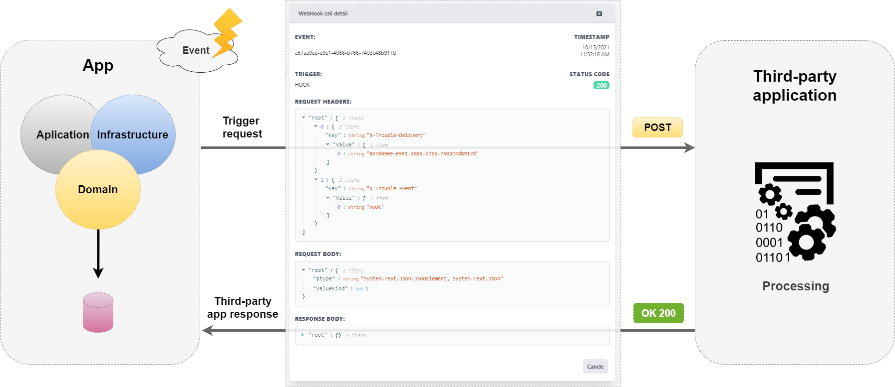
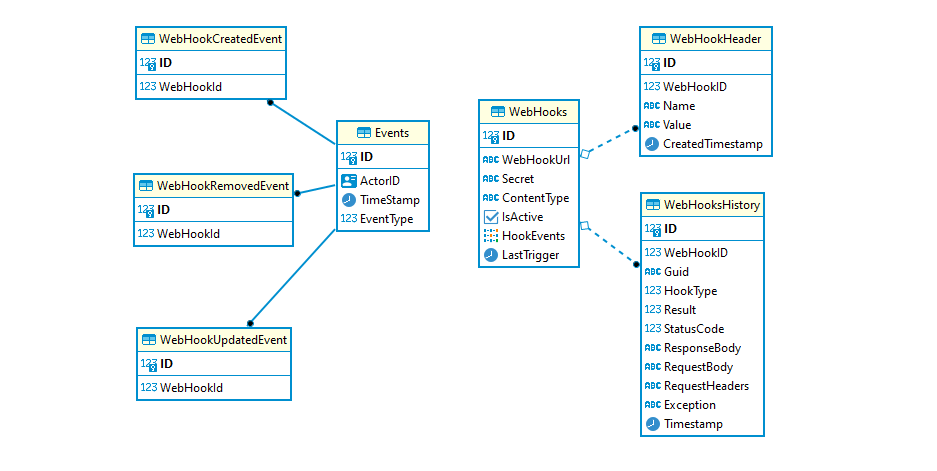
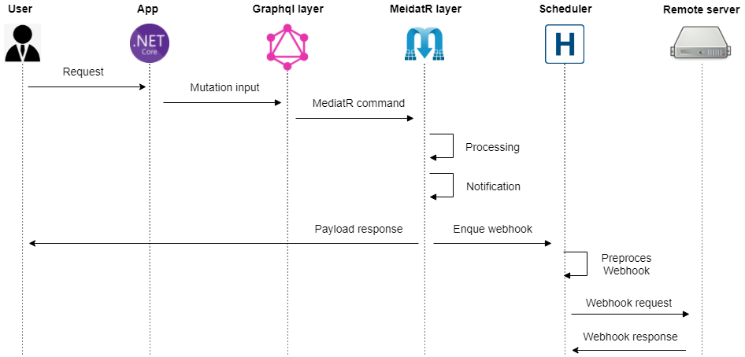
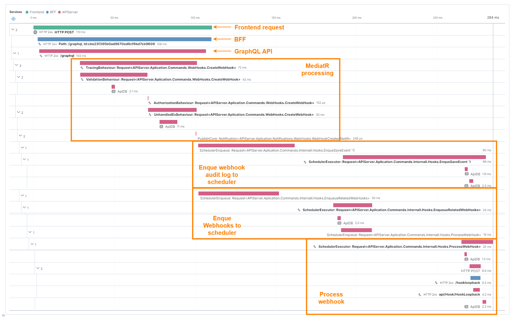
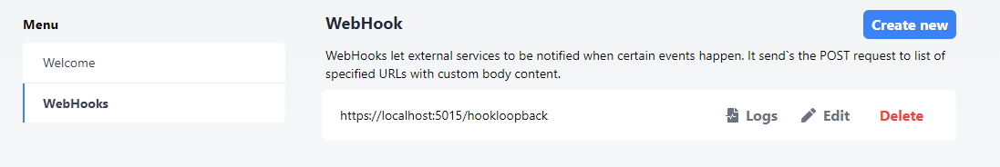
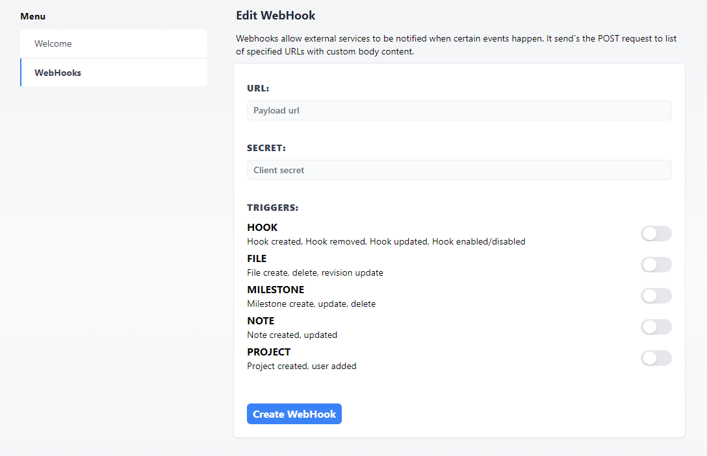
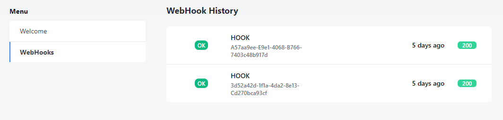

## WebHooks

A webhook is a way for a application to provide callbacks for 3-part applications. 

When an event occurs, the source application typically triggers an http POST call to a pre-configured external URL and wraps the data from the triggered event in the request's payload. 

This approach allows external applications to respond to events via the standard WebAPI interface.



This pattern is used by most large companies and I will use [Github](https://docs.github.com/en/developers/webhooks-and-events/events/github-event-types) *(listen to new pull request or issue was created)* as a template and integrate this functionality into the NetCore (c#) backend application.

## Demo requirements

- Be able to create/update and delete webhooks.
- Each WebHook can listen for one or more events.
- WebHook processing must be asynchronous to the user request, including some basic retry policies in case delivery fails.
- You can view the history of WebHooks that have been triggered.
- You can view the system history (audit logs) when the webhook was created/deleted or the parameters were updated.

## ED diagram

The ED diagram (Entity Relationship Model) shows the basic WebHook database tables and the relationships between them. This is what we need to build in our database


**On the left** you see the *System Event Model*, which is used to store information such as WebHook Created/Updated or Deleted. This represents some system audit (tracking) logs for monitoring webhook history in the application.

**On the right side** you can see the *WebHook database model*, which is very simple. Each webhook has multiple headers and multiple trigger history.

**WebHook structure:**
- ID - primary key of the database
- WebHookUrl - the url that will be triggered when someone is listening.
- Secret - this is the API key or authorization token used by 3-part applications to protect the API and only accept requests that have a valid secreat. The secret is transmitted with each request as the HTTP header ''X-Trouble-Secret'', which you can later rename as you wish.
- ContentType - represents the ContentType of the HTTP message.
- IsActive - is a flag to enable/disable the hook to send events.
- HookEvents - collection of events that the hook should listen for.
- Headers - list of additional headers you want to send with the webhook.
- Records - history of the webhook triggering log.
- LastTrigger - last time when the webhook was triggered.
 
**WebHookHistory Structure:**
- ID - Primary key of the database
- WebHookID - Associated webhook primary key
- Guid - alternate global unique key
- HookType - type of event that triggers the hook
- Result - result object of the webhook run
- StatusCode - result status code
- ResponseBody - body rcv from triggered endpoint url
- RequestBody - requested body
- RequestHeaders - requested headers sent with the message
- Exception - information about any exceptions
- Timestamp - date and time of the triggering event

**WebHookHeader structure:**
- ID - primary key of the database
- WebHookID - associated webhook primary key
- Name - name of the header
- value - value of the header

</br>

To convert this diagram into real database tables, I use the 'code-first-approach' with [EFCore ORM](https://docs.microsoft.com/en-us/ef/core/) (Object-relational mapper) and some design packages that help us convert C# code into an automatically generated DB migration.

## Stack

This is the most important part of this demo:

- `Netcore` as the backend framework.
- `EF-Core` as ORM to map our C# objects to database entities and `EF-Tools` to create database migrations.
- `MediatR` as in-memory messaging to process commands like CreateWebHook/ProcessWebHook etc.
- `Hangfire` for processing hooks in a queue and for basic retry policies.
- `PostgreSQL` as a database. (You can also use in-memory for testing). 
  
> **NOTE:** The final code sources are more complex and this article focuses only on WebHook integration!

## Domain level

The domain layer is a collection of entity objects and associated business logic that we call `domain models`.

## WebHook Domain Model

Since we are using the `code-first` approach to create database tables, we should define our WebHook domain:

`/Src/APIServer/Domain/Hooks/WebHook.cs`
```c#

namespace APIServer.Domain.Core.Models.WebHooks {
    public class WebHook {

        public WebHook() {
            this.Headers = new HashSet<WebHookHeader>();
            this.HookEvents = new HookEventType[0];
            this.Records = new List<WebHookRecord>();
        }

        /// <summary>
        /// Hook DB Id
        /// </summary>
        public long ID { get; set; }

        /// <summary>

        /// <summary>
        /// Webhook endpoint
        /// </summary>
        public string WebHookUrl { get; set; }

        /// <summary>
        /// Webhook secret
        /// </summary>
        #nullable enable
        public string? Secret { get; set; }
        #nullable disable
        
        /// <summary>
        /// Content Type
        /// </summary>
        public string ContentType { get; set; }

        /// <summary>
        /// Is active / NotActiv
        /// </summary>
        public bool IsActive { get; set; }

        /// <summary>
        /// Hook Events context
        /// </summary>
        public HookEventType[] HookEvents { get; set; }

        /// <summary>
        /// Additional HTTP headers. Will be sent with hook.
        /// </summary>
        virtual public HashSet<WebHookHeader> Headers { get; set; }

        /// <summary>
        /// Hook call records history
        /// </summary>
        virtual public ICollection<WebHookRecord> Records { get; set; }

        /// <summary>
        /// Timestamp of last hook trigger
        /// </summary>
        /// <value></value>
        public DateTime? LastTrigger { get; set; }
    }
}
```

Each hook contains multiple `WebHookRecord`.

`/Src/APIServer/Domain/Hooks/WebHookRecord.cs`

```c#
namespace APIServer.Domain.Core.Models.WebHooks {
    public class WebHookRecord {

        public WebHookRecord() { }

        /// <summary>
        /// Hook record DB Id
        /// </summary>
        public long ID { get; set; }

        /// <summary>
        /// Linked Webhook Id
        /// </summary>
        public long WebHookID { get; set; }

        /// <summary>
        /// Linked Webhook
        /// </summary>
        public WebHook WebHook { get; set; }

        /// <summary>
        /// Unique GUID
        /// </summary>
        public string Guid { get; set; }

        /// <summary>
        /// WebHookType
        /// </summary>
        public HookEventType HookType { get; set; }

        /// <summary>
        /// Hook result enum
        /// </summary>
        public RecordResult Result { get; set; }

        /// <summary>
        /// Response
        /// </summary>
        public int StatusCode { get; set; }

        /// <summary>
        /// Response json
        /// </summary>
        public string ResponseBody { get; set; }

        /// <summary>
        /// Request json
        /// </summary>
        public string RequestBody { get; set; }

        /// <summary>
        /// Request Headers json
        /// </summary>
        public string RequestHeaders { get; set; }

        /// <summary>
        /// Exception
        /// </summary>
        public string Exception { get; set; }

        /// <summary>
        /// Hook Call Timestamp
        /// </summary>
        public DateTime Timestamp { get; set; }
    }


    public enum RecordResult {
        undefined = 0,
        ok,
        parameter_error,
        http_error,
        dataQueryError
    }
}

```

Each hook contains multiple `WebHookHeader`

`/Src/APIServer/Domain/Hooks/WebHookHeader.cs`
```c#
namespace APIServer.Domain.Core.Models.WebHooks {
    public class WebHookHeader {

        /// <summary>
        /// Hook header ID
        /// </summary>
        public long ID { get; set; }

        /// <summary>
        /// Linked Webhook Id
        /// </summary>
        public long WebHookID { get; set; }

        /// <summary>
        /// Linked Webhook
        /// </summary>
        public WebHook WebHook { get; set; }

        /// <summary>
        /// Header Name
        /// </summary>
        public string Name { get; set; }

        /// <summary>
        /// Header content
        /// </summary>
        public string Value { get; set; }

        /// <summary>
        /// Header created time
        /// </summary>
        public DateTime CreatedTimestamp { get; set; }
    }
}
```

Each webhook can be triggered by multiple events:

`/Src/APIServer/Domain/Hooks/WebHookEvents.cs`
```c#
namespace APIServer.Domain.Core.Models.WebHooks {

    public enum HookEventType {
        
        // Take this as an example, you can implement any event source you like.
        hook, //(Hook created, Hook deleted ...)

        file, // (Some file uploaded, file deleted)

        note, // (Note posted, note updated)

        project, // (Some project created, project dissabled)

        milestone // (Milestone created, milestone is done etc...)

        //etc etc.. You can define your custom events types....
    }
}

```

Each event type groups different related actions:

`/Src/APIServer/Domain/Hooks/HookActions.cs`
```c#
namespace APIServer.Domain.Core.Models.WebHooks {

    // Actions of HookEventType
    public enum HookResourceAction {
        undefined,
        hook_created,
        hook_removed,
        hook_updated,
        // etc...
    }

    // Actions of ProjectEventType
    public enum projectAction {
        undefined,
        project_created,
        project_renamed,
        project_archived,
        //etc...
    }

}
```

### Events Domain model

`/Src/APIServer/Domain/Events/HookActions.cs`
```c#
namespace APIServer.Domain.Core.Models.Events {

    public class DomainEvent {
        public long ID { get; set; }
        #nullable enable
        public Guid? ActorID { get; set; }
        #nullable disable
        public DateTime TimeStamp { get; set; }

        public EventType EventType { get; set; }
    }
}
```

where `EventType` is:

`/Src/APIServer/Domain/Events/EventType.cs`
```c#
namespace APIServer.Domain.Core.Models.Events {

    public enum EventType {
        WebHook,
        System,
        Project,
    }
}
```

And then we can define our system events as follows:

`/Src/APIServer/Domain/Events/EventType.cs`
```c#

    /// <summary>
    /// WebHookCreated
    /// </summary>
    public class WebHookCreated : DomainEvent {

        public WebHookCreated() { }

        public long WebHookId {get;set;}

        // Add any custom props hire...
    }

    // Equal for 

```

## Persistence layer

This layer provides helpers to maintain application state at DB. In general, it defines `DBContext`, database `configuration files` and `migrations`.

Make sure you have installed the required packages in your `APIServer.Persistence.csproj`.

```xml
<PackageReference Include="Microsoft.EntityFrameworkCore" Version="5.0.9" />
<PackageReference Include="Microsoft.EntityFrameworkCore.Tools" Version="5.0.9">
```

Based on our domain model, the DBContext must contain these collections:
- `WebHooks` - Stored WebHooks.
- `WebHooksHistory` - WebHook history logs
- `Events` - WebHook system logs

Database DbContext:

`/Src/APIServer/Persistence/ApiDbContext.cs`
```c#
namespace APIServer.Persistence {

    public class ApiDbContext : DbContext {

        public DbSet<WebHook> WebHooks { get; set; }
        
        public DbSet<WebHookRecord> WebHooksHistory { get; set; }

        public DbSet<DomainEvent> Events { get; set; }

        public ApiDbContext(
            DbContextOptions<ApiDbContext> options)
            : base(options) { }

        protected override void OnModelCreating(ModelBuilder modelBuilder) {

            modelBuilder.ApplyConfigurationsFromAssembly(typeof(ApiDbContext).Assembly);

            modelBuilder.Entity<WebHookCreated>().ToTable("WebHookCreatedEvent");

            modelBuilder.Entity<WebHookRemoved>().ToTable("WebHookRemovedEvent");

            modelBuilder.Entity<WebHookUpdated>().ToTable("WebHookUpdatedEvent");

            modelBuilder.Entity<WebHook>().HasData(
                new WebHook() { 
                    ID = 1,
                    WebHookUrl = "https://localhost:5015/hookloopback",
                    IsActive = true,
                    ContentType = "application/json",
                    HookEvents=new HookEventType[]{HookEventType.hook}
                });

            base.OnModelCreating(modelBuilder);
        }
    }
}
```

By overriding the `OnModelCreating` function, we can configure our database model.
- `ApplyConfigurationsFromAssembly` - Specifies that all configuration files are loaded. These are defined manually in the `/Src/APIServer/Persistence/Configuration` folder as separate configuration classes.
- Define associations of units to tables (TPT)
- Initial database data

Entity configuration: (loaded with 'ApplyConfigurationsFromAssembly')

`/Src/APIServer/Persistence/Configuration/WebHook.cs`
```c#
namespace APIServer.Persistence {
    public class WebHookonfiguration : IEntityTypeConfiguration<WebHook> {
        public void Configure(EntityTypeBuilder<WebHook> builder) {

            builder.HasKey(e => e.ID);
            
            builder.HasMany(e => e.Headers)
            .WithOne(e => e.WebHook)
            .HasForeignKey(e => e.WebHookID);

            builder.HasMany(e => e.Records)
            .WithOne(e => e.WebHook)
            .HasForeignKey(e => e.WebHookID);
        }
    }
}
```

To generate DB migrations from our DBContext definition and DB configuration files an [`EFCore Tools`](https://docs.microsoft.com/en-us/ef/core/cli/dotnet) is used.

You need to install this with `cli` by running:

`dotnet tool install --global dotnet-ef`

You can verify the installation by running `dotnet ef` in the terminal and you should get the following:

```sh
                     _/\__       
               ---==/    \\      
         ___  ___   |.    \|\    
        | __|| __|  |  )   \\\   
        | _| | _|   \_/ |  //|\\ 
        |___||_|       /   \\\/\\

Entity Framework Core .NET Command-line Tools 5.0.9
```

To generate migration files you can run this command from `Src/APIServer/Persistence`

```sh
dotnet ef migrations add Init
```

This will create the `Migrations` folder with the appropriate migration files. To apply these migrations to your database, you can run the following:

```sh
dotnet ef database update
```

> &#10240;
>**NOTE:** Please make sure that the connection string defined in your configuration `MigrationConfig.cs` is valid. The migration tool needs it to connect to your DB and perform table creation.
> &#10240;

</br>

Since we want to keep the start of our main project clean, we also define a service collection extension. This helps us register our DBContext with a single command `services.AddApiDbContext(...);` and keep all the configuration out of the `Startup.cs`.

`/Src/APIServer/Persistence/Extensions/AddApiDbContext.cs`
```c#
namespace APIServer.Persistence.Extensions {
    
    public static partial class ServiceExtension {

        public static IServiceCollection AddApiDbContext(
            this IServiceCollection serviceCollection,
            IConfiguration Configuration, IWebHostEnvironment Environment) {

            serviceCollection.AddPooledDbContextFactory<ApiDbContext>(
                (s, o) => o
                    .UseNpgsql(Configuration["ConnectionStrings:ApiDbContext"], option => {
                    option.EnableRetryOnFailure();

                    if (Environment.IsDevelopment()) {
                        o.EnableDetailedErrors();
                        o.EnableSensitiveDataLogging();
                    }

                    }).UseLoggerFactory(s.GetRequiredService<ILoggerFactory>()));
                    
            return serviceCollection;
        }
    }
}
```

The `ConnectionStrings:ApiDbContext` is defined in `Src/APIServer/API/appsettings.json` as:

```json
{
  "ConnectionStrings": {
    "ApiDbContext": "Host=localhost;Port=5555;Database=APIServer;Username=postgres;Password=postgres",
  },
}
```

As you can see from the definition, the `AddPooledDbContextFactory` is used. This is required because GraphQL resolves load data in parallel, so multiple queries are made to the database at the same time. This is not possible with the traditional `Scoped` db context, as it is not thread-safe and cannot perform parallel processing!

## Application layer

This layer contains **MediatR** (CQRS) `commands` and `queries` to accomplish a specific application task.

It also contains a GraphQL layer on top of the MediatR application logic. Unfortunately, since `GraphQL` and `MediatR` provide similar concepts, the DDD pattern sometimes does not follow 100% of the known rules and is split between this two parts. Ideally, there would be complete separation, but since advanced error handling or cursor pagination is used, some of the DDD rules are ignored.

This is the distributed trace of the `CreateWebHook` command. You can see each part that we will implement.


Theoretical flow:



Real trace measurement:


### WebHook commands and queries

Lets have a look on example `CreateWebHook` command:

`Src/APIServer/Aplication/Public/Hooks/Create_WebHook.cs`
```c#
namespace APIServer.Aplication.Commands.WebHooks {

    /// <summary>
    /// Command for creating webhook
    /// </summary>
    [Authorize] // <-- Activate Auth check for command
    // [Authorize(FieldPolicy = true)] <-- Uncommend to activate Field Auth check for command
    public class CreateWebHook : IRequest<CreateWebHookPayload> {

        public CreateWebHook() {
            this.HookEvents = new HashSet<HookEventType>();
        }

        /// <summary> Url </summary>
        public string WebHookUrl { get; set; }

        /// <summary> Secret </summary>
        public string? Secret { get; set; }

        /// <summary> IsActive </summary>
        public bool IsActive { get; set; }

        /// <summary> HookEvents </summary>
        public HashSet<HookEventType> HookEvents { get; set; }
    }

    /// <summary>
    /// CreateWebHook Validator
    /// </summary>
    public class CreateWebHookValidator : AbstractValidator<CreateWebHook> {

        private readonly IDbContextFactory<ApiDbContext> _factory;

        public CreateWebHookValidator(IDbContextFactory<ApiDbContext> factory){
            _factory = factory;

            RuleFor(e => e.WebHookUrl)
            .NotEmpty()
            .NotNull();
            
            RuleFor(e => e.WebHookUrl)
            .Matches(Common.URI_REGEX)
            .WithMessage("Does not match URI expression");

            RuleFor(e => e.WebHookUrl)
            .MustAsync(BeUniqueByURL)
            .WithMessage("Hook endpoint allready exist");

            RuleFor(e => e.WebHookUrl)
            .MustAsync(CheckMaxAllowedHooksCount)
            .WithMessage("Max allowed hooks count detected");

            RuleFor(e => e.HookEvents)
            .NotNull();
        }

        public async Task<bool>  BeUniqueByURL(string url, CancellationToken cancellationToken) {
            
            await using ApiDbContext dbContext = 
                _factory.CreateDbContext();

            return await dbContext.WebHooks.AllAsync(e => e.WebHookUrl != url);
        }

        public async Task<bool> CheckMaxAllowedHooksCount(string url, CancellationToken cancellationToken) {
            
            await using ApiDbContext dbContext = 
                _factory.CreateDbContext();

            const long  MAX_HOOK_COUNT = 3;
            
            return (await dbContext.WebHooks.CountAsync()) <= MAX_HOOK_COUNT;
        }
    }

    /// <summary>
    /// Authorization validators for CreateWebHook
    /// </summary>
    public class CreateWebHookAuthorizationValidator : AuthorizationValidator<CreateWebHook> {

        private readonly IDbContextFactory<ApiDbContext> _factory;
        public CreateWebHookAuthorizationValidator(IDbContextFactory<ApiDbContext> factory) {

            _factory = factory;

            // Add Field authorization cehcks.. (use  [Authorize(FieldPolicy = true)] to activate)
        }
    }


    /// <summary>
    /// ICreateWebHookError
    /// </summary>
    public interface ICreateWebHookError { }

    /// <summary>
    /// CreateWebHookPayload
    /// </summary>
    public class CreateWebHookPayload : BasePayload<CreateWebHookPayload, ICreateWebHookError> {

        /// <summary>
        /// Created WebHook
        /// </summary>
        public WebHook hook { get; set; }
    }

    /// <summary>Handler for <c>CreateWebHook</c> command </summary>
    public class CreateWebHookHandler : IRequestHandler<CreateWebHook, CreateWebHookPayload> {

        /// <summary>
        /// Injected <c>IDbContextFactory<ApiDbContext></c>
        /// </summary>
        private readonly IDbContextFactory<ApiDbContext> _factory;

        /// <summary>
        /// Injected <c>IPublisher</c>
        /// </summary>
        private readonly SharedCore.Aplication.Interfaces.IPublisher _publisher;

        /// <summary>
        /// Injected <c>ICurrentUser</c>
        /// </summary>
        private readonly ICurrentUser _current;

        /// <summary>
        /// Main constructor
        /// </summary>
        public CreateWebHookHandler(
            IDbContextFactory<ApiDbContext> factory,
            SharedCore.Aplication.Interfaces.IPublisher publisher,
            ICurrentUser currentuser) {

            _factory = factory;

            _publisher = publisher;

            _current = currentuser;
        }

        /// <summary>
        /// Command handler for <c>CreateWebHook</c>
        /// </summary>
        public async Task<CreateWebHookPayload> Handle(CreateWebHook request, CancellationToken cancellationToken) {

            await using ApiDbContext dbContext = 
                _factory.CreateDbContext();

                WebHook hook = new WebHook {
                    WebHookUrl = request.WebHookUrl,
                    Secret = request.Secret,
                    ContentType = "application/json",
                    IsActive = request.IsActive,
                    HookEvents = request.HookEvents != null ? request.HookEvents.Distinct().ToArray() : new HookEventType[0]
                };

                dbContext.WebHooks.Add(hook);

                await dbContext.SaveChangesAsync(cancellationToken);

                try {

                    await _publisher.Publish(new WebHookCreatedNotifi() {
                        ActivityId = Activity.Current.Id
                    }, PublishStrategy.ParallelNoWait, default(CancellationToken));

                } catch { }

                var response = CreateWebHookPayload.Success();

                response.hook = hook;

                return response;
        }
    }
}
```

As you can see, the logic of the commands (as underling under GraphQL) already prepares the request/response objects to fit well in the GraphQL layer.

This means:
- Validation and Athorization checks are automatically transferred into validation and authorization errors under the MediatR behaviour.
- The handler returns a `payload` based object that is later consumed by GraphQL.
- Each command also defines a custom marker interface, such as `ICreateWebHookError`.

This is explained in more detail in one of the last parts [GraphQL Mutation Errors aka 6a](https://dev.to/damikun/graphql-mutation-union-erros-6a-with-hotchocolate-graphql-server-1b70), but it is important to remember that all handlers return a payload object!

On the GraphQL layer side, we need to define `WebHookMutations` as:

`Src/APIServer/Aplication/Graphql/Mutations/WebHook.cs`
```c#
namespace APIServer.Aplication.GraphQL.Mutation {

    /// <summary>
    /// WebHooks Mutations
    /// </summary>
    [ExtendObjectType(OperationTypeNames.Mutation)]
    public class WebHookMutations {

        /// <summary>
        /// Crate new  webhook
        /// </summary>
        public class CreateWebHookInput {

            /// <summary> Url </summary>
            public string WebHookUrl { get; set; }

            /// <summary> Secret </summary>
            public string? Secret { get; set; }

            /// <summary> IsActive </summary>
            public bool IsActive { get; set; }

            /// <summary> HookEvents </summary>
            public HookEventType[] HookEvents { get; set; }
        }

        /// <summary>
        /// Create new  webhook
        /// </summary>
        /// <returns></returns>
        public async Task<CreateWebHookPayload> CreateWebHook(
            CreateWebHookInput request,
            [Service] IMediator _mediator) {

            return await _mediator.Send(new CreateWebHook() {
                WebHookUrl = request.WebHookUrl,
                Secret = request.Secret,
                IsActive = request.IsActive,
                HookEvents = request.HookEvents != null ? new HashSet<HookEventType>(request.HookEvents) : new HashSet<HookEventType>(new HookEventType[0]),
            });
        }
    }
}
```

As you can see, `mutation == command` and the GraphQL layer simply passes the input object to `MediatR` and takes back the payload response. This is a similar approach to calling MediatR via the API controller, except GraphQL can do some extra magic (sugar) before and after processing.

</br>

When it comes to querying, it's a little different. If we want to use the built-in pagination and filtering, we need to pass DBContex to our handler or keep the logic in the GraphQL layer. To keep the demo simple, we will query the data directly from the GraphQL layer:

```c#
[UseApiDbContextAttribute]
[UsePaging(typeof(WebHookType))]
[UseFiltering]
public IQueryable<GQL_WebHook> Webhooks(
[Service] ICurrentUser current,
[ScopedService] ApiDbContext context) {

    if (!current.Exist) {
        return null;
    }
    
    return context.WebHooks
        .AsNoTracking()
        .ProjectTo<GQL_WebHook>(_mapper.ConfigurationProvider)
        .AsQueryable();
}
```

Let us take a quick look at how the mutation type is defined under the GraphQL layer:

```c#
namespace APIServer.Aplication.GraphQL.Types {
    public class CreateWebHookPayloadType : ObjectType<CreateWebHookPayload> {
        protected override void Configure(IObjectTypeDescriptor<CreateWebHookPayload> descriptor) {
            descriptor.Field(e => e.hook).Type<WebHookType>();
        }
    }

    public class CreateWebHookErrorUnion : UnionType<ICreateWebHookError> {
        protected override void Configure(IUnionTypeDescriptor descriptor) {
            descriptor.Type<ValidationErrorType>();
            descriptor.Type<UnAuthorisedType>();
            descriptor.Type<InternalServerErrorType>();
        }
    }
}
```

From the definition, we can see that this mutation of MediatR returns `CreateWebHookPayload` with the field `hook`. We can extend or override any value with GraphQL and this is the right place to change the response or define how additional data should be resolved.

Another important point is `CreateWebHookErrorUnion` which defines that the command can return 3 different errors as unions. They are available under payload `Error[]`. This is also explained in more detail in the part [GraphQL mutation errors aka 6a](../Doc/GraphQL%20-%20MutationErrors.md).

</br>

It's a similar story for GraphQL queries. Let us take a look at `WebHookType`:

```c#
namespace APIServer.Aplication.GraphQL.Types {

    /// <summary> Graphql WebHookType </summary>
    public class WebHookType : ObjectType<GQL_WebHook> {

        protected override void Configure(IObjectTypeDescriptor<GQL_WebHook> descriptor) {

            descriptor.AsNode().IdField(t => t.ID).NodeResolver((ctx, id) =>
                ctx.DataLoader<WebHookByIdDataLoader>().LoadAsync(id, ctx.RequestAborted));

            descriptor.Field(t => t.ID).Type<NonNullType<IdType>>();

            descriptor.Field("systemid").Type<NonNullType<LongType>>().Resolve((IResolverContext context) => {
                return context.Parent<GQL_WebHook>().ID;
            });

            descriptor.Field(t => t.Records)
            .UseDbContext<ApiDbContext>()
            .Resolve(async  ctx => {

                ApiDbContext _context = ctx.Service<ApiDbContext>();

                ICurrentUser _current = ctx.Service<ICurrentUser>();

                long hook_id = ctx.Parent<GQL_WebHook>().ID;

                if (!_current.Exist) {
                    return null;
                }

                if (hook_id <= 0) {
                    return new List<GQL_WebHookRecord>().AsQueryable();
                }

                return _context.WebHooksHistory
                .AsNoTracking()
                .Where(e => e.WebHookID == hook_id)
                .ProjectTo<GQL_WebHookRecord>(_mapper.ConfigurationProvider)
                .OrderByDescending(e => e.Timestamp);

            })
            .UsePaging<WebHookRecordType>()
            .UseFiltering();
        }
    }
}
```

This `ObjectType` uses a DTO object and defines how each field should be resolved. Some fields are resolved by `Parent` (our top query) and other fields contain custom resolution logic like the `Records` field.

Since Hotchocolate GraphQL Server follows the Relay specification, the `Relay Global Id` and `Node` interfaces are implemented. The corresponding definition can be found under `WebHookType`.

This allows us to query any object that implements this using the `node` query.

```c#
descriptor.AsNode().IdField(t => t.ID).NodeResolver((ctx, id) =>
    ctx.DataLoader<WebHookByIdDataLoader>().LoadAsync(id, ctx.RequestAborted));
```

Where `DataLoader<WebHookByIdDataLoader>` is :

`Src/APIServer/Aplication/Graphql/Dataloaders/WebHooks/WebHookById_DataLoader.cs`
```c#
namespace APIServer.Aplication.GraphQL.DataLoaders {

    public class WebHookByIdDataLoader : BatchDataLoader<long, GQL_WebHook> {
        /// <summary> Injected <c>ApiDbContext</c> </summary>
        private readonly IDbContextFactory<ApiDbContext> _factory;

        /// <summary> Injected <c>ICurrentUser</c> </summary>
        private readonly ICurrentUser _current;

        private readonly SemaphoreSlim _semaphoregate = new SemaphoreSlim(1);

        public WebHookByIdDataLoader(
            IBatchScheduler scheduler,
            IDbContextFactory<ApiDbContext> factory,
            ICurrentUser current) : base(scheduler) {
            _current = current;
            _factory = factory;
        }

        protected override async Task<IReadOnlyDictionary<long, GQL_WebHook>> LoadBatchAsync(
            IReadOnlyList<long> keys,
            CancellationToken cancellationToken) {

            if (!_current.Exist) {
                return new List<GQL_WebHook>().ToDictionary(e => e.ID, null);
            }

            await using ApiDbContext dbContext = 
                _factory.CreateDbContext();

            await _semaphoregate.WaitAsync();

            try {
                return await dbContext.WebHooks
                .AsNoTracking()
                .Where(s => keys.Contains(s.ID))
                .ProjectTo<GQL_WebHookRecord>(_mapper.ConfigurationProvider)
                .ToDictionaryAsync(t => t.ID, cancellationToken);
            } finally {
                _semaphoregate.Release();
            }
        }
    }
}
```

Dataloaders are optimization techniques. They are not GraphQL specific and can be part of an application/business logic outside of GraphQl. We use them to solve the N+1 problem, i.e., resolving similar data with different IDs in the same time.

The advantages and disadvantages + benchmarks for dataloaders compared to the traditional method are explained in a separate part, where you can go in depth and understand how to design your scheme. This part contains only a basic introduction to backend logic, so do not worry if you do not understand the topic well.

</br>

### WebHook notification and processing

We have already seen how mutation is transfered to the MediatR command and how the result is returned, and now we can quickly and easily set up how webhooks are processed. This is internal functionality and this command should not be publicly available.

You can find all internal commands at: `Src/APIServer/Apliaction/Commands/Internal`.

To trigger internal notifications, the MediatR Publisher is used:

```c#
await _publisher.Publish(new WebHookCreatedNotifi() {
    ActivityId = Activity.Current.Id
}, PublishStrategy.ParallelNoWait, default(CancellationToken));

```

These are internal notifications that are handled at the user's request. It is good to keep them fast to collect only context data and pass the heavy processing to the scheduler (background worker) with enque.

This is the MediatR extension:

```c#
public string Enqueue(IRequest request, string parentJobId, JobContinuationOptions continuationOption, string description = null) {
    var mediatorSerializedObject = SerializeObject(request, description);

    return BackgroundJob.ContinueJobWith(parentJobId, () => _commandsExecutor.ExecuteCommand(mediatorSerializedObject), continuationOption);
}
```

This is an internal handler to enque all webhook listeners:

```c#

namespace APIServer.Aplication.Commands.Internall.Hooks  {

    /// <summary>
    /// Command for processing WebHook event
    /// </summary>
    public class EnqueueRelatedWebHooks : CommandBase {
        public HookEventType EventType { get; set; }
        public object Event { get; set; }
    }

    /// <summary>
    /// Command handler for <c>EnqueueRelatedWebHooks</c>
    /// </summary>
    public class EnqueueRelatedWebHooksHandler : IRequestHandler<EnqueueRelatedWebHooks, Unit> {

        /// <summary> Injected <c>ApiDbContext</c> </summary>
        private readonly IDbContextFactory<ApiDbContext> _factory;

        /// <summary> Injected <c>IMediator</c> </summary>
        private readonly IMediator _mediator;

        /// <summary> Injected <c>IHttpClientFactory</c> </summary>
        private readonly IHttpClientFactory _clientFactory;

        /// <summary> Main Constructor </summary>
        public EnqueueRelatedWebHooksHandler(
            IDbContextFactory<ApiDbContext> factory,
            IMediator mediator,
            IHttpClientFactory httpClient) {
            _factory = factory;
            _mediator = mediator;
            _clientFactory = httpClient;
        }

        /// <summary> Command handler for  <c>EnqueueRelatedWebHooks</c> </summary>
        public async Task<Unit> Handle(EnqueueRelatedWebHooks request, CancellationToken cancellationToken) {
            
            if (request == null || request.Event == null) {
                throw new ArgumentNullException();
            }

            await using ApiDbContext dbContext = 
                _factory.CreateDbContext();

            List<WebHook> hooks = await dbContext.WebHooks
            .AsNoTracking()
            .Where(e => e.HookEvents.Contains(HookEventType.hook))
            .ToListAsync(cancellationToken);

            if (hooks != null) {
                foreach (var hook_item in hooks) {
                    if (hook_item.IsActive && hook_item.ID > 0) {
                        try {
                            _mediator.Enqueue(new ProcessWebHook() {
                                HookId = hook_item.ID,
                                Event = request.Event,
                                EventType = request.EventType
                            });
                        } catch { }
                    }
                }
            }

            return Unit.Value;
        }
    }
}
```

And the webhook processing may look like this:

```c#
namespace APIServer.Aplication.Commands.Internall.Hooks {

    /// <summary> Command for processing WebHook event </summary>
    public class ProcessWebHook : CommandBase {
        public long HookId { get; set; }
        public dynamic Event { get; set; }
        public HookEventType EventType { get; set; }
    }

    /// <summary> Command handler for <c>ProcessWebHook</c> </summary>
    public class ProcessWebHookHandler : IRequestHandler<ProcessWebHook, Unit> {

        /// <summary> Injected <c>ApiDbContext</c> </summary>
        private readonly IDbContextFactory<ApiDbContext> _factory;

        /// <summary> Injected <c>IMediator</c> </summary>
        private readonly IMediator _mediator;

        /// <summary> Injected <c>IHttpClientFactory</c> </summary>
        private readonly IHttpClientFactory _clientFactory;

        /// <summary> Main Constructor </summary>
        public ProcessWebHookHandler(
            IDbContextFactory<ApiDbContext> factory,
            IMediator mediator,
            IHttpClientFactory httpClient) {
             _factory = factory;
            _mediator = mediator;
            _clientFactory = httpClient;
        }

        /// <summary> Command handler for  <c>ProcessWebHook</c> </summary>
        public async Task<Unit> Handle(ProcessWebHook request, CancellationToken cancellationToken) {

            WebHookRecord record = new WebHookRecord() {
                WebHookID = request.HookId,
                Guid = Guid.NewGuid().ToString(),
                HookType = request.EventType,
                Timestamp = DateTime.Now
            };

            if (request == null || request.HookId <= 0) {
                record.Result = RecordResult.parameter_error;
            }

            await using ApiDbContext dbContext = 
                _factory.CreateDbContext();

            try {

                WebHook hook = null;

                try {
                    hook = await dbContext.WebHooks
                        .Where(e => e.ID == request.HookId)
                        .FirstOrDefaultAsync(cancellationToken);

                } catch (Exception ex) {
                    record.Result = RecordResult.dataQueryError;
                    record.Exception = ex.ToString();

                    return Unit.Value;
                }

                if (hook != null) {

                    var options = new JsonSerializerOptions {
                        WriteIndented = true,
                        IncludeFields = true,
                    };

                    var serialised_request_body = new StringContent(
                          JsonSerializer.Serialize<dynamic>(request.Event, options),
                          Encoding.UTF8,
                          "application/json");


                    var httpClient = _clientFactory.CreateClient();

                    /* Set Headers */
                    httpClient.DefaultRequestHeaders.Add("X-Trouble-Delivery", record.Guid);

                    if (!string.IsNullOrWhiteSpace(hook.Secret)) {
                        httpClient.DefaultRequestHeaders.Add("X-Trouble-Secret", hook.Secret);
                    }

                    httpClient.DefaultRequestHeaders.Add("X-Trouble-Event", request.EventType.ToString().ToLowerInvariant());

                    record.RequestBody = await serialised_request_body.ReadAsStringAsync(cancellationToken);

                    var serialized_headers = new StringContent(
                                     JsonSerializer.Serialize(httpClient.DefaultRequestHeaders.ToList(), options),
                                     Encoding.UTF8,
                                     "application/json");

                    record.RequestHeaders = await serialized_headers.ReadAsStringAsync(cancellationToken);

                    if (!string.IsNullOrWhiteSpace(hook.WebHookUrl)) {
                        try {
                            using var httpResponse = await httpClient.PostAsync(hook.WebHookUrl, serialised_request_body);

                            if (httpResponse != null) {
                                record.StatusCode = (int)httpResponse.StatusCode;

                                if (httpResponse.Content != null) {
                                    record.ResponseBody = await httpResponse.Content.ReadAsStringAsync(cancellationToken);
                                }
                            }

                            record.Result = RecordResult.ok;
                        } catch (Exception ex) {
                            record.Result = RecordResult.http_error;
                            record.Exception = ex.ToString();
                        }
                    } else {
                        record.Result = RecordResult.parameter_error;
                    }
                } else {
                    record.Result = RecordResult.parameter_error;
                }

            } finally {

                try {
                    dbContext.WebHooksHistory.Add(record);
                    await dbContext.SaveChangesAsync(cancellationToken);
                } catch { }

            }

            return Unit.Value;
        }
    }
}
```

## API Layer

This is where the API microservice is configured. This depends on the `application` and `persistence` layer.

The `Startup.cs` class configures the host application using DI setup and middelware pipeline. This is a demo configuration:

`Src/APIServer/API/Startup.cs`
```c#
namespace APIServer
{
    public class Startup
    {
        public Startup(IConfiguration configuration, IWebHostEnvironment enviroment)
        {
            Configuration = configuration;

            Environment = enviroment;
        }

        public IWebHostEnvironment Environment { get; }

        public IConfiguration Configuration { get; }

        // This method gets called by the runtime. Use this method to add services to the container.
        public void ConfigureServices(IServiceCollection services)
        {
            services.AddControllers();

            services.AddSwaggerGen(c =>{
                c.SwaggerDoc("v1", new OpenApiInfo { Title = "Api", Version = "v1" });
            });

            services.AddAuth(Configuration);

            services.AddDbContext(Configuration,Environment);

            services.AddHttpClient();

            services.AddHealthChecks();

            services.AddGraphql(Environment);

            services.AddHttpContextAccessor();

            services.AddMemoryCache();

            services.AddTelemerty(Configuration,Environment);

            services.AddScoped<ICurrentUser, CurrentUser>();

            services.AddMediatR();

            services.AddScheduler(Configuration);

            services.AddSingleton(Serilog.Log.Logger);
        }

        // This method gets called by the runtime. Use this method to configure the HTTP request pipeline.
        public void Configure(
            IApplicationBuilder app,
             IWebHostEnvironment env,
             IServiceProvider serviceProvider,
             IServiceScopeFactory scopeFactory)
        {
            app.UseForwardedHeaders(new ForwardedHeadersOptions{
                ForwardedHeaders = ForwardedHeaders.XForwardedFor | ForwardedHeaders.XForwardedProto | ForwardedHeaders.XForwardedHost,
            });

            app.UseEnsureApiContextCreated(serviceProvider,scopeFactory);

            if (env.IsDevelopment()) {
                app.UseDeveloperExceptionPage();
                app.UseSwagger();
                app.UseSwaggerUI(c => c.SwaggerEndpoint("/swagger/v1/swagger.json", "Api v1"));
            }

            app.UseHealthChecks("/health");

            app.UseHttpsRedirection();

            app.UseRouting();

            app.UseAuthentication();
            
            app.UseAuthorization();

            app.UseHangfireServer();

            if(env.IsDevelopment()){
                app.UseHangfireDashboard("/scheduler");
            }

            app.UseEndpoints(endpoints =>
            {
                endpoints.MapControllers()
                    .RequireAuthorization("ApiCaller");
                
                endpoints.MapGraphQL()
                .WithOptions(new GraphQLServerOptions {
                    EnableSchemaRequests = env.IsDevelopment(),
                    Tool = { Enable = env.IsDevelopment() },
                });

                endpoints.MapControllerRoute(
                    name: "default",
                    pattern: "{controller}/{action=Index}/{id?}");
            });
        }
    }
}
```

Since the whole configuration is explained in separate parts for logging, tracing, monitoring and gql errors, I will not go into it here on a daily basis and just provide the most important parts. To see all configurations, please follow the sources at the end of this article!

The configuration of the GraphQL part consists of:

```c#
namespace APIServer.Configuration {
    public static partial class ServiceExtension {
        public static IServiceCollection AddGraphql(
            this IServiceCollection serviceCollection, IWebHostEnvironment env) {

            serviceCollection.AddGraphQLServer()
                    .SetPagingOptions(
                        new PagingOptions { IncludeTotalCount = true, MaxPageSize = 200 })
                    .ModifyRequestOptions(requestExecutorOptions => {
                        if (env.IsDevelopment() ||
                            System.Diagnostics.Debugger.IsAttached) {
                            requestExecutorOptions.ExecutionTimeout = TimeSpan.FromMinutes(1);
                        }
                        
                         requestExecutorOptions.IncludeExceptionDetails = !env.IsProduction();
                    })

                    .AddGlobalObjectIdentification()
                    .AddQueryFieldToMutationPayloads()

                    .AddFiltering()
                    .AddSorting()

                    .AddQueryType<Query>()
                        .AddTypeExtension<WebHookQueries>()
                        .AddTypeExtension<UserQueries>()
                        .AddTypeExtension<SystemQueries>()
                    .AddMutationType<Mutation>()
                        .AddTypeExtension<WebHookMutations>()

                    .BindRuntimeType<DateTime, DateTimeType>()
                    .BindRuntimeType<int, IntType>()

                    .AddType<BadRequestType>()
                    .AddType<InternalServerErrorType>()
                    .AddType<UnAuthorisedType>()
                    .AddType<ValidationErrorType>()
                    .AddType<BaseErrorType>()
                    .AddType<UserDeactivatedType>()
                    .AddType<BaseErrorInterfaceType>()
                    .AddType<WebHookNotFoundType>()
                    .AddType<WebHookRecordType>()
                    .AddType<WebHookType>()
                    .AddType<UserType>()
                    .AddType<UpdateWebHookUriPayloadType>()
                    .AddType<UpdateWebHookUriErrorUnion>()
                    .AddType<UpdateWebHookTriggerEventsPayloadType>()
                    .AddType<UpdateWebHookTriggerEventsErrorUnion>()
                    .AddType<UpdateWebHookSecretPayloadType>()
                    .AddType<UpdateWebHookSecretErrorUnion>()
                    .AddType<UpdateWebHookPayloadPayloadType>()
                    .AddType<UpdateWebHookPayloadErrorUnion>()
                    .AddType<UpdateWebHookActivStatePayloadType>()
                    .AddType<UpdateWebHookActivStateErrorUnion>()
                    .AddType<RemoveWebHookPayloadType>()
                    .AddType<RemoveWebHookErrorUnion>()
                    .AddType<CreateWebHookPayloadType>()
                    .AddType<CreateWebHookErrorUnion>()

                    .AddDataLoader<UserByIdDataLoader>()
                    .AddDataLoader<WebHookByIdDataLoader>()
                    .AddDataLoader<WebHookRecordByIdDataLoader>()

                    .UsePersistedQueryPipeline()
                    .UseReadPersistedQuery()
                    .AddReadOnlyFileSystemQueryStorage("./persisted_queries");
                    
            return serviceCollection;
        }
    }
}
```

MediatR configuration:

```c#
namespace APIServer.Configuration {
    public static partial class ServiceExtension {
        public static IServiceCollection AddMediatR(this IServiceCollection services) {

            // Command executor
            services.AddMediatR(cfg => cfg.Using<AppMediator>(), typeof(CreateWebHook).GetTypeInfo().Assembly);

            services.AddTransient<SharedCore.Aplication.Interfaces.IPublisher, APIServer.Extensions.Publisher>();

            services.AddValidatorsFromAssembly(typeof(CreateWebHookValidator).GetTypeInfo().Assembly);

            services.AddTransient<IRequestHandler<EnqueSaveEvent<WebHookCreated>, Unit>, EnqueSaveEventHandler<WebHookCreated>>();

            services.AddTransient<IRequestHandler<EnqueSaveEvent<WebHookUpdated>, Unit>, EnqueSaveEventHandler<WebHookUpdated>>();

            services.AddTransient<IRequestHandler<EnqueSaveEvent<WebHookRemoved>, Unit>, EnqueSaveEventHandler<WebHookRemoved>>();
            
            services.AddMediatRSchedulerIntegration();

            services.AddTransient(typeof(IPipelineBehavior<,>), typeof(TracingBehaviour<,>));

            services.AddTransient(typeof(IPipelineBehavior<,>), typeof(CommandPerformanceBehaviour<,>));

            services.AddTransient(typeof(IPipelineBehavior<,>), typeof(ValidationBehaviour<,>));

            services.AddTransient(typeof(IPipelineBehavior<,>), typeof(AuthorizationBehaviour<,>));

            services.AddTransient(typeof(IPipelineBehavior<,>), typeof(UnhandledExBehaviour<,>));

            return services;
        }
    }
}
```

Where `AppMediator` is:

```c#

namespace APIServer.Extensions {

    public class AppMediator : Mediator {

        private Func<IEnumerable<Func<INotification, CancellationToken, Task>>, INotification, CancellationToken, Task> _publishStrategy;

        public AppMediator(
            ServiceFactory serviceFactory
            ) : base(serviceFactory) {
        }

        public AppMediator(
            ServiceFactory serviceFactory,
            Func<IEnumerable<Func<INotification, CancellationToken, Task>>, INotification, CancellationToken, Task>? publishStrategy
            ) : base(serviceFactory) {

            _publishStrategy = publishStrategy != null ? publishStrategy : SyncStopOnException;
        }

        public Task<TResponse> Send<TResponse>(ICommandBase<TResponse> request, CancellationToken cancellationToken = default) {
            return base.Send<TResponse>(request, cancellationToken);
        }

        public Task<object?> Send(ICommandBase request, CancellationToken cancellationToken = default) {
            return base.Send(request as object, cancellationToken);
        }

        private static async Task SyncStopOnException(IEnumerable<Func<INotification, CancellationToken, Task>> handlers, INotification notification, CancellationToken cancellationToken) {
            foreach (var handler in handlers) {
                await handler(notification, cancellationToken).ConfigureAwait(false);
            }
        }

        protected override Task PublishCore(IEnumerable<Func<INotification, CancellationToken, Task>> allHandlers, INotification notification, CancellationToken cancellationToken = default) {

            Activity activity = null;

            if (notification is INotificationBase) {

                INotificationBase I_base_notify = notification as INotificationBase;

                // If any activity is in context will be set as default in case value of ActivityId == null
                if (I_base_notify.ActivityId == null
                    && Activity.Current != null
                    && Activity.Current.Id != null) {
                    I_base_notify.ActivityId = Activity.Current.Id;
                }

                activity = Sources.DemoSource.StartActivity(
                    String.Format("PublishCore: Notification<{0}>", notification.GetType().FullName), ActivityKind.Producer);

                // This chane activity parrent / children relation..
                if (I_base_notify.ActivityId != null
                     && Activity.Current != null
                     && Activity.Current.ParentId == null) {
                    Activity.Current.SetParentId(I_base_notify.ActivityId);
                }

                if (Activity.Current != null
                    && Activity.Current.ParentId != null) {
                    Activity.Current.AddTag("Parrent Id", Activity.Current.ParentId);
                }

            } else {
                activity = Sources.DemoSource.StartActivity(
                    String.Format("PublishCore: Notification<{0}>", notification.GetType().FullName), ActivityKind.Producer);
            }

            try {
                Activity.Current.AddTag("Activity Id", Activity.Current.Id);

                activity?.Start();

                return _publishStrategy != null ? _publishStrategy(allHandlers, notification, cancellationToken) : base.PublishCore(allHandlers, notification, cancellationToken);

            } finally {
                activity?.Stop();
                activity?.Dispose();
            }
        }
    }
}
```

## UI interface

The detailed integration of React UI is explained in separate materials. This is the current demo showcase:







