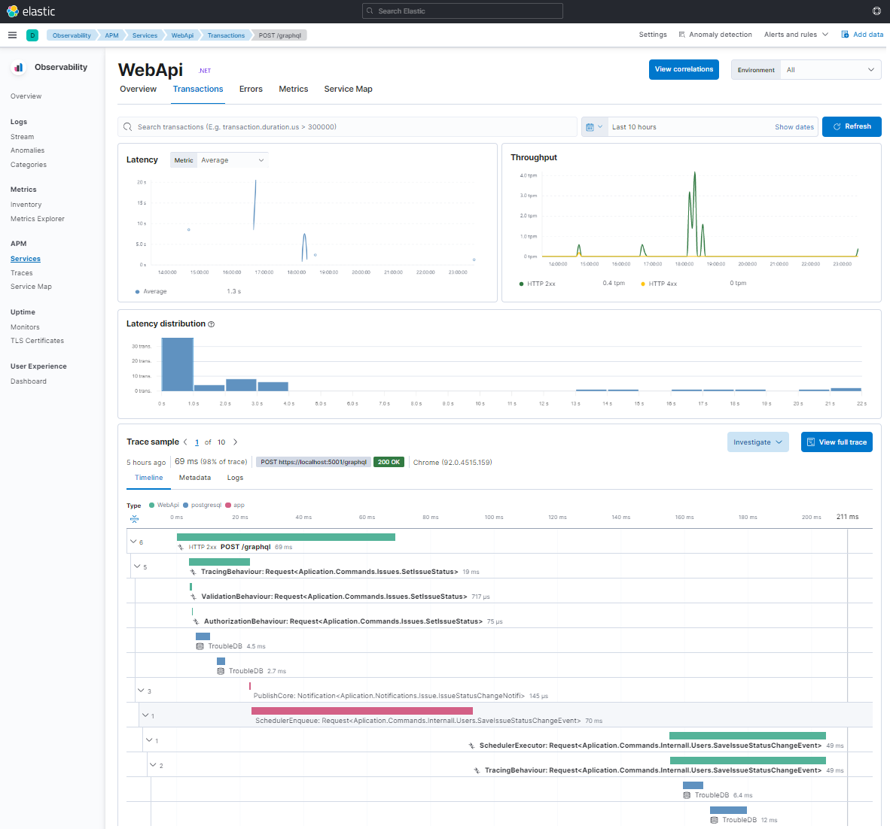

<h3 align="center">!!!!!! Work in progres !!!!!!</h3>
<h3 align="center">Dont use it now..</h3>

### Integration steps:
Please follow this steps because of connection between each part:

1) [Configure logging](Doc/Logging.md) - Teach you how to setup proper distributed logging solution for .Net
2) [Configure telemetry](Doc/OpenTelemetry.md) - Teach you how to setup proper Opentelemetry and Elastic APM
3) [Configure idenity](Doc/Identity.md) - Teach you how to use BFF pattern to secure your app.
4) [Configure monitoring](Doc/ElasticSearch.md) - Teach you how to monitor enitre app stack (This depens on parts 1, 2)

 

 

 

  <h2 align="center">Trouble Train</h2>

   <h3 align="center">!!!!!! Work in progres !!!!!!</h3>

**What is it?**

Trouble train is fullstack app workshop.

// todo..

**Content**
// Todo ...

