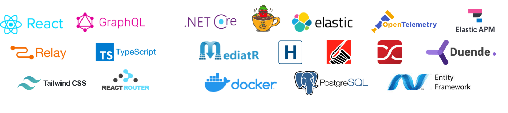
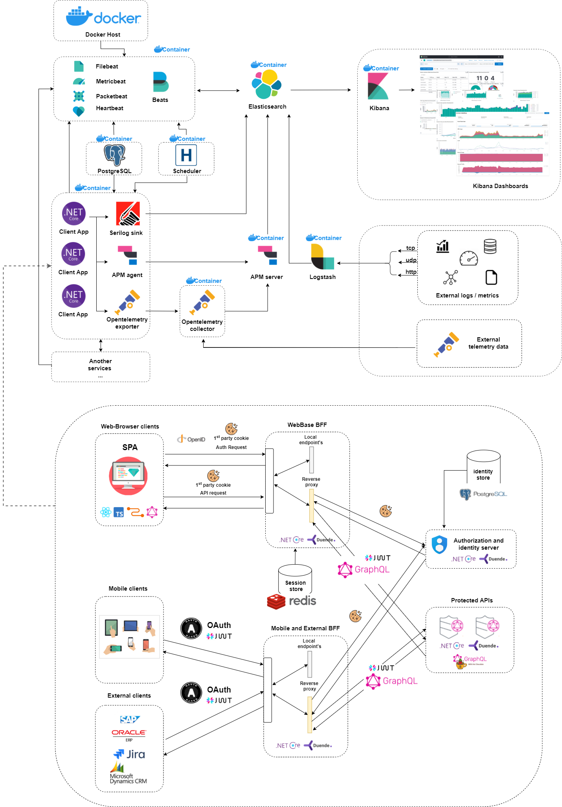
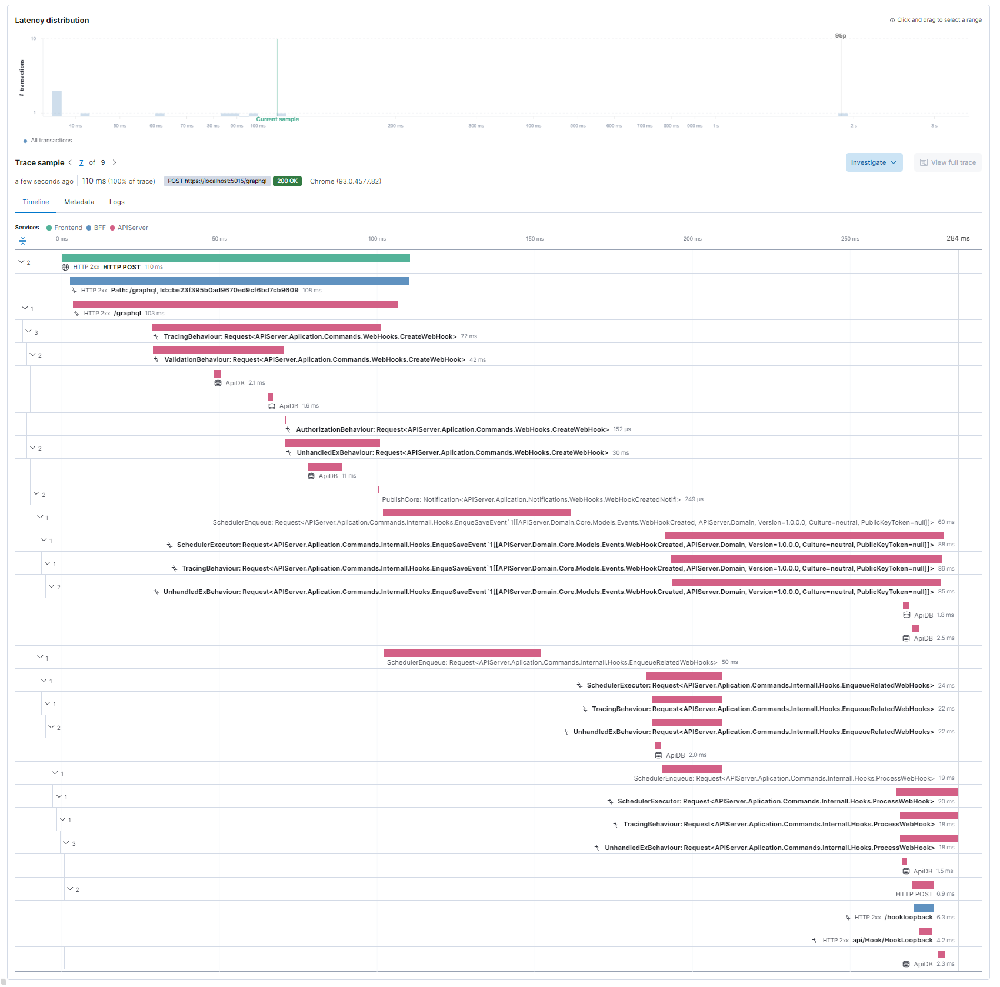
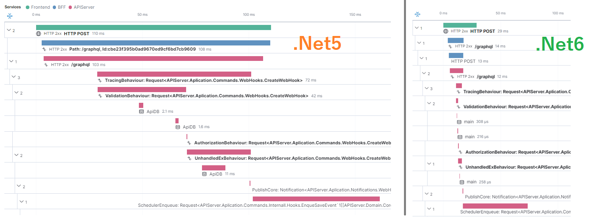

<h2 align="center">Full Stack Workshop (Frontend + Backend + Monitoring) </h2>

<p align="center">
  
</p>
<p align="center" > The application contains a full frontend and backend implementation (<b>Net6.0</b>🚀) with infrastructure and app monitoring. There are several patterns used such as. <b>Mediator, BFF, Domain</b> etc.. and everything is secured with <b>Identity server</b> fully supporting <b>OpenId Connect</b> and <b>OAuth2.0</b></p>

<h5 align="center" >

  <a href="https://github.com/damikun/trouble-training/blob/main/Doc/WebHookBackend.md" >WebHook backend setup</a></br>
  <a href="https://github.com/damikun/trouble-training/blob/main/Doc/Logging.md" >Configure Logging</a></br>
  <a href="https://github.com/damikun/trouble-training/blob/main/Doc/OpenTelemetry.md">Configure Tracing</a></br>
  <a href="https://github.com/damikun/trouble-training/blob/main/Doc/Identity.md">Configure Identity</a></br>
  <a href="https://github.com/damikun/trouble-training/blob/main/Doc/ElasticSearch.md">Configure Monitoring</a></br>
  <a href="https://github.com/damikun/trouble-training/blob/main/Doc/GraphQL%20-%20MutationErrors.md">Handle GraphQL Errors</a></br>
  <a href="https://github.com/damikun/trouble-training/blob/main/Doc/BuildSystem.md">Build Automation</a></br>
  <a href="https://github.com/damikun/trouble-training/tree/main/Src/Tests/Postman">API testing Postman/Newman</a></br>
</br>


</h5>

<p align="center" >Demo Application contains small UI, where you can manage your WebHooks</p>

<p align="center">
  
</p>

## Stack

 - **Frontend**  - [React](https://reactjs.org/), [Relay](https://relay.dev/), [Typecsript](https://www.typescriptlang.org/), [ReactRouter](https://reactrouter.com/), [TailwindCSS](https://tailwindcss.com/)
 - **Backend** - [Netcore](https://dotnet.microsoft.com/), [Hotchocolate](https://chillicream.com), [IdentityServer](https://duendesoftware.com/products/identityserver), [ElasticSearch](https://www.elastic.co/), [Opentelemerty](https://opentelemetry.io/), [Serilog](https://serilog.net/), [MediatR](https://github.com/jbogard/MediatR), [Hangfire](https://www.hangfire.io/), [Automapper](https://automapper.org/), [Fluentvalidation](https://fluentvalidation.net/), [Docker](https://www.docker.com/), [Entity Framework](https://docs.microsoft.com/cs-cz/ef/)

## Project structure

- [APIServer](https://github.com/damikun/trouble-training/tree/main/Src/APIServer) - Is protected GraphQL API
- [BFF](https://github.com/damikun/trouble-training/tree/main/Src/BFF) - Is Backend for Frontend pattern
  - [Frontend React](https://github.com/damikun/trouble-training/tree/main/Src/BFF/API/ClientApp) - This also contains Frontend React app served using static files
- [IdentityServer](https://github.com/damikun/trouble-training/tree/main/Src/IdentityServer) - Idetity server service for providing `OpenId Connect` and `OAuth2.0`
- [Device](https://github.com/damikun/trouble-training/blob/main/Doc/Identity.md#authentication-machine-to-machine-using-client-credentials-flow) - Machine-to-machine comunucation using clinetcredentials for external apps/devices
- [Tests](https://github.com/damikun/trouble-training/blob/main/Src/Tests) - Unit, Integration and API tests

## Integration steps:

Please follow these steps if you want to understand it because of the connection between the parts:

1) [WebHook backend](Doc/WebHookBackend.md) - I`ll show you how to create basic WebHook integration under .NetCore Backend for this demo.
2) [Configure logging](Doc/Logging.md) - I`ll show you how to set up a proper distributed logging solution for .Net
3) [Configure telemetry](Doc/OpenTelemetry.md) - I`ll show you how to properly set up Opentelemetry and Elastic APM.
4) [Configure identity](Doc/Identity.md) - You`ll learn how to use the BFF pattern to secure your application.
5) [Configure monitoring](Doc/ElasticSearch.md) - You will learn how to monitor the entire app stack (this depends on parts 1 and 2).
6) [Handle GraphQL Mutation errors](https://github.com/damikun/trouble-training/blob/main/Doc/GraphQL%20-%20MutationErrors.md) - You will learn how to integrate *6a* pattern.
7) [Build automation and workflows](Doc/BuildSystem.md) - You will learn how to setup build plan and generate workflows.
8) [Automate GraphQL API Testing](https://github.com/damikun/trouble-training/tree/main/Src/Tests/Postman) - You will automate API testing using Postman/Newman from Github-Actions

<br />
<p align="center">



<br />

</p>

**Frontend to Backend distributed tracing example**

On this monitoring graphical visualization, you can see entire request sended from Client Frontend (Creating a webhook)

<p align="center">



Net6.0 is 🚀 (Net5.0 vs Net6.0 measurement) 


</p>

<br />


## Download docker

Based on your system download and [install docker](https://docs.docker.com/engine/install/). This is required!

</br>

## Restore all projects

There are two options:
- Use prepared init script. Run `.\build.cmd E2E_RunAs_Local` from project root. (This will take time since restore)
- Manual instalation (Use in case script fails) follow the [manual instal readme](https://github.com/damikun/trouble-training/blob/main/Doc/Manual_Install.md)
> **NOTE** Restore scripts use `npm`. In case you wanna use `yarn` you need to use manual instalation process..

</br>

## Run Frontend and Backend

From root directory run `tye run`  

(Make sure Docker is running before)

</br>

## Compose elastic docker images

Set this configurtaion settings (for localhost) from your `cmd`:

```sh
#For Linux
sysctl -w vm.max_map_count=262144 
echo "vm.max_map_count=262144" >> /etc/sysctl.conf
```

```sh
#For Windows WSL
wsl -d docker-desktop
sysctl -w vm.max_map_count=262144
```

**Continue with images:**

In the `/Docker` folder you will find prepared images for:
- **Elasticsearch** - Elastic, Kibana, OtelCollector, APMserver, Logstash.
  - Shell `cd` to `Docker/ElasticSearch` and run `docker-compose up`
- **Beats** - (Optional)  FileBeat, HeartBeat, MetricBeat, PacketBeat (⚠️ Skip this in case you dont have enaught RAM !)
  - Shell `cd` to `Docker/Beats` and run `docker-compose up`

In each folder you will find `docker-compose.yml` and you need to run the command `docker-compose up` in your terminal. The setup has been tested on WSL Docker Desktop.

> **Note:** Folder `/Docker` also contains other images for aditional lessons. (For this demo ignor it)

</br>

## Run Elastic and Beats

Start the elasticsearch container group and then beats. Please stick to this order to avoid exception logging due to a missing connection. You can also put everything into a Docker image and wait until the previous section is complete.

> **Note:** Running beats for demo is optional. This require additional RAM and CPU allocation..

In case you have problem to start elastic due to memory issues adjust `max_map_count`


```sh
#For Linux
sysctl -w vm.max_map_count=262144 
echo "vm.max_map_count=262144" >> /etc/sysctl.conf
```

```sh
#For Windows WSL
wsl -d docker-desktop
sysctl -w vm.max_map_count=262144
```

To run all containers, please make sure you have enough RAM and a good computer - this is not for kids :P Have fun :)