In this section, I`ll show you how to use **Postman** to test protected GraphQL API and we will run the Postman collection using **Newman** from GithubActions!

You can integrate API tests in several places
- Under backend corelanguage.
- QA department, where non-developers need to run manual/automated tests
- Frontend using E2E testing with Cypress.

Maybe you use all 3 options because you have multiple departments. This is always organization specific!

## Postman

[Postman](https://www.postman.com/) is a well-known tool that helps you test your APIs.

Postman supports:
- REST
- WebSockets
- GraphQL

This is an advantage in the market as it can cover multiple access points to your application. And the experience of UI is pretty good compared to other tools on the market.

You can :
- Define your request
- Define local and global headers
- Define variables
- Manage cookies
- Manage Auth Flow (oAuth/Openid)
- Manage and verify SSL certificates
- And more other...

In terms of test automation, this is even more powerfool:

- Create Test Collection
- import/export these collections
- Store collections locally or in the cloud
- Provides basic monitoring between test runs
- Provides a headless console runner for CI/CD
- Collect history between runs
- And more other...
  
## Postman as GraphQL IDE?

**Not yet**, but I see the possibility of it becoming a powerfool tool for GraphQL. 

That is something I do not understand. They have a great feature set and also support the basics of GraphQL, which could really be much better, but important features like introspection are not supported. 

**Advantages**
- Everything in one place
- Good way to test APIs locally and from CI/CD.
- You do not have to be a programmer to do this.
- Advanced features for working with API
 
**Disadvantages**
- You can not use schema introspection. This shocked me a bit, because one of the most important features is not supported?
- You have to create the documentation manually
- You have to process multi-part answers yourself

## Install Postman

For the demo please, install [canary release](https://www.postman.com/downloads/canary/), which contains all the new features not yet included in the stable release.

After successful installation you can create a new workspace.

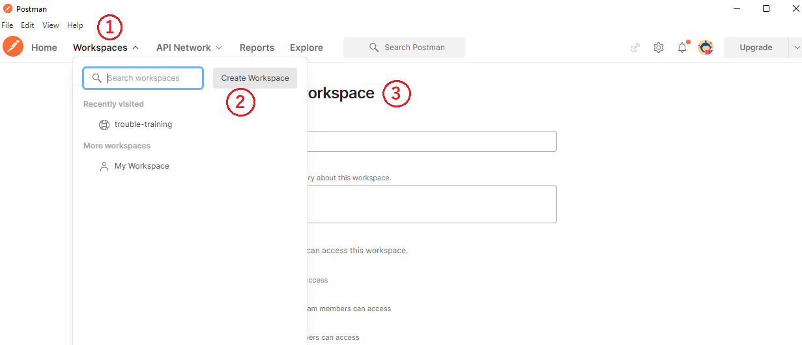

## Define API endpoint

Using the navigation tabs, switch to your workspace and create a GraphQL API endpoint. You can bind this endpoint to a specific test collection later.

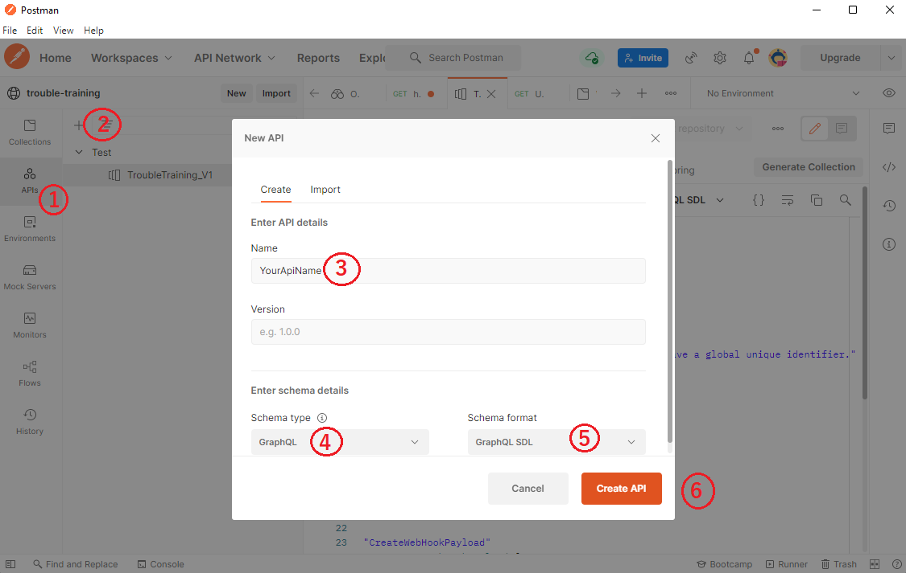

## Import GraphQL SDL

This has to be done manually! Unfortunately Postman does not support introspection, but you can work with version files for that!

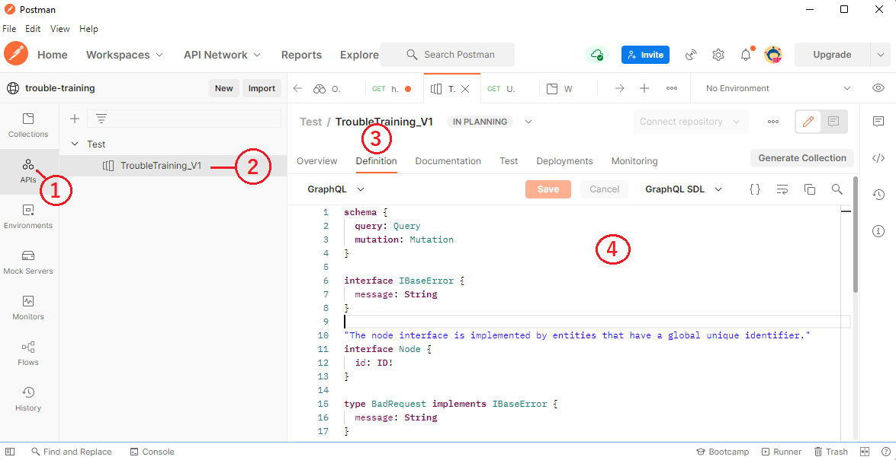

## Create your test collection

You need to define your test collection. This is the place where you put all your scripts, queries, and asserts.

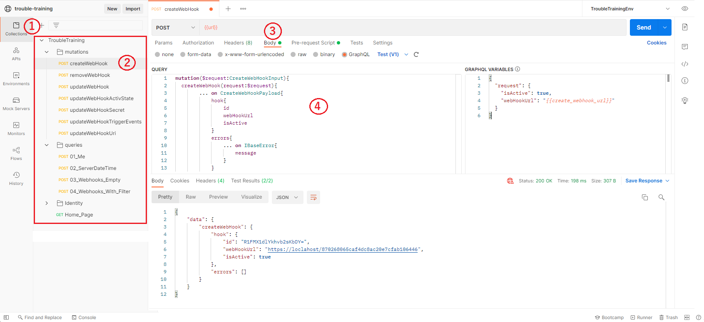

## Pre-requests and Tests scripts

`Pre-request` runs before the actual requests. `Tests` run after the requests and are used to confirm that the result is valid. Both of these are defined in `javascript`. You can switch between them using tabs depending on your view:

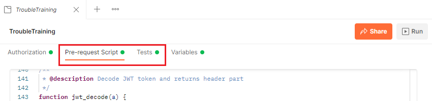

The `Pre-Request` and `Tests` can be found in several scopes. 

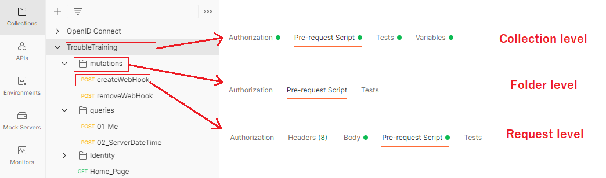

**Scope is just palce, where you can find them**. 
- Scope level Collection
- Section level Folder
- Scope level Request

Basically, this defines the script execution flow as follows: `Collection pre-script` > `Folder pre-script` > `Request pre-script` > `Request` > `Response`...  and something similar works for variables ( Image from [Postman Docs](learning.postman.com) )

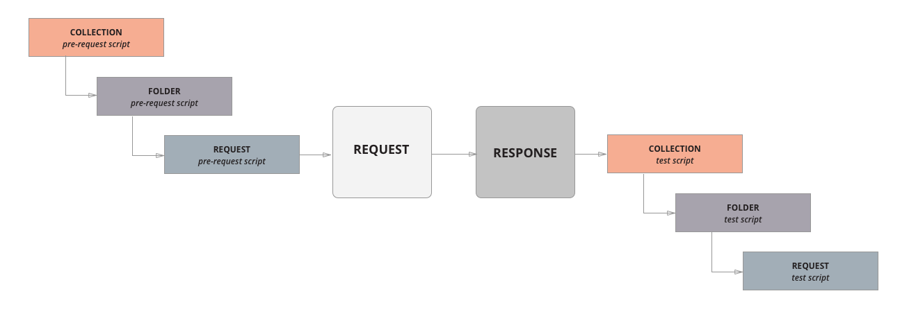 

Example:
- If we want to set a specific header for all tests, we set it using `Collection pre-script` and this will be applied to all requests.
    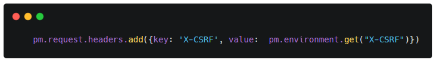
- If we want to set a specific behaviour for a specific test, we set it using `Request pre-script`.
    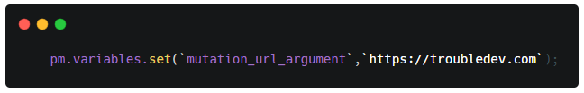

## Is there a initial script?

Postman does **not** have the functionality of an *init* script that runs once on startup! But you can easily implement it using variables! (save the temporary state)

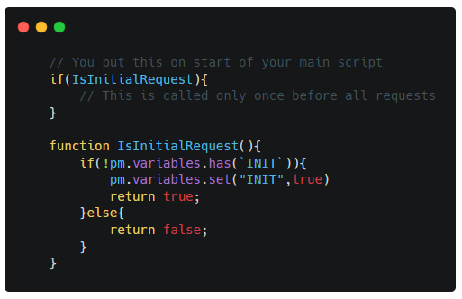

## How do you sign-in with OAuth/OIDC provider?
This depends on whether you are doing the tests manually or automated

**Manual testing** - This is not a problem, as Postman provides extensive options.

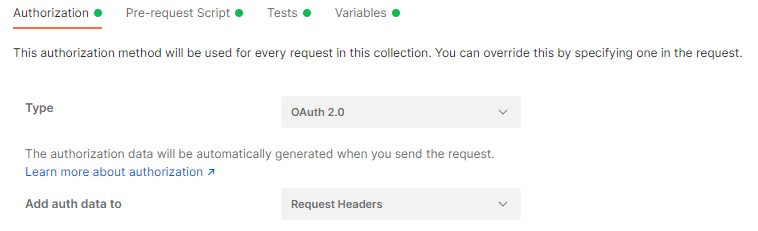

**Automating and running hedless `CI/CD`** - You need to write scripts and that can be difficult with some oidc providers who have strict rules and check all security aspects. You may have issues with sharing and parsing data, CORS, etc.

For testing purposes, you can define a specific oidc `client_id:Postman`. You can simply protect it with `ResourceOwnerPassword` and create a test user for it.

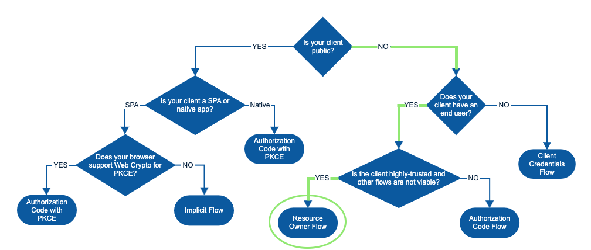 Image from [Okta](developer.okta.com)

The `ResourceOwnerPassword` is fully secured in this scenario:
- You have a special client (oidc client) and you need `Secret` to use it.
- The test user still needs to provide his `name` and `password`.
- Will only be activated under a specific flag
- Will not be used publicly
- Can be restricted to a specific origin

## Request access token
To request a new token, you must make an `asynchronous` call to the oidc token endpoint.

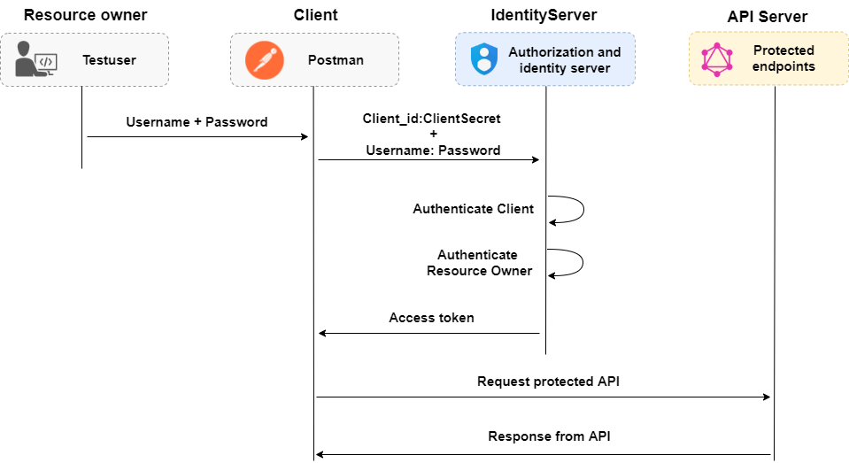

You will do this in the `Pre-scripts` collection once for all tests:

1) You need to check if you have the token from the previous run 
2) Validate the lifetime of the token.
 - Token is valid - > uses the existing one 
 - Token has expired - > requests a new one

Requesting tokens requires an `aync` call to the remote API. This is complicated in Postman. You need to create an `async` helper for this since request are not awaitable by default!

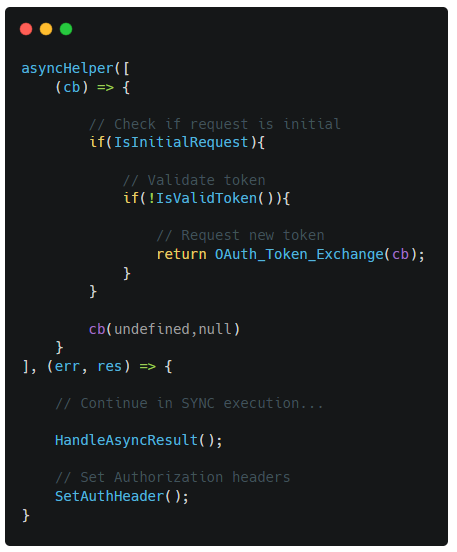

The `OAuth_Token_Exchange` triggers the request with the function `pm.sendRequest(...)`.

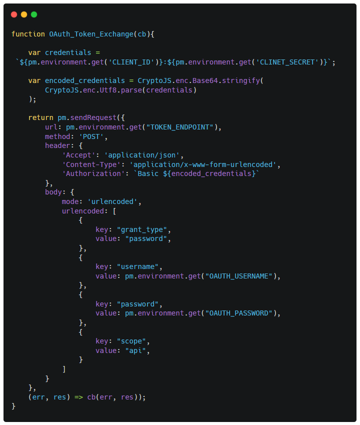

(All sources can be found at the end!)

## Validation of the GraphQL response

GraphQL returns `json` and you need to create a helper script to validate it. This script validates property by property with the option to ignore some.

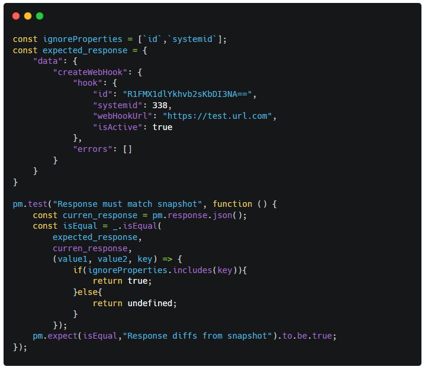

## Run yoru test manualy from Postman
Verify that the tests are running before exporting them.

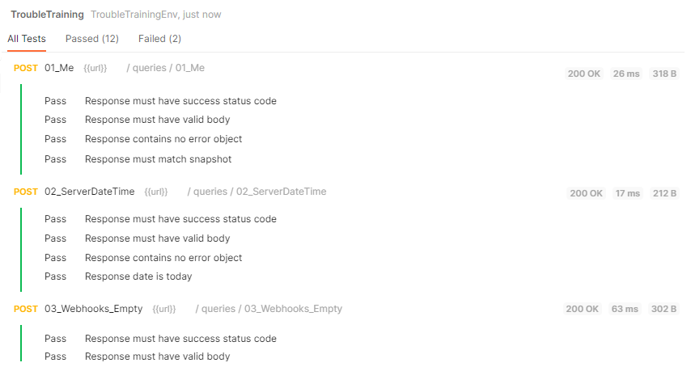

## Run yoru test manualy from VsCode
There is extension called [Thunder Client](https://www.thunderclient.io/). Which can run Postman collection unfortunatelly this **is not usefull** for our case since it **does not support** scrippting!

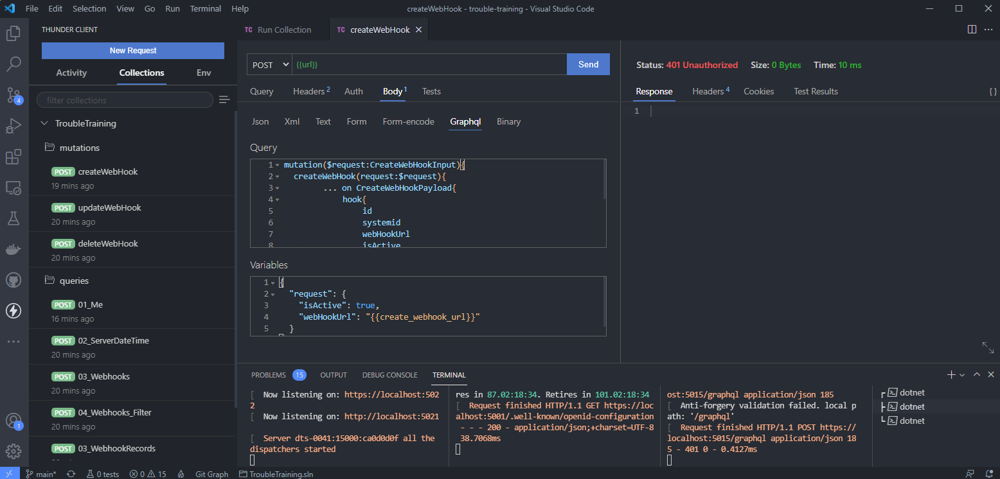

## Export test data

We wanna automate run! 

For that you need to export the collection and the variables and use exported data in headless `ci/cd` runner.

*Export collection:*
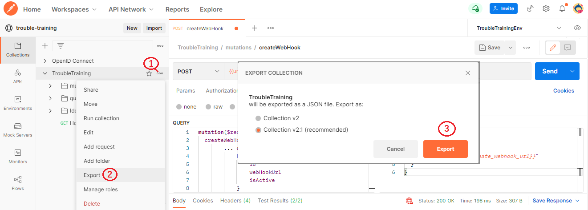

*Export enviroment:*
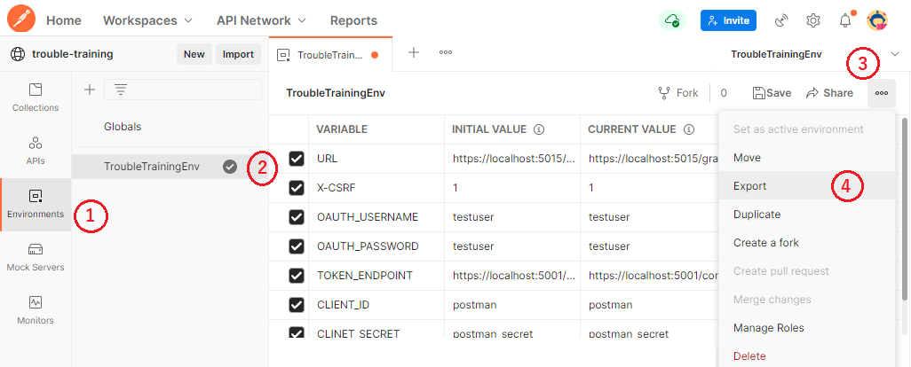

## Newman headless runner

Newman is CLI runner for postman collections. You can find it on [Github](https://github.com/postmanlabs/newman).

Install with: `npm install -g newman`.

Run from console (terminal):

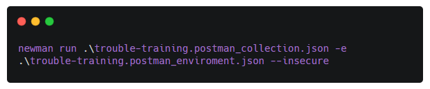

(We use the `--insecure` flag because we use untrusted developer certificates).

This is an example of the output

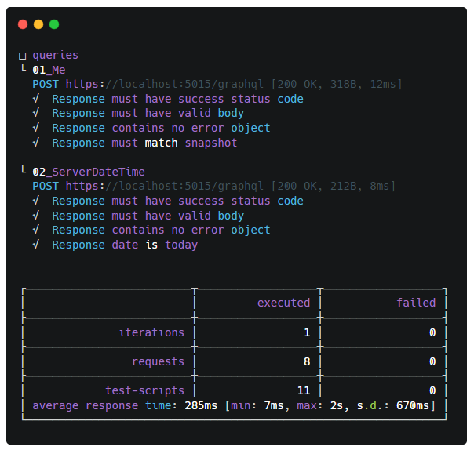

## Integration in Build and CI/CD

The demo application uses `Nuke` for build automation.

Nuke is a console application that contains all build logic defined as `Targets` and allows you to run cross-platform and generate `.yaml` for `CI/CD` pipelines.

Let us place `Newman` in front of the `Cypress` tests.

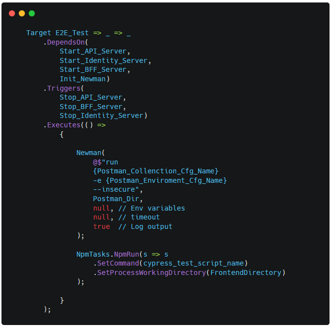

To better understand what `Target_E2E_Tests` is. Let us take a look at the whole pipeline and the dependencies between the different targets.

Targets define named operation with specific actions.

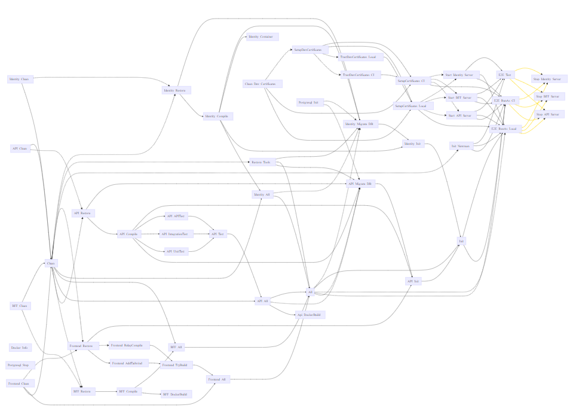

And this is result of GithubAction run:

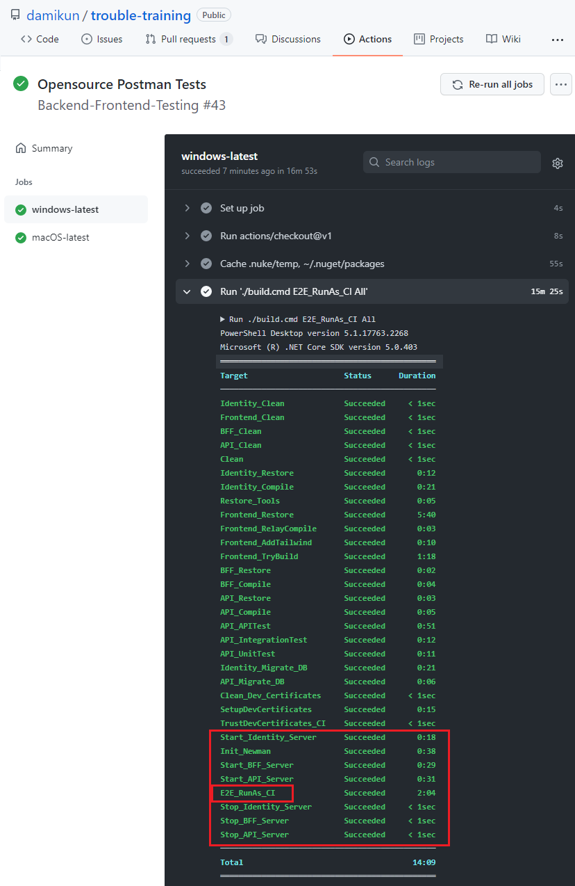
